# System Design Concepts: The Complete Study Guide

A detailed introduction to designing applications that communicate correctly, respond well to users, handle growth, and recover when something goes wrong. Each topic explains the idea, the problem it solves, and the limits you need to understand before using it.

## Preface

System design decides how application parts work together: who owns official data, who may change it, and how requests reach that owner. Explain both normal operation and failure: a slow dependency, two competing writes, or a successful booking whose reply is lost.

The topic index begins with a 30-concept checklist and organizes the full reading into fifteen categories across five learning stages. Alongside fundamentals, networking, APIs, scaling, storage, caching, architecture, messaging, coordination, resilience, observability, security, and testing, the index names data pipelines, deployment, and complete designs explicitly. Each topic links to its specific explanation. Complete chapters remain available for reading the surrounding reasoning in depth.

Examples span shopping, payments, bookings, chat, search, video, document processing, notifications, and device updates. They illustrate business tradeoffs, not a named company's private implementation. A disconnected store is one messaging example, not the book's organizing theme.

These are original explanations. Playlist titles guide coverage but do not prove that full videos or transcripts were reviewed. The source-and-coverage section records what was checked and added. Always verify product-specific guarantees against the documentation for your actual version and settings.

## How to Read This Book

Read an explanation before using its revision points. Ask what problem it solves, trace a normal request and its saved state, then introduce a lost reply or crash. Explain why the required result still holds and where the technique stops helping.

For a cache, explain the source, allowed age, outage behavior, and why a displayed inventory count cannot reserve the final item. Apply the same depth to queues, replicas, load balancers, and retries.

You need not build every component. Draw a small system, identify records and messages, and walk through operations. Turn uncertainty into a testable question, such as "What if the worker crashes after saving but before acknowledging?" Use a small, safe experiment to understand the result.

This is a single, self-contained handbook. No application changes or cloud deployments are required to read it. Practical exercises use hypothetical or isolated development resources and must not be run against production systems.

### Course orientation and prerequisites

You should be comfortable reading a small function, following an HTTP request, and understanding that a database stores records. You do not need to know every database, cloud service, or distributed algorithm before starting. If memory, threads, or data structures are unfamiliar, use the supporting chapters when those ideas appear. The goal is to explain a design's behavior and tradeoffs, not to memorize a list of products.

The course follows five stages. A stage is a useful learning order, not a deadline or a claim that all topics have equal difficulty. Keep the complete chapters for depth; use individual topic links when revising a specific mechanism. Definitions introduce a concept, worked examples make its behavior concrete, and practice checks expose assumptions that a successful-path diagram can hide.

| Stage | Focus | Ready to move on when you can... |
| --- | --- | --- |
| Foundations | Requirements, networking, and API contracts | Trace a request, define a successful outcome, and separate transport from business correctness |
| Build and scale | Capacity, databases, caching, and architecture | Choose a storage model, protect a concurrent update, and explain where a cache or extra instance helps |
| Distributed systems | Messaging, coordination, and data pipelines | Follow a duplicate, a delayed event, and a partition through explicit ownership and recovery rules |
| Production readiness | Resilience, security, deployments, and testing | Bound overload, protect tenant data, measure user outcomes, and release a compatible change |
| Apply the concepts | Complete designs and interview practice | Explain the simplest complete design, identify its bottleneck, and defend one alternative |

A productive session ends with evidence of understanding. For example, draw a write that commits before its reply is lost, then explain how the client recovers without creating a second effect. For practical exercises, use local or disposable development resources with synthetic records. Reading the example or playing its animation is not the same as executing and validating the system it describes.

The public [AlgoMaster course introduction](https://algomaster.io/learn/system-design/course-introduction) informed the emphasis on learning order, visual explanation, and active practice. This handbook provides original material and its own exercises; it does not reproduce premium course lessons or claim to include that site's AI interviewer, narration, or animation library.

## System Design: The Complete Topic Map

This index names each concept directly. Begin with the 30 core concepts or choose a category below. Every link opens the relevant section of the full handbook, with definitions, examples, failure cases, and tradeoffs in ordinary English. **Core** marks the thirty concepts in the shorter checklist; it does not mean the other topics are optional for every design.

The topic names and coverage were checked against [AlgoMaster: 30 Must-Know System Design Concepts](https://algomaster.io/learn/system-design/top-30-system-design-concepts) and the [GeeksforGeeks System Design Tutorial](https://www.geeksforgeeks.org/system-design/system-design-tutorial/). These pages inform the learning index, not copied article text. The handbook's original explanations, diagrams, practical examples, and deeper distributed-systems material are retained. Product guarantees still require checking the relevant official documentation.

### 30 Core Concepts

1. [Latency](#latency-throughput-and-the-slow-tail)
2. [Client-Server Model](#client-server-model)
3. [IP Addresses](#ip-addresses-ports-and-nat)
4. [DNS (Domain Name System)](#dns-is-a-distributed-naming-system)
5. [Forward Proxy vs Reverse Proxy](#forward-proxy-versus-reverse-proxy)
6. [HTTP and HTTPS](#http-and-https)
7. [APIs](#an-api-is-a-promise-between-components)
8. [REST API](#rest-style-http-apis)
9. [GraphQL](#graphql)
10. [WebSockets](#websockets)
11. [Webhooks](#webhooks)
12. [API Gateway](#what-an-api-gateway-adds)
13. [Vertical Scaling](#vertical-scaling)
14. [Horizontal Scaling](#horizontal-scaling)
15. [Load Balancing](#distributing-work-is-different-from-creating-capacity)
16. [Databases](#databases)
17. [SQL vs NoSQL](#sql-vs-nosql)
18. [Database Indexing](#indexes-are-extra-data-structures)
19. [Denormalization](#denormalization)
20. [Vertical Partitioning](#vertical-partitioning)
21. [Database Sharding](#partitioning-and-sharding-split-data)
22. [Database Replication](#replication-copies-data)
23. [Blob and Object Storage](#blob-and-object-storage)
24. [Caching](#a-cache-is-a-reusable-answer-not-automatically-the-truth)
25. [CDN (Content Delivery Network)](#what-a-cdn-does)
26. [Microservices](#microservices)
27. [Message Queues](#a-shared-queue-divides-work)
28. [Idempotency](#idempotency-in-plain-english)
29. [CAP Theorem](#cap-during-a-network-partition)
30. [Rate Limiting](#rate-limiting)

### 1. System Design Fundamentals

- [What Is System Design?](#what-system-design-actually-means)
- [Functional Requirements](#functional-requirements-and-quality-requirements)
- [Non-Functional Requirements](#functional-requirements-and-quality-requirements)
- [High-Level Design (HLD)](#high-level-design-and-low-level-design)
- [Low-Level Design (LLD)](#object-oriented-programming-and-interfaces)
- [Latency](#latency-throughput-and-the-slow-tail) **Core**
- [Throughput](#saturation-and-queueing)
- [Capacity Estimation](#estimate-from-a-workload-not-a-population-count-alone)
- [Availability](#availability-reliability-and-durability-are-different-promises)
- [Reliability and Durability](#availability-reliability-and-durability-are-different-promises)
- [Maintainability](#maintainability)
- [Cost and Performance Optimization](#costs-and-failure-budgets)

### 2. Networking & Web Protocols

- [Client-Server Model](#client-server-model) **Core**
- [IP Addresses](#ip-addresses-ports-and-nat) **Core**
- [DNS (Domain Name System)](#dns-is-a-distributed-naming-system) **Core**
- [DNS Caching and TTL](#dns-caching-and-ttl)
- [Anycast, GeoDNS, and Global Routing](#anycast-geodns-latency-routing-and-alias-records)
- [Forward Proxy vs Reverse Proxy](#forward-proxy-versus-reverse-proxy) **Core**
- [TCP vs UDP](#tcp-udp-flow-control-and-congestion)
- [HTTP and HTTPS](#http-and-https) **Core**
- [HTTP/1.1, HTTP/2, and HTTP/3](#http11-http2-and-http3)
- [Web Servers and Application Servers](#web-servers-and-application-servers)
- [Service Discovery](#service-discovery-in-practice)

### 3. APIs & Real-Time Communication

- [APIs](#an-api-is-a-promise-between-components) **Core**
- [REST API](#rest-style-http-apis) **Core**
- [GraphQL](#graphql) **Core**
- [RPC and gRPC](#rpc-and-grpc)
- [SOAP](#soap-webhooks-and-asynchronous-interfaces)
- [WebSockets](#websockets) **Core**
- [Webhooks](#webhooks) **Core**
- [Server-Sent Events (SSE)](#server-sent-events-sse)
- [Short Polling and Long Polling](#polling-sse-and-websockets)
- [API Gateway](#what-an-api-gateway-adds) **Core**
- [Asynchronous Request-Reply](#asynchronous-request-reply)
- [Pagination](#pagination-and-stable-results)
- [API Versioning and Compatibility](#performance-and-evolution)

### 4. Scalability & Load Balancing

- [Vertical Scaling](#vertical-scaling) **Core**
- [Horizontal Scaling](#horizontal-scaling) **Core**
- [Load Balancing](#distributing-work-is-different-from-creating-capacity) **Core**
- [L4 and L7 Load Balancers](#l4-and-l7-balancing)
- [Load Balancing Algorithms](#how-balancing-algorithms-choose)
- [Stateful vs Stateless Systems](#statelessness-and-session-affinity)
- [Liveness and readiness probes](#health-checks-and-graceful-removal)
- [Autoscaling and Bottlenecks](#find-the-bottleneck-before-scaling)
- [Load Balancing vs Failover](#active-passive-and-active-active)
- [Concurrency and Parallelism](#working-on-several-things-versus-executing-simultaneously)

### 5. Databases & Storage

- [Databases](#databases) **Core**
- [SQL vs NoSQL](#sql-vs-nosql) **Core**
- [Database Types and Product Choices](#database-examples-and-the-questions-they-answer)
- [Database Indexing](#indexes-are-extra-data-structures) **Core**
- [Write-Ahead Logs (WAL)](#write-ahead-logs-and-crash-recovery)
- [LSM Trees and SSTables](#lsm-trees-sstables-and-compaction)
- [MVCC and Optimistic Concurrency](#mvcc-and-optimistic-concurrency)
- [B-Trees and B+ Trees](#b-trees-and-b-trees-in-a-real-query)
- [Normalization](#normalization-and-denormalization)
- [Denormalization](#denormalization) **Core**
- [Vertical Partitioning](#vertical-partitioning) **Core**
- [Database Sharding](#partitioning-and-sharding-split-data) **Core**
- [Database Replication](#replication-copies-data) **Core**
- [Replica Lag and Read-Your-Writes](#read-your-writes-and-replica-lag)
- [Leaderless quorums: R + W > N](#leaderless-quorums-with-a-worked-example)
- [Resharding and Data Migration](#rebalancing-and-migration)
- [ACID Transactions](#acid-in-ordinary-language)
- [Transaction Isolation](#isolation-anomalies-and-write-skew)
- [SQL Query Optimization](#tuning-a-slow-database-backed-api)
- [Blob and Object Storage](#blob-and-object-storage) **Core**
- [Block, File, and Object Storage](#block-file-and-object-storage)
- [Bloom Filters](#bloom-filters-and-approximate-answers)
- [HyperLogLog](#bloom-filters-and-approximate-answers)

### 6. Caching & Content Delivery

- [Caching](#a-cache-is-a-reusable-answer-not-automatically-the-truth) **Core**
- [Cache placement and ownership](#where-caches-sit-in-the-request-path)
- [Cache-aside and read-through](#cache-aside-and-read-through)
- [Write-through and write-behind](#write-through-and-write-behind)
- [Cache Eviction Policies](#keys-expiration-and-eviction)
- [Cold Cache and Warm Cache](#cold-cache-and-warm-cache)
- [Distributed Cache](#hot-keys-and-distributed-caches)
- [Stampedes, breakdown, and avalanches](#stampedes-avalanches-and-penetration)
- [Cache breakdown and XFetch](#cache-breakdown-and-probabilistic-early-refresh-with-xfetch)
- [Cache Invalidation](#the-stale-fill-race)
- [CDC and Debezium cache updates](#cdc-and-debezium-for-cache-invalidation)
- [Redis](#what-redis-contributes)
- [CDN (Content Delivery Network)](#what-a-cdn-does) **Core**
- [Edge Caching and Edge Computing](#dynamic-cdn-content-and-edge-workers)

### 7. Architecture & Design Patterns

- [Monolithic Architecture](#modular-monoliths-and-microservices)
- [Microservices](#microservices) **Core**
- [Multi-Tenancy and Isolation](#multi-tenant-architecture-and-isolation)
- [Monolith vs Microservices](#modular-monoliths-and-microservices)
- [Serverless Architecture](#cloud-service-models)
- [Event-Driven Architecture](#why-services-communicate-through-messaging)
- [OOP and Interfaces](#object-oriented-programming-and-interfaces)
- [SOLID Principles](#kiss-solid-and-decisions-that-can-evolve)
- [DRY, KISS, and YAGNI](#dry-kiss-and-yagni)
- [UML Diagrams](#uml-diagrams)
- [Design Patterns](#design-patterns)
- [Backend for Frontend (BFF)](#backend-for-frontend)

### 8. Message Queues & Event Streaming

- [Message Queues](#a-shared-queue-divides-work) **Core**
- [Publish-Subscribe (Pub/Sub)](#topics-and-subscriptions-distribute-independent-copies)
- [Commands vs Events](#commands-and-events-express-different-meanings)
- [Kafka and Event Streaming](#kafkas-retained-partitioned-log)
- [RabbitMQ](#rabbitmq-and-routed-work)
- [Amazon SQS and redrive](#amazon-sqs-delay-queues-and-redrive-policies)
- [Apache Pulsar](#pulsars-separation-of-serving-and-storage)
- [Azure Service Bus](#azure-messaging-services)
- [Azure Event Hubs](#azure-messaging-services)
- [Azure Event Grid](#azure-messaging-services)
- [Delivery Guarantees](#at-most-once-and-at-least-once)
- [Idempotency](#idempotency-in-plain-english) **Core**
- [Transactional Outbox](#transactional-outbox)
- [Event Sourcing](#event-sourcing)
- [CQRS](#cqrs-and-materialized-views)
- [Background jobs and catch-up](#event-driven-and-schedule-driven-jobs)

### 9. Distributed Systems & Coordination

- [Consistency models](#consistency-describes-what-readers-may-observe)
- [CAP Theorem](#cap-during-a-network-partition) **Core**
- [BASE and PACELC](#base-and-pacelc)
- [Consistent hashing and virtual nodes](#a-consistent-hashing-ring-with-virtual-nodes)
- [Consensus Algorithms](#quorums-and-consensus)
- [Lamport Clocks and Vector Clocks](#lamport-clocks-and-vector-clocks)
- [Replica Repair and CRDTs](#replica-repair-and-conflict-resolution)
- [Gossip and Failure Detection](#gossip-heartbeats-and-failure-detection)
- [Raft and replicated state machines](#replicated-state-machines-and-raft-step-by-step)
- [Paxos and ZooKeeper Atomic Broadcast](#paxos-and-zookeeper-atomic-broadcast)
- [Distributed locks, leases, and fencing](#redlock-zookeeper-locks-and-consul-sessions)
- [Unique IDs across machines](#snowflake-ids-uuidv4-uuidv7-and-ticket-services)
- [2PC and a coordinator failure](#two-phase-commit-and-a-failed-coordinator)
- [3PC and its assumptions](#three-phase-commit-and-its-timing-assumptions)
- [Distributed transactions and sagas](#sagas-coordinate-business-steps)

### 10. Reliability & Traffic Protection

- [Fault tolerance and recovery](#design-for-specified-failures)
- [High Availability and Failover](#active-passive-and-active-active)
- [Backups and Disaster Recovery](#backups-snapshots-and-point-in-time-recovery)
- [RTO and RPO](#recovery-objectives)
- [Rate Limiting](#rate-limiting) **Core**
- [Backpressure and Load Shedding](#control-demand-before-resources-collapse)
- [Rate Limiting Algorithms](#fixed-and-sliding-windows)
- [Backoff, jitter, and retry budgets](#backoff-and-jitter)
- [Calculate a strict retry traffic budget](#a-strict-retry-budget-as-a-share-of-outgoing-traffic)
- [DLQs and poison messages](#what-a-dlq-is-for)
- [Delay queues and safe redrive](#durable-delayed-retry)
- [Circuit breakers and bulkheads](#circuit-breakers)

### 11. Observability & Security

- [Metrics and useful measurements](#counters-gauges-histograms-and-observability-tools)
- [Distributed Tracing and Structured Logs](#logs-metrics-and-traces-in-practice)
- [Authentication and authorization](#authentication-and-authorization)
- [OAuth 2.0, OIDC, and JWT](#oauth-20-and-openid-connect)
- [TLS and Secure Communication](#http-and-https)
- [Zero trust and service-to-service security](#zero-trust-and-mutual-tls-between-services)
- [SLOs, alerts, and recovery ownership](#service-level-indicators-and-objectives)

### 12. Testing & Delivery

- [Unit Testing](#unit-testing)
- [Integration Testing](#integration-testing)
- [Load Testing](#load-testing)
- [Stress Testing](#stress-testing)
- [CI/CD Pipeline](#cicd-pipeline)
- [Secure SDLC](#secure-software-development-lifecycle)

### 13. Search & Data Pipelines

- [OLTP, OLAP, and data processing](#operational-versus-analytical-workloads)
- [Search and Inverted Indexes](#search-is-a-specialized-read-problem)
- [Lakehouse Architecture](#what-a-lakehouse-adds)
- [Batch vs Stream Processing](#batch-and-stream-processing)
- [Windows, Watermarks, and Checkpoints](#windows-watermarks-and-stream-recovery)
- [Backfills and Data Lineage](#data-quality-lineage-and-recovery)

### 14. Deployment & Evolution

- [Virtual Machines and Containers](#bare-metal-virtual-machines-and-containers)
- [Rolling, Canary, and Blue-Green Deployments](#deployment-strategies)
- [Schema Evolution and Replay](#schema-evolution-and-replay-compatibility)
- [Database Migrations and Rollback](#database-and-message-compatibility)

### 15. Worked Designs & Interview Preparation

These designs combine requirements, data models, capacity, request paths, and recovery. Use the [System Design Interview Framework](#a-practical-interview-structure) to explain decisions instead of listing components. Follow the stages in [Course orientation and prerequisites](#course-orientation-and-prerequisites) before attempting the more difficult tradeoffs.

### Complete real-life design walkthroughs

Apply the groups together in [orders, bookings, and multi-channel notifications](#30-designing-orders-bookings-and-notifications), then [chat, video, product search, and a URL shortener](#31-designing-chat-media-and-search). Each walkthrough names the important records, normal request flow, failures, recovery steps, and tradeoffs. Use [interview preparation and the learning plan](#32-interview-practice-and-a-learning-plan) to practise explaining the choices and testing weak points. A diagram becomes useful when you can explain what each arrow means and what happens if its reply is lost.

- [Order and Payment Workflow](#design-a-an-online-order-and-payment-workflow)
- [Hotel Booking and Seat Reservations](#design-b-hotel-rooms-or-event-seats)
- [Notification Service](#design-c-a-multi-channel-notification-service)
- [Chat System](#design-d-persistent-chat)
- [Video Upload and Streaming](#design-e-video-upload-and-processing)
- [Search and Autocomplete](#design-f-product-search-and-autocomplete)
- [URL Shortener](#design-g-a-url-shortener)
- [News Feed](#design-h-a-news-feed)

## Other Topics: Supporting Computing and Engineering

Complete supporting chapters stay together, while their design-related sections also have direct links in the main topic catalog. They are not discarded or reduced to summaries. Use them when you need a clearer understanding of the machine, code, platform, or engineering workflow behind a design decision.

For computing foundations, read [memory, storage, and runtimes](#3-memory-storage-and-runtime-behavior), [data structures and algorithmic cost](#4-data-structures-and-algorithmic-cost), and [concurrency and parallelism](#5-concurrency-and-parallelism). They explain why async is not the same as parallel, why a process-local lock has limited scope, and why a quick algorithm can still be slow when it waits for storage or the network.

For implementation and operations, read [application and client architecture](#9-application-and-client-architecture), [cloud infrastructure and containers](#18-cloud-infrastructure-and-containers), [testing, delivery, and Git](#28-testing-delivery-and-engineering-workflow), and [Linux and practical diagnosis](#29-linux-diagnostics-and-runtime-investigation). These cover modular design, client patterns, Kubernetes, deployments, compatibility, operating-system resources, and safe investigation. Supporting does not mean unimportant; it means these subjects are available without interrupting the main topic sequence.

System Design and Other Topics each use their own sequential reading numbers. Stable internal references keep existing links and notes attached to the same material. The topic map gives a subject-based route through the chapters. Read by topic when preparing a specific design, or follow complete chapters when learning the surrounding reasoning in depth.

## Contents

- [Preface](#preface)
- [How to Read This Book](#how-to-read-this-book)
- [System Design Topic Map](#system-design-the-complete-topic-map)
- [Other Topics](#other-topics-supporting-computing-and-engineering)
- [Part I: System-Design Foundations](#part-i-system-design-foundations)
- [1. Thinking Like a System Designer](#1-thinking-like-a-system-designer)
- [2. Quality Goals and Capacity Estimates](#2-quality-goals-and-capacity-estimates)
- [3. Memory, Storage, and Runtime Behavior](#3-memory-storage-and-runtime-behavior)
- [4. Data Structures and Algorithmic Cost](#4-data-structures-and-algorithmic-cost)
- [5. Concurrency and Parallelism](#5-concurrency-and-parallelism)
- [6. The Internet and Web Protocols](#6-the-internet-and-web-protocols)
- [7. DNS, Proxies, and API Gateways](#7-dns-proxies-and-api-gateways)
- [8. API Contracts and Communication Styles](#8-api-contracts-and-communication-styles)
- [9. Application and Client Architecture](#9-application-and-client-architecture)
- [10. Load Balancing and Application Scaling](#10-load-balancing-and-application-scaling)
- [11. Relational Data, Indexes, and Transactions](#11-relational-data-indexes-and-transactions)
- [12. Database Models and Distributed Data](#12-database-models-and-distributed-data)
- [13. Caching and Freshness](#13-caching-and-freshness)
- [14. Redis and Content Delivery Networks](#14-redis-and-content-delivery-networks)
- [15. Consistency, CAP, and Coordination](#15-consistency-cap-and-coordination)
- [16. Availability and Recovery Architecture](#16-availability-and-recovery-architecture)
- [17. Search, Data Pipelines, and Analytics](#17-search-data-pipelines-and-analytics)
- [18. Cloud Infrastructure and Containers](#18-cloud-infrastructure-and-containers)
- [Part II: Communication and Reliable Workflows](#part-ii-communication-and-reliable-workflows)
- [19. Message Buses, Queues, and Events](#19-message-buses-queues-and-events)
- [20. Kafka, RabbitMQ, Pulsar, and Azure Messaging](#20-kafka-rabbitmq-pulsar-and-azure-messaging)
- [21. Delivery Guarantees and Idempotency](#21-delivery-guarantees-and-idempotency)
- [22. Retries and Dead-Letter Queues](#22-retries-and-dead-letter-queues)
- [23. Outbox, Sagas, and Transaction Boundaries](#23-outbox-sagas-and-transaction-boundaries)
- [24. Ordering, Scheduling, and Reconciliation](#24-ordering-scheduling-and-reconciliation)
- [25. Rate Limiting and Resilience Patterns](#25-rate-limiting-and-resilience-patterns)
- [26. Observability and Production Operations](#26-observability-and-production-operations)
- [27. Security, Identity, and Trust Boundaries](#27-security-identity-and-trust-boundaries)
- [28. Testing, Delivery, and Engineering Workflow](#28-testing-delivery-and-engineering-workflow)
- [29. Linux, Diagnostics, and Runtime Investigation](#29-linux-diagnostics-and-runtime-investigation)
- [30. Designing Orders, Bookings, and Notifications](#30-designing-orders-bookings-and-notifications)
- [31. Designing Chat, Media, and Search](#31-designing-chat-media-and-search)
- [32. Interview Practice and a Learning Plan](#32-interview-practice-and-a-learning-plan)
- [Source and Topic Coverage](#source-and-topic-coverage)
- [Reference Shelf](#reference-shelf)
- [Glossary for Revision](#glossary-for-revision)

## Part I: System-Design Foundations

Follow a request through the network, application, and data stores, then introduce growth or failure. For each component, explain its responsibility and why it is needed. A useful diagram shows how requirements are met, not just infrastructure names.

## 1. Thinking Like a System Designer

### What system design actually means

Consider a doctor's appointment app. A patient chooses a doctor and time; the app saves the booking and sends a confirmation email. One web application and one relational database may be enough. The browser is the client, the application handles requests, and the database owns the official booking records. Network requests and replies can be delayed or lost.

Three cases reveal the design decisions:

- **Two patients choose the same slot.** This is a concurrency problem: operations overlap while changing shared data. A faster server does not choose the winner. Enforce the reservation rule where the booking is saved, not just by disabling a browser button.
- **The booking succeeds, but email fails.** Keep the appointment. Saving a booking and delivering its confirmation are separate tasks. Save the pending email work so it can be retried.
- **The booking succeeds, but its reply is lost.** The patient sees a timeout and retries. A stable request ID identifies another attempt at the same operation; a status lookup reveals the saved result without creating another booking.

System design establishes who owns each official record, which changes must succeed together, what components exchange, and how failures recover. Choose tools after these rules are clear. Tools enforce the rules; they do not choose them.

### Functional requirements and quality requirements

**Functional requirements** describe what users can do: search appointments, book a slot, cancel, and view bookings. They also define scope. Doctor recommendations and historical trends may be useful without belonging in the first version.

**Quality requirements** describe how well those actions must work and what constraints apply: fast searches, confirmed bookings that survive restarts, and private patient records. These concern speed, reliability, durability, and security rather than extra screens.

Make them testable. Replace "the system should be fast" with "at the agreed peak traffic level, 95% of appointment searches must finish within 300 milliseconds." Specify the peak workload and where timing starts and stops.

Qualities can conflict. Checking every booking rule before replying gives a confirmed result but may take longer. Accepting a request first gives a quicker reply, but cannot honestly mean "already booked." Regional copies reduce distance to users but introduce competing booking attempts across regions. A **tradeoff** is a benefit with a cost or new responsibility; explain both.

### High-level design and low-level design

**High-level design** assigns responsibilities to clients, APIs, databases, queues, workers, and external services. Trace important operations through them, showing data ownership, failure handling, and scaling. Every diagram arrow should identify a request, response, write, or message.

**Low-level design** explains how each component works: classes, interfaces, algorithms, data structures, validation, and error handling. A **state machine** lists allowed states and transitions. A booking may move from requested to confirmed or rejected, but not from cancelled back to confirmed without a new decision.

Both are necessary. Good classes cannot repair a workflow that loses work between services. An architecture diagram cannot replace the database rule that prevents duplicate bookings. High-level design assigns responsibility; low-level design enforces it.

### Start with the smallest complete design

A modular application with one database is often a good starting point: fewer network failures, fewer services to operate, and simpler local transactions. A **transaction** lets related changes succeed or fail together.

A **modular monolith** is one deployable application with clear internal sections, such as bookings, billing, and notifications. Each owns its rules and exposes an interface. These boundaries improve the current design and can support a later service split when justified.

Add components for a specific need:

- **Queue:** retain work until a worker is ready, including tasks that outlive the request. Define persistence and recovery guarantees.
- **Cache:** avoid repeated reads or calculations. Define how old data may be.
- **More application instances:** handle traffic or an instance failure. Identify shared bottlenecks.
- **Separate services:** support independent releases or different capacity needs. Account for extra communication and operational work.

### A worked design conversation

Ask two questions: can search results be slightly old, and must a successful booking reply mean the slot is reserved? Suppose both answers are yes.

1. Cache search results briefly. A listed slot is an option to try, not a reservation.
2. When the patient presses Book, reserve the slot against the official database. Enforce the rule in a transaction.
3. In that same transaction, save the reservation and a durable pending-notification record. **Durable** means surviving the failures covered by the storage guarantee.
4. Return the booking ID. A background worker sends the email and retries provider failures without recreating the booking.
5. After a lost reply, reuse the stable request ID to identify the original operation. Use the booking ID, once known, to look up its saved status.

Later chapters call the saved pending work a **transactional outbox**, and safe repeated attempts **idempotency**. The names matter less than the behavior: one booking owner, protected reservation rules, independently recoverable notifications, and replies with clear meanings. The same reasoning applies to ticket sales, orders, and payments.

### Questions to explain aloud

Why does a faster machine not prevent double booking? Why should a failed email not erase a successful reservation? After a server succeeds but the browser times out, how can the patient recover the result without another booking? Keep **capacity** (handling more work), **concurrency** (protecting overlapping work), and **recovery** (finishing interrupted work) separate.

### Key Points to Remember

- Define the user's goal, the rule that must always hold, and the meaning of success. Explain the behavior behind each diagram arrow.
- Capacity and correctness differ. More servers handle more attempts; an enforced reservation rule prevents double booking.
- Use the smallest complete design. A modular monolith can have clear responsibilities, background jobs, and multiple running instances.
- Name the official data owner and transaction boundary. Separate bookings from later email, analytics, and search updates.

### Interview Catch

**The question:** "Our booking system sometimes creates duplicate reservations. Should we add more servers or move to microservices?"

**The trap:** Treating a correctness failure as a capacity problem. More servers can increase competition for the slot. A separate service does not make an unsafe check safe.

**A stronger answer:** State the **invariant**, the rule that must always hold: one accepted reservation per slot. Enforce it in the official store with an atomic operation, constraint, or suitable transaction. **Atomic** means another request cannot slip between the protected steps. Give attempts stable IDs, save confirmation work with the booking, and measure traffic before adding servers.

**Follow-up to expect:** "The booking committed, but sending the email failed. What does the customer see?" A confirmed booking with a status ID; the email remains pending or retrying. Do not report booking failure because its notification has not arrived.

## 2. Quality Goals and Capacity Estimates

### Availability, reliability, and durability are different promises

**Availability** means an operation can serve users when needed. A working homepage does not make checkout available if every purchase fails. State the operation and measurement perspective before quoting uptime; a health-check response is not a completed purchase.

**Reliability** means correct behavior over time. A fast API that creates duplicate orders is reachable but unreliable. **Durability** means acknowledged data survives the failures covered by its storage guarantee. An unreachable server may have safe orders on disk; a running server may have lost an acknowledged order.

Each needs different protection: redundant servers for instance failures, correctly configured storage and replication for data survival, transactions for related changes, and idempotency for repeated attempts. More servers alone do not prevent duplicates or make writes durable.

### Latency, throughput, and the slow tail

**Latency** is elapsed time between defined start and end points. Accepting a video upload in 100 milliseconds differs from converting it into playable formats over several minutes. Measure both when relevant; "accepted" does not mean "processing complete."

**Throughput** counts completed work per time unit, such as 1,000 requests per second. State the workload: cached-price reads and financial reports have different costs. **Concurrency** counts operations in progress. Increasing it can improve throughput while capacity is free; after saturation, it mainly increases waiting.

Percentiles expose delays hidden by averages. A p95 of 300 milliseconds means about 95% of measured requests finished within that time; some of the remaining 5% may take seconds. **Fan-out**, where one request creates several others, increases the chance of encountering a slow dependency. These slowest experiences are **tail latency**.

#### Reading p50, p95, and p99 together

Sort 10,000 checkout durations from fastest to slowest. **p50**, the median, is the midpoint; about 95% finish by **p95**, and 99% by **p99**. They describe the same measurements. A p50 of 80 ms and p99 of 4 seconds means typical requests are quick but some customers wait much longer.

If a release keeps p50 at 80 ms but raises p99 from 500 ms to 4 seconds, investigate slow paths such as database locks, cold caches, and busy connection pools. The percentile locates a problem in the distribution; it does not identify the cause.

State the measurement window, operation, and workload. A p99 from ten requests is unstable; a daily value may hide a severe short burst. Do not average server p99s: their request counts and distributions differ. Combine compatible distributions, such as histogram buckets, before estimating a service-wide percentile.

**RPS** means requests per second; **QPS** means queries per second. Specify arrivals versus completions and the measured boundary. At twenty database queries per page request, 100 API RPS produces 2,000 database QPS. Explain typical latency, slow requests, and downstream work together.

### Saturation and queueing

**Saturation** means a resource cannot keep up with incoming work. The limit may be CPU, disk, connections, a shared lock, or a provider's request allowance. Low CPU can mean requests are waiting elsewhere, not that more capacity is available.

A serial worker taking 100 milliseconds per job has an ideal capacity of ten jobs per second. At five arrivals per second, it has spare capacity. At ten, delays create a backlog with no spare capacity to drain it. At twelve, the queue grows until capacity increases or work is rejected. Leave room for real-world variation.

Little's Law relates average work in a stable system to arrival/completion rate and average time in the system:

$$
L = \lambda W
$$

Here $L$ is average requests in the measured system, $\lambda$ is the steady rate through it, and $W$ is average time spent there. At 200 requests per second and 0.25 seconds each, about 50 requests are in progress. All three measurements must use the same boundary, including waiting and processing when both fall inside it. This supports estimates, not a promise that a growing queue will clear or a replacement for load tests.

### Estimate from a workload, not a population count alone

For a photo-sharing app:

- **Reads:** one million daily users opening the feed 20 times produce 20 million requests daily, about 231 per second on average. A ten-times peak is about 2,310 per second, but justify that factor using expected traffic. Global and local-evening services have different peaks.
- **Storage:** 100,000 users uploading two 3 MB photos daily add 600 GB per day, or roughly 18 TB over 30 days in decimal units. Add thumbnails, metadata, replicas, backups, and retention cleanup. Object storage and a CDN address media delivery, not the same bottleneck as database indexing.
- **Amplification:** count response bytes and downstream calls. Fifty feed records may need one batched query; one unbounded GraphQL request may trigger hundreds of backend calls.

### Latency numbers are orders of magnitude, not timeless constants

CPU caches are generally faster than RAM, which is faster than remote requests or slow storage. Exact timings depend on hardware, workload, virtualization, cache state, and geography. Avoid unnecessary expensive round trips in frequent paths.

For example, 1,000 serial database calls to validate 1,000 records can be slow despite efficient queries. Batching reads or using set-based operations reduces round trips, but overly large batches increase waiting and memory use. Measure against the operation's latency and throughput goals.

### Costs and failure budgets

A 99.9% time-based availability objective allows 43.2 minutes outside the objective over 30 days; 99.99% allows 4.32 minutes. That extra nine can require safer deployments, redundancy, faster incident response, and better dependencies. Request-based objectives count requests instead of converting directly to outage minutes.

Include staff time, transfer, monitoring, maintenance, and recovery in cost estimates. Managed databases may trade a higher bill for less backup and upgrade work. Separate services offer independent scaling but add monitoring, authorization, and compatibility work. Use explicit assumptions to justify decisions, not to claim exact predictions.

### A practical checkpoint

For notifications, estimate daily requests, peak messages per second, payload size, retention, and provider limits. Is the bottleneck acceptance, storage, or delivery? Explain why more API servers cannot overcome a provider's fixed throughput allowance without changing the contract.

### Key Points to Remember

- Define the measured boundary: acceptance, queue waiting, and end-to-end completion are different experiences.
- Plan for peaks and recovery bursts, including payloads, downstream calls, retention, replicas, and provider limits.
- Throughput counts completions; concurrency counts in-progress work. Beyond saturation, more concurrency mainly adds waiting.
- Use averages for capacity estimates and percentiles for slow requests. Little's Law needs a stable system and matching boundaries.

### Interview Catch

**The question:** "We receive one million requests daily. Can we divide by 86,400 and provision exactly that many requests per second?"

**The trap:** Provisioning for an average second while ignoring campaigns, evening peaks, reconnect bursts, and downstream calls.

**A stronger answer:** Start with the average, then estimate request types, peaks, sizes, and downstream work. Set latency goals, measure the shared bottleneck, and leave headroom. Define overload behavior: a bounded queue, rejection, delay, or scaling where downstream capacity permits. More API servers must not simply overload the same database.

**Follow-up to expect:** "The average latency is good, but some users wait several seconds. Why?" Discuss percentiles, queueing, slow dependencies, and the probability that a large fan-out encounters at least one slow operation.

## 3. Memory, Storage, and Runtime Behavior

### Why system designers need a basic hardware model

Every abstraction uses hardware: lists consume memory, transactions use storage, and remote calls use a network and two machines. The **working set** is the data used frequently. Keeping it in memory has a different cost from repeatedly searching a remote dataset.

A processor reads registers, small CPU caches, and RAM. Caches are smaller but faster than RAM. **Data locality** keeps related data together so fetched data can be reused. For small collections, scanning a compact array may beat following pointers through scattered objects, even when the latter looks better mathematically.

Use Big-O to understand growth, then measure allocations, copies, storage, and network costs. Equal Big-O complexity does not imply equal response time.

### RAM, disks, and durable writes

RAM is temporary: process state is normally lost on exit, and power loss erases RAM. SSDs and disks retain data, but a successful write may still be buffered by the operating system or device. A database or broker must specify whether it acknowledges after buffering, flushing, replication, or a combination. That boundary determines which failures accepted data survives.

SSDs generally handle scattered reads better than mechanical disks. Both benefit from fewer **I/O** (input/output) operations, sequential access, and suitable batching. A **write-ahead log** records changes before updating other stored structures, allowing recovery after a crash according to commit rules.

The operating system's **page cache** keeps recently accessed file data in RAM, providing fast reads without placing everything in the application's heap. Sequential-log systems often benefit from both efficient disk access and this cache.

### Block, file, and object storage

**Block storage** exposes numbered blocks; a file system or database organizes their bytes. **File storage** exposes named files and folders, supporting operations such as opening files, listing directories, and sharing files between machines.

**Object storage** exposes keys, bytes, and metadata through an API. It suits images, video segments, backups, exports, and snapshots. It is not a transactional database row with freely editable fields. Define naming, access, retention, and cleanup of unfinished uploads.

In a document-processing system, the original PDF belongs naturally in object storage while the job state, owner, and output references belong in a database. The queue can carry a small job identity and reference. This division avoids repeatedly copying large files through every message and database row.

### Blob and object storage

A **blob**, or binary large object, is a file-like payload such as a photo, video, PDF, or backup. Object storage saves a payload under an object key together with metadata. A bucket or container groups objects. The application usually stores the stable object key, owner, size, and processing status in its database, while the large bytes live in object storage. A temporary signed URL is an access credential, not the permanent identity to save as the only reference.

Consider a video upload. First, the application authenticates the user, checks the allowed size and type, and allocates an unpredictable object key. It can issue a short-lived upload permission scoped to that key. The client uploads the bytes directly to storage, often using multipart upload for a large file. The application then verifies completion before marking the video available for processing. A transcoding worker produces derived objects, and an authorized download path or CDN delivers approved results.

The database update and object upload are usually not one transaction. If an upload succeeds but the database update fails, an orphan object may remain. If metadata is saved before the upload completes, the application must not claim that a readable file exists. Use explicit pending and complete states, repeatable completion checks, and cleanup for abandoned uploads. Versioned keys help keep an old CDN entry from being mistaken for newly replaced content.

Object storage is useful for large payloads, lifecycle policies, and independent delivery. It does not behave like a general shared disk: directory operations, random in-place writes, rename behavior, consistency, and permissions depend on the service. Durability claims also do not replace deletion protection, backups where required, or a tested recovery plan. Compare request charges, retrieval delays, egress costs, retention, and access rules alongside the price per stored gigabyte.

### Processes, threads, and isolation

A **process** is an operating-system-managed program with its own memory view and resources. **Threads** are execution paths within it; they share memory but keep their own execution state. Sharing reduces copying but requires **synchronization**, rules that keep concurrent reads and changes correct.

**Virtual memory** gives each process an address space whose pages map to RAM and, where supported, storage. It does not provide unlimited fast memory. Excessive paging causes slowdowns; exceeding container or operating-system memory limits may terminate the process.

Managed programs can leak memory by retaining unneeded objects. An unbounded cache, task list, or queue can exhaust memory even with garbage collection.

### Garbage collection and language tradeoffs

A **garbage collector** reclaims unreachable objects, preventing many manual memory-management errors. Allocation and collection still cost CPU and memory and may pause work. Age-based grouping, concurrent collection, and reference tracing make different throughput, pause-time, and memory tradeoffs.

Java commonly compiles source to bytecode, loads and verifies classes in the JVM, and executes through interpretation and just-in-time compilation. The JVM manages heap memory and provides several garbage-collection strategies depending on version and configuration. C#/.NET also uses a managed runtime with JIT and, in some scenarios, ahead-of-time compilation options. Python implementations vary; conventional CPython combines reference counting with cycle detection, while other implementations may differ. Go uses a garbage-collected runtime with lightweight scheduled goroutines. C++ commonly uses explicit ownership and deterministic resource management, but correct lifetime management remains the programmer's responsibility.

No language is always fastest. CPU-heavy calculations, database-waiting APIs, and memory-heavy stream processing face different limits. Consider team skills, libraries, deployment, and runtime behavior, then profile the workload. A language rewrite helps little when the database dominates latency.

### A realistic performance investigation

Suppose an image service becomes slow every few minutes. First distinguish CPU saturation, garbage-collection pauses, large-object allocation, disk pressure, and downstream latency. If each request creates several full-size copies of an image, reducing copies or bounding concurrent transformations may help more than increasing worker count.

If memory usage rises indefinitely, inspect what remains reachable rather than assuming the garbage collector is broken. If latency increases only during cold startup, investigate class loading, JIT work, connection establishment, and cache warming. The same symptom, "slow," can come from very different layers.

### Practical understanding check

What happens if a process acknowledges an upload stored only in RAM, then crashes? Why can a database safely read cached values from RAM? Separate durable-write guarantees from read optimizations: memory is useful for speed, not as the only surviving copy.

### Key Points to Remember

- Separate working memory from durable storage. Cached reads can coexist with logged, flushed, and replicated writes.
- Hardware costs vary with workload. Check excess network calls and copies before blaming the language.
- Garbage collection cannot reclaim reachable objects. Bound caches and task queues.
- Match storage to access and recovery needs. Transactions, large files, and temporary files differ; one process's buffer is not durable acceptance.

### Interview Catch

**The question:** "Our API placed an upload in memory and returned success. Is that safe because the process uses garbage collection?"

**The trap:** Confusing memory safety with durability. Garbage collection manages object lifetime during execution; it cannot preserve RAM across a process crash or power loss.

**A stronger answer:** Define success. For durable acceptance, save the bytes or a reference to a safely stored copy, plus the processing job's identity, before replying. Bound processing memory and never mark incomplete output ready. Garbage collection manages runtime memory; storage acknowledgement rules determine crash survival.

**Follow-up to expect:** "The managed heap is modest, but the container exceeds its memory limit. How?" Native libraries, network buffers, mapped files, thread stacks, and runtime memory also count. Compare heap, total process, and container measurements.

## 4. Data Structures and Algorithmic Cost

### Data structures shape what a system can do efficiently

A data structure organizes information so particular operations are convenient. A hash table makes lookup by an exact key efficient. A sorted tree supports ordered traversal and range queries. A queue makes arrival-ordered work easy to represent. No structure is best for every access pattern, so designing storage starts with the operations the application needs.

**Big-O** describes how work grows with input size. A linear scan, $O(n)$, may inspect all $n$ items; doubling the input roughly doubles the checks. A balanced tree lookup, $O(\log n)$, repeatedly narrows the search, so work grows more slowly. A hash lookup is typically $O(1)$ on average: expected work does not grow directly with collection size. That does not guarantee identical lookup times or eliminate remote network costs.

For system design, ask how a local operation repeats across the workload. A small inefficiency executed once daily may be irrelevant. The same inefficiency inside every item of every feed request can dominate cost. Distinguish CPU complexity, memory usage, storage I/O, network round trips, and the size of returned results.

### Arrays, lists, stacks, and queues

An **array** supports direct access by index and efficient reads of nearby items. A dynamic array can grow, occasionally allocating a larger block and copying its contents. A **linked list** connects nodes through pointers. Inserting or removing a known node is convenient, but finding it may require traversal, and scattered memory accesses can be slower than scanning an array.

A stack processes the most recently added item first. Call stacks, undo histories, and depth-first traversal are familiar uses. A queue processes work according to an ordering policy, commonly first-in-first-out. A deque allows efficient operations at both ends and can support work scheduling or sliding-window logic.

An in-memory queue is a data structure, not a durable message broker. It can organize tasks inside one process, but it disappears with that process unless additional persistence exists. This distinction prevents a common design mistake: solving scheduling within a worker and accidentally claiming that accepted work survives a machine failure.

### Hash tables, sets, and trees

A hash table maps a key to a bucket using a hash function, then handles collisions between keys that land together. It is useful for exact lookups such as a session ID or product ID. Hash sets apply similar ideas to membership checks. Resizing, collisions, adversarial input, and memory use all influence behavior.

A **balanced search tree** keeps keys ordered without degrading into a long chain. It supports lookup, insertion, and ranges such as prices between 100 and 200. **B-trees** keep many keys per node, reducing the storage pages fetched for ordered database queries.

A **trie** follows a key's prefix, often character by character, supporting autocomplete. A **graph** models nodes and relationships, such as routes or dependencies. A **heap** finds the highest- or lowest-priority item without sorting everything. A scheduler may use one to select the next due job, but still needs durable job records and safe coordination between workers.

### Bloom filters and approximate answers

A **Bloom filter** answers "definitely not present" or "possibly present." Shared bits can cause a **false positive**, reporting possible membership for an absent value. Verify possible matches against real data when correctness matters. A correctly maintained standard filter does not reject inserted items, but an application-level filter can still miss newly created database records if updates lag. The mathematical guarantee assumes the filter was updated.

One practical use is avoiding unnecessary storage reads for keys that clearly do not exist. Another is checking whether a large dataset might contain a value before consulting more expensive structures. It should not decide that a caller is authorized, or that an order exists, without the necessary authoritative checks.

Approximate structures trade exactness for lower resource use. **HyperLogLog** estimates distinct values, such as daily unique visitors; other **sketches** estimate frequencies. Use them when a defined error is acceptable and exact records would be costly, not as a substitute for authoritative billing records.

### Indexes, search, and time-series organization

An inverted index maps terms to the documents containing them. A search engine uses it to find candidate documents for a query without scanning every page. Additional structures and scoring rank results, and stored fields or document retrieval provide the displayed content. Search is therefore more than putting all documents into a hash map.

**Time-series data** combines timestamps with identities such as device IDs. Time-based grouping helps range queries and retention cleanup, but may send all recent writes to one hot partition. Design for both query patterns and write distribution.

### A worked example: product autocomplete

For a small catalog, a database prefix query with a suitable index may be enough. For a large catalog with language-aware matching and relevance ranking, a search index is more suitable. Cache popular prefixes when their results can tolerate a defined freshness delay, and bound the number of suggestions returned.

The product database remains authoritative; the search index is a derived view that may lag. If autocomplete suggests a removed product, the product page should report its current unavailability. A suggestion aids discovery; it does not guarantee a purchase.

### What to explain in an interview

Explain why exact lookup, range search, prefix search, and relevance search suggest different structures. Then identify when an in-process structure is sufficient and when the data must be shared, durable, or distributed. This connects ordinary algorithms to the architectural responsibilities they actually serve.

### Key Points to Remember

- Match structures to access patterns: exact keys, ranges, prefixes, priorities, and ranked search differ.
- Big-O models growth, not milliseconds. Include memory layout, allocation, I/O, network calls, and result size.
- Indexes cost space and update work. Exact-key efficiency does not imply efficient range queries.
- Define acceptable error for approximate results. Verify Bloom-filter matches when correctness depends on them.

### Interview Catch

**The question:** "A hash lookup is O(1). Why not use a hash table for every query and promise constant response time?"

**The trap:** Applying a local average-complexity claim to an entire distributed request. Range queries, collisions, memory pressure, remote access, and returning a large result are not eliminated by hashing.

**A stronger answer:** List the queries: product IDs, price ranges, and ranked search need different structures. Include storage, network, and result-transfer costs. Test realistic data and hot keys. Use Big-O for growth, then measure memory and latency before promising performance.

**Follow-up to expect:** "Can a Bloom filter decide that an order exists?" Explain false positives and the need for a real lookup, plus the risk that an outdated application-level filter omits newly created records.

## 5. Concurrency and Parallelism

### Working on several things versus executing simultaneously

**Concurrency** handles tasks over overlapping periods; **parallelism** executes them simultaneously on separate resources. An event loop working on another request while one waits for the network is concurrent. Two cores calculating at once are parallel. A program can use both.

The distinction matters when choosing how to improve performance. If a request spends most of its time waiting for a database, asynchronous I/O can let the application serve other work without dedicating a blocked thread to each wait. If the request spends all its time compressing data, asynchronous syntax does not make the CPU calculation faster. It may need better algorithms, hardware acceleration, or bounded parallel workers.

### Threads, tasks, and event loops

A **thread** is an operating-system-scheduled execution path. A **task** or **promise** represents work or a future result, not necessarily a dedicated thread. Many tasks can share a smaller pool. With non-blocking I/O, the operating system signals readiness so each waiting operation does not occupy a blocked thread.

An event loop handles ready events and callbacks. It can be highly efficient when handlers are short and do not block. A CPU-heavy callback or a synchronous blocking call can prevent unrelated requests from making progress on that loop. This is why a service with low total CPU usage can still have one overloaded event-loop thread.

Thread pools are finite resources. Creating thousands of tasks that block on synchronous I/O may exhaust available threads or produce long scheduling delays. Increasing the pool size can hide the symptom briefly while increasing memory and context-switch overhead. Use appropriate non-blocking operations and bounded concurrency rather than treating thread count as an unlimited resource.

### Race conditions and atomic operations

A race condition occurs when an outcome depends incorrectly on the timing of concurrent operations. Two checkout requests can both read an inventory count of one and both decide to reserve it. Each request's local logic looks sensible, but together they violate the invariant that only one item can be sold.

A **lock** admits one participant to a protected **critical section**, but covers only callers using that same lock. A process-local lock does not protect against other application instances. An **atomic operation** closes an unsafe gap: a database conditional update can check stock and reserve it as one protected change for every instance.

**Optimistic concurrency** detects changes since a read. An update requiring version 7 fails if another writer produced version 8. Decide whether to reread, merge, retry safely, or ask the user. **Pessimistic concurrency** locks against competing changes in advance, trading fewer conflicts for waiting and possible deadlocks.

### Deadlocks, starvation, and bounded resources

A deadlock is a cycle of waiting: one transaction holds resource A and needs B while another holds B and needs A. Databases often detect such cycles and abort a participant. The application may retry the aborted transaction when the operation is safe and the retry budget permits it. Consistent resource-ordering and shorter transactions can reduce deadlock risk.

**Starvation** means work repeatedly loses access to resources. A busy high-priority queue may prevent low-priority jobs from ever running. Use fair scheduling, separate pools, or minimum capacity shares. Priorities redistribute waiting; they do not solve overload without admission limits.

Bound connection pools, worker counts, in-flight payload bytes, and queued tasks. A limit on message count alone may be inadequate if one message contains a huge object. Good backpressure reflects the resource actually at risk, such as memory, provider requests, or database connections.

### Structured cancellation and deadlines

**Cancellation** asks work to stop; it does not prove every effect stopped. A provider may charge a payment after its caller cancels the wait. Keep a stable operation ID and check status. **Reconciliation** compares saved records with the provider's result and resolves differences.

Propagate the remaining deadline. After a half-second step in a two-second request, later steps share 1.5 seconds, not two seconds each. A ten-second retry sequence cannot fit. Background jobs may have longer deadlines but still need resource limits and expiry rules.

### A worked example: generating invoices

Suppose a report needs 1,000 customer invoices. Launching 1,000 simultaneous database-heavy tasks can overwhelm the database. Processing one at a time may be unnecessarily slow. Use a measured concurrency limit, batch compatible reads, and separate CPU-heavy rendering from rate-limited external delivery.

If each invoice must be created once per billing period, enforce a unique business identity in durable storage. The concurrency limit protects capacity; the uniqueness rule protects correctness. These remain separate even if both happen to be implemented in the same worker.

### A useful checkpoint

Explain why `async` does not mean parallel, why parallel does not mean unlimited, and why a lock inside one process does not protect a shared database from every other process. These three distinctions prevent a surprising number of system-design mistakes.

### Key Points to Remember

- Async overlaps waiting; parallelism uses execution resources. Neither removes the need for concurrency limits.
- Process-local locks do not cover every instance. Enforce shared rules where all competing writers are covered.
- Protect checks and changes together; an unprotected read-then-write can race.
- Cancellation does not prove an external action stopped. Check stable operation IDs before retrying or compensating.

### Interview Catch

**The question:** "I used async/await and a lock around checkout. Can five API instances now update inventory safely?"

**The trap:** Treating non-blocking scheduling as concurrency control and treating one process's lock as a fleet-wide lock. Every instance can still hold its own independent lock and act on the same old stock value.

**A stronger answer:** Use async I/O for efficient waiting. Protect inventory separately with an atomic database operation, suitable constraint, or transaction. Bound database concurrency and handle rejections or version conflicts. Add cross-service coordination only when the official store cannot enforce the rule simply. Scheduling and correctness are different responsibilities.

**Follow-up to expect:** "The request was cancelled. Can we release the reservation immediately?" Determine whether payment or confirmation may already have completed, and use conditional state transitions rather than assuming cancellation reversed external work.

## 6. The Internet and Web Protocols

### Client-server model

In the **client-server model**, one participant requests a service and another handles that request. A browser asking for a product page is a client. The application returning product information is a server. These are roles in an interaction, not permanent labels for machines: that application becomes a client when it asks a database or payment provider for work.

The client gathers input, sends a request, and presents the result. The server validates input, checks permission, applies business rules, and returns an outcome. Keep authoritative rules on the server even when the client also checks them for convenience. A disabled checkout button cannot prevent another caller from sending the same request directly.

This separation allows a web client and a mobile client to share one supported API, and allows server instances to scale independently of client releases. It also introduces an unreliable boundary. The server can finish an operation while the reply is lost. A client needs deadlines, an honest pending or unknown state, and an operation identity for safe recovery. Repeating a request is not proof that the first attempt did nothing.

For a shopping basket, the browser may render changes optimistically while the server saves the accepted quantity. For purchasing the final item, the server must enforce the inventory rule against concurrent buyers. The client-server model tells us who asks and who answers; transactions, replication, and idempotency determine what the answer can safely promise.

### IP addresses, ports, and NAT

An **IP address** identifies an interface or destination in a network's addressing scheme. **IPv4** uses 32-bit addresses such as `192.0.2.10`; **IPv6** uses 128-bit addresses such as `2001:db8::10`. These examples are documentation addresses. Publicly routable addresses can be reached through Internet routing when policy allows it. Private address ranges are reused inside separate networks, so the same private address can identify different machines in different organizations.

A **port** identifies a transport endpoint at an address. HTTPS commonly uses port 443, but the destination address and port still do not prove which user or business resource a request belongs to. Routers forward packets toward destinations using routing information. Firewalls and access policies decide which connections are permitted.

**NAT**, or network address translation, rewrites address information and often port mappings between networks. Several employees may appear to a website under one public IP address. A phone can change its address when it switches networks. Consequently, an IP address is not a durable person, session, or account identity. IP-based quotas are useful for some traffic protection, but authenticated user or tenant limits answer a different question.

In a design, use service names and discovery rather than hard-coding replaceable server addresses. Plan for IPv4/IPv6 support, private connectivity, allowed routes, and connection reuse. DNS gives a caller an address; routing reaches that address; TLS verifies the expected service identity. These responsibilities work together but are not interchangeable.

### What happens when you open a website

A browser resolves the hostname through DNS, establishes or reuses a connection, negotiates security, and sends a request. Routers carry packets toward infrastructure that may include a CDN, firewall, reverse proxy, load balancer, and application server.

A page also loads scripts, styles, images, and API data from browser caches, edge locations, or backends. Timing only the HTML response misses much of the experience.

An **IP address** identifies a network destination; a **port** identifies an application endpoint there. Routers select the next packet hop. **NAT** (network address translation) lets several devices share a public IP, and addresses can change. An IP is a routing address, not a reliable person or device identity.

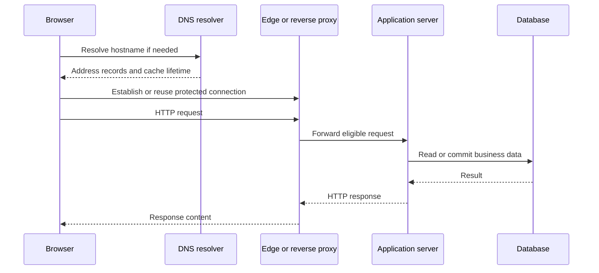

This is a responsibility diagram, not a packet-level trace. DNS may already be cached and connections may already exist. Some responses stop at the edge cache instead of reaching the application. At each step, ask what must happen before the next participant can make progress and where an observable delay could originate.

### Web servers and application servers

A **web server** accepts HTTP requests and serves responses. It may return static files, terminate TLS, compress responses, or reverse-proxy a request. An **application server** runs the business behavior behind an endpoint, such as checking an order's owner and reading its saved status. One program can perform both roles; they are not a requirement for two separate physical machines.

For example, an entry server can serve a versioned JavaScript file directly but forward `/api/orders/42` to an application. The application authorizes the caller and queries the database. A cacheable image may stop at the CDN before either server is involved. Choose separate deployments when security, operations, independent scaling, or runtime needs justify them, not merely because a diagram has two labels.

### The OSI model as a reasoning tool

The **OSI model** separates seven responsibilities: physical signals; data-link communication on a local link; network routing between networks; transport between application endpoints; session management; presentation of data; and application messages. These are reasoning layers, not necessarily seven separate programs.

Real Internet implementations are often described using the simpler TCP/IP model, and protocols do not always fit neatly into one OSI box. Use the model to locate a problem rather than forcing every library into a rigid category. A broken cable, incorrect route, TCP timeout, TLS certificate error, and HTTP authorization failure affect different responsibilities even if the user describes all of them as "the website is down."

These layers also explain load-balancer terminology. An L4 balancer commonly routes transport connections using addresses and ports. An L7 balancer can inspect application information such as HTTP host and path when it has access to the decrypted protocol. This is a difference in available information, not a universal ranking.

### TCP, UDP, flow control, and congestion

**TCP** supplies an ordered byte stream with retransmission, flow control, and congestion control. The application still defines message boundaries and meaning. Delivering purchase-request bytes does not prove the purchase committed. A connection failure before the reply leaves an uncertain result requiring a status check or safe retry.

UDP provides datagrams without TCP's built-in delivery and ordering behavior. It suits applications that implement their own behavior or prefer timely new information to waiting for old data. Real-time media and QUIC use UDP for different reasons. A protocol above UDP can add reliability and security; the transport choice alone does not determine application correctness.

**Flow control** protects the receiving endpoint; **congestion control** responds to network pressure. Neither knows database capacity or provider quotas. Application **admission control** limits accepted work to sustainable capacity. Larger network buffers may hide overload temporarily while increasing user waiting.

### HTTP and HTTPS

HTTP defines request and response semantics, including methods, status codes, headers, and representations. The application still defines what a successful response proves. `202 Accepted` commonly means work was accepted for later processing, not that its final effect is complete. The method, status, and body should express one consistent contract.

**HTTPS** carries HTTP over TLS, which verifies server identity and protects data in transit against reading or undetected changes. **Mutual TLS** also verifies the client's certificate. Neither grants access to a particular order: the application must still authorize the request.

Certificate verification checks the expected identity and accepted trust chain under the client's policy. Disabling verification to fix a certificate error removes protection. Production designs need issuance, renewal, expiry monitoring, and correct identity handling between proxies and backends. Encrypting the client-to-proxy connection does not automatically encrypt the proxy-to-backend connection.

### HTTP/1.1, HTTP/2, and HTTP/3

HTTP/1.1 supports persistent connections, but clients commonly use several connections for concurrent requests. Its request/response behavior and historical pipelining limitations can make slow responses interfere with other work on a connection. Reuse avoids repeated setup costs, but the benefit depends on the workload and network.

**HTTP/2** multiplexes request/response streams on one connection and compresses headers. It commonly runs over TCP, so lost TCP data can stall several streams. A few multiplexed connections may carry many requests, making connection count a poor load metric.

**HTTP/3** runs over **QUIC**, which uses UDP with its own security and connection handling. Streams recover more independently than over a shared ordered TCP stream, and connection migration helps when a phone changes networks. Congestion, overloaded servers, database locks, and slow providers still cause delays. HTTP methods, headers, and statuses retain their meaning.

Choose using support, infrastructure constraints, and measurements. A slow database query will not become efficient merely because a browser negotiates HTTP/3. Protocol improvements are valuable when they address the actual transport or connection overhead in a measured path.

### Connection lifecycle and practical diagnosis

Connection reuse avoids some DNS, transport, and TLS setup. Bound connection pools and define idle lifetimes: the remote end may close an idle connection, so reuse can fail. Long-lived connections may also stay attached to old instances after routing changes. Include that behavior in deployment and failover plans.

Suppose a product page loads while checkout fails. Checkout may use another hostname, route, authorization policy, or dependency. Inspect the failed request's real destination and timing. If it never reaches the handler, investigate network and proxy stages. If the handler begins quickly but waits on a database, changing DNS is unlikely to help. Layered reasoning turns a broad symptom into a testable hypothesis.

### Explain it back

Describe a page load from name resolution to database response. Then identify what TLS protects, what TCP protects, and what only the application can prove. A correct answer should not claim that successful transport delivery proves a purchase or reservation completed.

### Key Points to Remember

- Trace naming, connection setup, security, routing, and application work to locate delays.
- TCP delivers ordered bytes, not transactions. TLS protects connections and identity, not business permissions.
- HTTP/2 multiplexes over shared TCP recovery; HTTP/3 uses QUIC. Neither removes backend bottlenecks.
- Reuse connections with bounded pools and lifetimes. Live connections do not retain missed messages.

### Interview Catch

**The question:** "We upgraded to HTTP/3. Why is checkout still slow?"

**The trap:** Assuming a transport improvement removes every latency source. Serialization, proxy queues, database locks, provider calls, and overloaded handlers can still dominate the request.

**A stronger answer:** Measure client work, connection setup, proxy queues, handlers, database calls, and providers separately. HTTP/3 helps when transport costs matter, not when a query or handler dominates. Choose the fix from evidence, then remeasure complete checkout latency.

**Follow-up to expect:** "TCP acknowledged the bytes. Does that prove the purchase succeeded?" Explain that application acceptance and committed business completion require their own evidence and stable operation identities.

## 7. DNS, Proxies, and API Gateways

### DNS is a distributed naming system

**DNS** maps names to records such as addresses and aliases. A **recursive resolver** checks its cache, then follows the hierarchy if needed: root servers, top-level domain such as .com, and the domain's **authoritative servers**, which hold its official records. The resolver returns and may cache the answer.

An A record supplies an IPv4 address and an AAAA record an IPv6 address. A CNAME expresses an alias under DNS rules. MX records support mail routing, while TXT records carry information used for domain verification and other policies. DNS has more responsibilities than returning one IP address, but naming and endpoint routing are the usual starting point for application design.

**TTL** (time to live) sets how long an answer may be cached. Updating the official record neither clears every cache nor closes connections to the old address. Include caching, client behavior, and connection reuse in DNS failover estimates.

### DNS caching and TTL

DNS answers may be cached by the operating system, application, recursive resolver, and other participants. The **TTL**, or time to live, tells a cache how long an answer may be reused under DNS rules. A cached negative answer can also temporarily preserve a result that a name does not exist. Caches reduce lookup latency and authoritative-server load, but delay the visibility of changes.

Suppose a record points to region A with a five-minute TTL. Switching the authoritative record to region B does not erase an answer that a resolver obtained one minute earlier. That resolver may reuse the old answer for its remaining lifetime. An already-open connection may last longer still. Lowering a TTL immediately before a failure does not shorten TTLs already attached to cached answers.

Flushing a local DNS cache only affects that local cache. It does not flush every customer's browser, resolver, or connection pool. For a planned migration, lower the TTL ahead of time, wait for older lifetimes to elapse, and keep a compatible old endpoint during transition. For recovery, test cached answers, failed lookups, and existing connections as well as a clean first lookup. A TTL is a caching control, not a guaranteed end-to-end failover time.

### DNS availability and security

A resolver failure can prevent a client reaching an otherwise healthy service. A bad authoritative change can make healthy servers unreachable by name. Redundant naming infrastructure, cautious changes, and monitoring are part of real availability, not an optional detail outside the architecture.

**DNSSEC** verifies DNS data using signatures and a chain of trust; it does not encrypt queries. **Encrypted DNS** protects communication with the resolver. Neither replaces website TLS verification or application authorization. Name the boundary each protection covers.

Internal service discovery may use DNS names that resolve to changing endpoints. Hard-coding one instance address defeats that abstraction. Clients should follow the platform's intended resolution and connection lifecycle so deployments do not leave them attached indefinitely to dead instances.

### Anycast, GeoDNS, latency routing, and ALIAS records

There are two different decisions in global routing: which address a name resolves to, and how packets reach that address. DNS participates in the first decision. Internet routing participates in the second. The same global service can use both, but they are not interchangeable. Start by identifying which decision your chosen feature controls and what information it has about the user.

With Anycast, several locations advertise the same IP address through the routing system. Routers choose a path according to their routing policies, commonly using BGP. A nearby or well-connected location may receive the traffic, but "nearest" does not necessarily mean the smallest geographic distance or the lowest measured application latency. Anycast is useful for globally distributed DNS servers and edge services. It does not copy application data or decide which region owns a booking. Route changes can also affect long-lived connections, so a service needs an appropriate connection and recovery design.

GeoDNS returns different DNS answers based on an estimated location. A resolver may receive a European endpoint while another receives an Asian endpoint. However, the DNS server often sees the recursive resolver's location rather than the user's exact location. Supported mechanisms such as EDNS Client Subnet can provide additional information, with privacy and caching implications. Geographic routing is therefore an estimate based on available information, not proof of where an individual person is. It must not be the only control for a strict data-residency rule.

Latency-based DNS routing uses a provider's measurements or model to choose an endpoint expected to respond well from that area or network. It does not usually run a fresh end-to-end database request from every user's device before answering DNS. A low network delay also says little about whether a region's database is overloaded. Combine suitable routing policy with health information, capacity planning, and an application path that respects data ownership. DNS TTL and connection reuse still determine how quickly clients observe a changed decision.

An A record supplies an IPv4 address; AAAA supplies IPv6. A CNAME points one name to another name. DNS rules prevent a normal CNAME from coexisting with the other required records at a zone apex, such as example.com itself. Some DNS providers offer ALIAS, ANAME, alias records, or CNAME flattening to support similar convenience there. ALIAS is not a single universally standardized DNS record type with identical behavior across providers. The provider may resolve a target and synthesize address answers. Check supported targets, TTL behavior, health integration, and apex rules for the actual service.

**Real-life scenario: a travel site with regional entry points.** A traveler opens the site from Singapore. DNS returns an eligible regional address under the routing policy. An Anycast edge may receive the connection, verify TLS, and forward an allowed request. A booking write must still reach the region or database that owns that reservation. If Europe fails, a new DNS answer or route can direct traffic elsewhere, but the backup must also have working credentials, sufficient capacity, and an acceptable copy of the data.

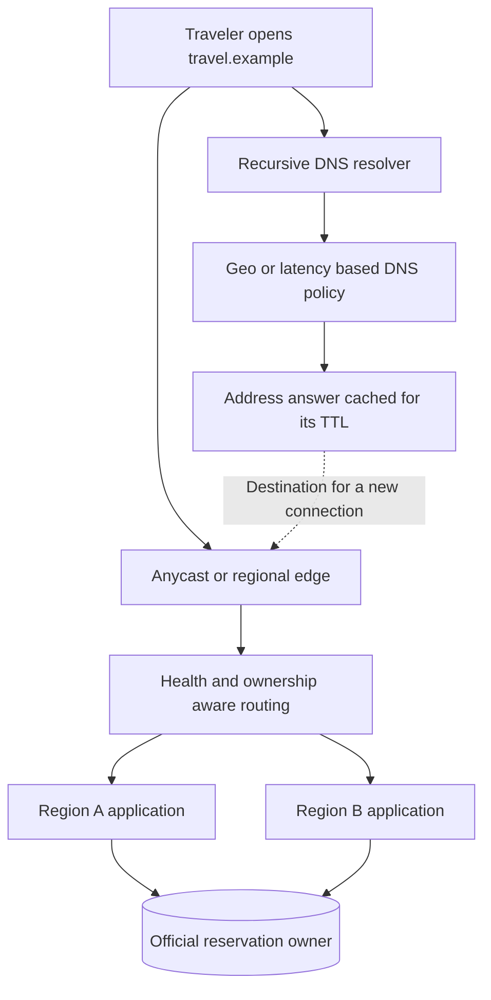

Read the diagram as two connected paths: name lookup chooses an address, while the actual application request travels through the edge and serving system. The dashed arrow is not a booking operation. This distinction helps diagnose failures. An incorrect DNS answer, a changed network route, a broken TLS certificate, and a database with no valid writer can all prevent booking for different reasons.

**Explain it aloud:** "Anycast influences the network path to a shared address. GeoDNS and latency-based DNS influence which address the resolver receives. They improve traffic placement, but they do not make failover instant or make every region's data current." Then explain how you would test a client with a cached old answer and an already-open connection.

### Forward proxy versus reverse proxy

A **forward proxy** represents clients. A corporate proxy can apply outbound policies and logging; external servers may see its address. HTTPS inspection requires an explicit TLS and certificate-trust setup, not just forwarding.

A **reverse proxy** represents servers. It receives inbound requests and may terminate TLS, route by host or path, limit requests, cache, or balance traffic. Clients need not know backend addresses. Remember which side it represents: requesting clients versus serving backends.

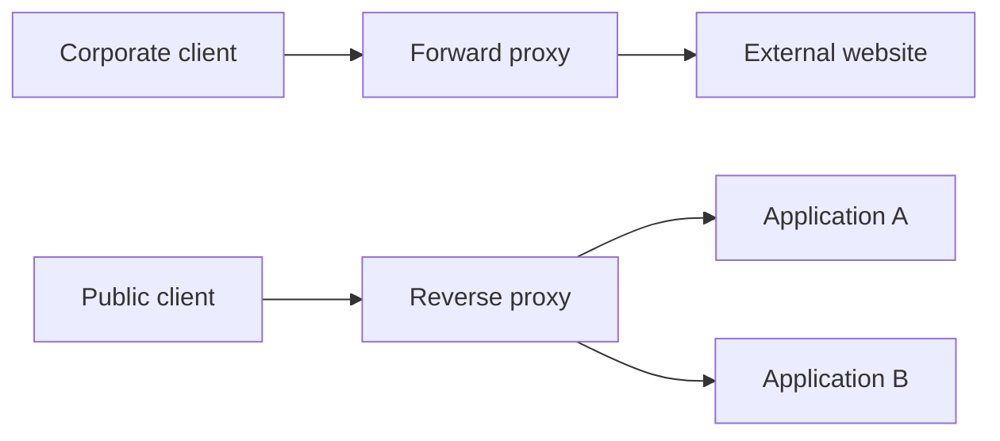

The upper path represents an organization's outgoing traffic; the lower represents an application's incoming traffic. Both may exist in one end-to-end request. Neither establishes the user's business permissions merely by forwarding packets.

### What an API gateway adds

An API gateway is an API-facing control point for policies such as authentication checks, quotas, routing, version handling, and telemetry. It can give clients a stable entry while internal services change. This is valuable when several teams expose APIs with common policy needs.

Do not put every business workflow in the gateway by default. Centralizing bookings, payments, and notifications couples their releases through one component. Separate entry policies from durable workflow ownership unless the gateway is deliberately designed to save and recover that work.

Gateways, proxies, and load balancers overlap in products. One product may perform all three roles. Explain responsibilities first instead of adding three nearly identical boxes just to mention technologies. A service mesh has another focus: service-to-service networking behavior, often including identity, routing, and telemetry. It is not a durable message bus.

#### NGINX, Envoy, and Kong in an application

NGINX is commonly used as a web server and reverse proxy, with capabilities such as TLS termination, routing, caching, and load balancing depending on its configuration and edition. Envoy is a network and application proxy often used at service entry points or between services. Its routing, telemetry, and traffic-control features can support a gateway or service mesh. Kong is an API gateway platform with policy and plugin capabilities for concerns such as authentication, request limits, and API management. Products overlap, so compare the configured responsibility rather than drawing a mandatory box for each brand.

Imagine a shopping app calling a public orders endpoint. The entry proxy can reject an oversized body, require supported authentication, attach a correlation ID, and route the request. A gateway can apply a customer's API quota or manage versioned routes. None of this proves that the customer may access the order ID in the request. The order service still checks the actual resource and business rule. Syntactic validation at the edge and business validation at the owner solve different problems.

Aggregation means combining several backend results into one client response. For a product page, an API gateway or BFF might fetch product details, stock display, and recommendations. Set a limit on fan-out and decide which results are essential. A failed recommendation lookup need not prevent the page from showing the product. Keep durable checkout coordination separate unless the gateway is deliberately designed to own and recover that workflow. A convenient place to make several calls is not automatically the right owner of a payment saga.

**Explain it aloud:** "The proxy or gateway controls entry and routing. The business service decides the valid operation on its data. I choose NGINX, Envoy, Kong, or a managed option by the policies, operating model, and integrations I actually need." This avoids treating a product choice as an explanation of the architecture.

### Forwarded information and trust

A backend may need the original client's address, host, or scheme after a request passes through a proxy. Forwarded headers carry such information, but an untrusted caller can send misleading values too. Configure which proxies the backend trusts and how it interprets the chain.

These trust rules affect redirects, secure cookies, request limits, and audit logs. If a caller can choose the address that your rate limiter trusts, it may bypass an IP-based limit by changing a header. Establish identity through validated authentication, then check the caller's permissions. An apparent network address is not a substitute for either step. Also control which backend paths the gateway exposes. A route intended only for internal use must not become public just because the gateway forwards any path a caller supplies.

### Service discovery in practice

**Service discovery** finds usable instances. With client-side discovery, the caller selects an endpoint; with server-side discovery, a routing layer selects it. DNS, registries, or orchestration platforms supply the list, allowing addresses to change without hard-coded callers. Discovery is a recent observation, not a guarantee that the next call succeeds.

Registrations and health observations can become stale. A failed request still needs bounded handling even if discovery said the instance was healthy moments ago. Registries themselves require availability and security. A discovery mechanism reduces hard-coded coupling; it cannot make networks perfectly reliable.

### A regional travel application

Consider a travel application with regional endpoints. Global routing directs a client to an appropriate region; a gateway validates access and quotas; load balancing selects a healthy booking instance. The booking service still checks ownership of the requested reservation.

If one region fails, changing routing can move new requests, but it does not guarantee the other region has every recent write. Sessions, cached DNS, and data ownership matter. Endpoint failover and data failover must be designed together rather than treated as independent checkboxes.

### Check your understanding

Explain why a corporate proxy is not the same role as a public API gateway. Then explain why changing DNS does not prove every user immediately stopped using an old backend. Include cached answers, existing connections, and the location of authoritative data.

### Key Points to Remember

- DNS updates do not invalidate every cached answer or existing connection.
- Forward proxies represent clients; reverse proxies represent servers. One product may also provide gateway and balancing roles.
- Discovery and health data can be stale. Keep deadlines and failure handling.
- Trust only the configured proxy chain. Forwarded headers and network location do not replace identity or authorization.

### Interview Catch

**The question:** "The primary region failed, so we changed DNS. Is failover now complete?"

**The trap:** Equating destination selection with complete service recovery. Clients may retain old connections, while the new region may lack current data, credentials, capacity, or valid write ownership.

**A stronger answer:** Check cached addresses and old connections, then backup credentials, capacity, and data. Establish the new writer and prevent the old primary from writing. State replication lag and possible data loss. Failover is complete when required business operations work under those rules, not when DNS changes.

**Follow-up to expect:** "Can the backend trust X-Forwarded-For for rate limiting?" Explain trusted proxy configuration, spoofable client headers, and why an authenticated tenant or user quota may be more appropriate than IP identity alone.

## 8. API Contracts and Communication Styles

### An API is a promise between components

An **API contract** defines how callers request work and interpret results: URLs, fields, authorization, validation, errors, deadlines, pagination, and retry safety. Callers build workflows around these promises. Changing a response's meaning can break them even when its JSON shape stays unchanged.

An SDK is client code that helps use an API or platform. It may supply typed models, serialization, authentication helpers, and retries. The SDK is not the API itself, and its default retry behavior may not suit every business operation. Understanding the underlying contract remains necessary when debugging uncertain outcomes or upgrading a client library.

### REST-style HTTP APIs

A resource-oriented API might use `GET /orders/42` to retrieve an order and `POST /orders` to request creation. PUT commonly replaces a representation at a known identity; PATCH applies a defined partial modification. The actual operation must still be described precisely. "Set quantity to five" and "increase quantity by one" have different duplicate behavior.

**GET is safe:** it requests a read, not a purchase or other business change. **Idempotent** methods promise the same intended effect when repeated. A POST can also support safe retries through an application idempotency key. Methods express the contract; database rules and application logic must enforce it.

REST also emphasizes a uniform interface, stateless requests, cacheable representations where appropriate, and resource relationships. In practice, many APIs described as REST are pragmatic resource-oriented HTTP APIs rather than strict implementations of every REST constraint. In an interview, explain the contract you mean instead of assuming the label settles every design detail.

### HTTP status and error semantics

A 2xx response means success under the endpoint's contract. `201 Created` can identify a newly created resource, while `202 Accepted` means processing was accepted but may remain unfinished. A `204 No Content` response has no response body. Callers need these distinctions to avoid displaying a completed business result when only acceptance occurred.

The 3xx class concerns redirection. Some redirects preserve method and body while others are historically used to redirect to a retrieval operation, so select the appropriate status for the intended behavior. A redirect target must also be controlled; accepting an arbitrary untrusted destination can create a security problem.

**4xx** codes concern the request or access: `401` requires valid authentication; `403` refuses access; `409 Conflict` reports a state conflict; `412 Precondition Failed` reports a failed supplied condition; `429 Too Many Requests` signals a rate limit. **5xx** codes report server-side failures, including gateway failures. A write may already have committed before a timeout or error response, so do not infer "nothing happened."

Give errors stable categories and a correlation identity, while avoiding secrets and sensitive internals. A caller should know whether to correct input, refresh state, retry under a budget, or query an uncertain operation. An HTML stack trace from an internal framework is not a useful public API contract.

### RPC and gRPC

Remote Procedure Call represents a remote operation as a callable method with defined input and output. It can provide clear typed contracts, but a remote call is not an ordinary local function. Serialization, network delay, independent failure, deadlines, and compatibility remain part of its behavior.

gRPC commonly uses Protocol Buffers and efficient binary serialization, and supports unary and streaming interactions. It is useful for controlled internal APIs with strong tooling requirements. Browser support, infrastructure, public-client needs, and troubleshooting practices influence whether it fits a boundary.

In **Protocol Buffers**, field numbers identify encoded fields. Reusing a number with a new meaning can break old clients; compatible additions are usually safer. Generated types neither guarantee semantic compatibility nor prevent duplicate payments. Preserve field meaning and implement operation-level retry safety.

### GraphQL

GraphQL lets a client select fields through a typed schema. A mobile product page can request fewer fields than a desktop console, reducing some over-fetching and endpoint proliferation. The server takes on query planning, resolver efficiency, field-level authorization, and resource-limit responsibilities.

GraphQL can hide backend fan-out. Loading 100 orders, then fetching each customer separately, creates 1 + 100 queries: the **N+1 problem**. Batch lookups or use a request-scoped loader. Bound nesting depth, query cost, page size, and execution time; one HTTP request can still be expensive.

Caching also needs deliberate design because query shapes vary. Object-level authorization must still apply even when the top-level endpoint accepts the request. GraphQL is valuable when client composition benefits justify these costs; it does not universally replace REST or RPC.

### SOAP, webhooks, and asynchronous interfaces

SOAP uses structured XML messages and a formal ecosystem of contracts and standards. It remains useful in established enterprise integrations where those contracts and tools already exist. A new simple API may not need that ecosystem, but an existing SOAP integration is not automatically architecturally wrong.

#### Webhooks

A **webhook** is an event-triggered HTTP call, such as a payment-status notification. Its receiver can be unavailable or process the event before losing its reply. Use durable attempt records, sender/signature verification, duplicate handling, retry limits, and monitoring. An `eventId` helps only if the receiver checks it.

For a payment callback, verify the signature over the required original request bytes and apply the provider's timestamp or replay checks. Find the intended payment using a stable provider identity. Save the accepted event or apply the change atomically before acknowledging it under the agreed contract. Expensive follow-up work can run asynchronously after durable acceptance; an in-memory task is not enough to promise survival after restart.

Callbacks can arrive twice or out of order. Do not change a paid order back to pending merely because an older event arrives later. Use valid state transitions, event versions where available, and a provider status lookup when the result is uncertain. A missing webhook should be recoverable through reconciliation. The callback is a notification mechanism, not the only possible record of a payment.

#### Asynchronous request-reply

**Asynchronous request-reply** accepts now and completes later. Return `202 Accepted` with an operation ID for status lookup or later notification. Save the job before replying if acceptance promises restart survival. Define completed, failed, cancelled, and expired states, plus result retention. The ID must resolve to reliable saved state.

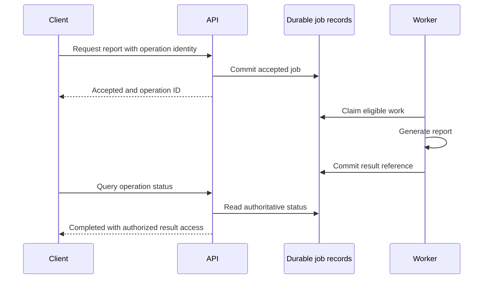

The worker's claim must be recoverable after a crash, and repeating a job must not create conflicting authoritative results. The diagram shows the contract boundary, not a promise that a process-local task survives restart. A durable queue can be used to schedule work, but the application still needs truthful job state and result ownership.

### Polling, SSE, and WebSockets

Short polling repeatedly asks for new information. Long polling holds a request until an update or timeout occurs, reducing empty responses. Both can be suitable when scale and latency expectations fit. A simple status page does not automatically need a permanent socket.

#### Server-Sent Events (SSE)

**Server-Sent Events (SSE)** stream server-to-client updates over HTTP, useful for dashboards. The browser opens a response stream and the server sends text events as new information becomes available. Client commands can still use ordinary HTTP requests. This is often enough for report progress or notifications where the server needs to push updates but the client does not need a continuous two-way channel.

The event stream needs authorization, connection limits, heartbeat and timeout handling, and compatible proxy buffering settings. Event IDs can support resuming from a last-received position only when the server retains enough history to serve that position. If retention has expired, return a fresh snapshot or require a state refresh. An automatically reconnected transport does not prove that no business update was missed.

#### WebSockets

**WebSockets** support two-way messages over a long-lived connection, useful for chat, collaborative tools, and interactive updates. A common HTTP/1.1 setup uses an Upgrade handshake; newer HTTP versions have their own supported mechanisms. Once established, both sides can send frames without making a separate request-response exchange for every message. The application still defines message types, ordering rules, permissions, and acknowledgement meaning.

For chat, first authorize the user and conversation. Give each outgoing message a stable identity, save accepted messages, and distinguish server acceptance from recipient delivery and read status. If a connection drops after a send, retry using that identity or query the saved outcome. On reconnect, fetch messages after a saved cursor rather than assuming the socket remembers history.

Open connections consume memory and file descriptors, and slow receivers need bounded buffers or disconnection policies. Reconnect bursts can overload a recovering fleet. Load balancers must support the connection lifetime, and draining should allow a controlled reconnect. Both SSE and WebSockets need limits, authentication, and reconnect handling. A live connection is not message history or a substitute for durable storage.

### Pagination and stable results

Offset pagination skips a count before returning a page. It is straightforward for small administrative lists, but large offsets may be expensive and concurrent changes can move records between pages. A user scrolling a changing feed can see repeats or miss items.

**Cursor/keyset pagination** continues from a stable sort position. A timestamp plus unique ID provides an unambiguous tie-breaker. Encoding a cursor hides its format, not its validation or authorization requirements. A changing feed may tolerate live results; an exact historical report may need a fixed snapshot across pages.

### Performance and evolution

API performance improves through suitable queries, batching, selected fields, compression, connection reuse, eligible caching, and bounded concurrency. A client downloading a megabyte to display three values may need a better representation before another server. A database-bound endpoint may need a query fix rather than a protocol change.

Prefer compatible additive changes when possible. Mobile and partner clients may not update immediately after a server deployment. Version contracts when their meaning must change, track usage, and give consumers a migration path. A successful deployment is not proof that every old client can interpret its results.

### A worked example

A mobile banking application requests a bounded, cursor-paginated transaction history authorized for the signed-in account. Each item has a stable transaction identity and ordering key. The displayed balance has an explicit freshness contract, while a new transfer uses authoritative validation and a stable operation key. Pagination, readable errors, and idempotency work together to make the experience understandable when the mobile network drops.

### Key Points to Remember

- Contracts include permissions, errors, completion, pagination, retries, and compatibility. SDKs do not redefine them.
- Choose the interface for the caller's needs and measure backend work, not just HTTP request count.
- Separate acceptance from completion. Implement idempotency, and treat timed-out writes as potentially committed.
- Cursors need stable ordering and tie-breakers. Exact reports may also need snapshots.

### Interview Catch

**The question:** "GraphQL returns everything in one request. Does that automatically make it faster than REST?"

**The trap:** Counting network requests while ignoring resolver fan-out, N+1 database queries, authorization work, and unbounded query shapes. Smaller frontend traffic can conceal larger backend cost.

**A stronger answer:** Compare screen needs with resolver work. Batch reads, authorize objects and fields, and bound nesting, query cost, pages, and time. Measure user latency and server resources. A predictable REST endpoint may be simpler and faster; GraphQL earns its cost when flexible client composition is useful.

**Follow-up to expect:** "The create request timed out; should the SDK generate another request ID?" Preserve the same business operation identity for the same intent and reject reusing that key with different input.

## 9. Application and Client Architecture

### Layers separate real responsibilities

**Presentation** handles requests and display; **business logic** applies pricing and cancellation rules; **persistence** reads and writes data. Separate them so another client cannot bypass a rule kept only in a button handler, and a query change does not require rewriting every screen.

Layers become ceremonial when they only forward data through many files without clarifying ownership. Use abstractions to describe meaningful behavior or isolate a dependency, not to maximize interfaces. A small understandable module can be better than a large framework of empty indirection.

### Modular monoliths and microservices

A modular monolith packages business modules into one deployment with explicit internal boundaries. It offers straightforward local transactions and debugging, and can scale horizontally for many workloads. Clear domains and background queues do not require separately deployed services.

#### Microservices

Microservices split selected capabilities into independently deployable units. A catalog team may need different scaling and release cadence from payment processing. This can improve ownership and selective change, but adds network calls, partial failures, distributed tracing, compatibility, and cross-service recovery.

A **distributed monolith** splits deployment without gaining independence: features require coordinated releases, and long call chains share failures. Prefer boundaries around business capabilities such as billing or enrollment, not one service per table. More deployables alone do not improve ownership.

### Bounded contexts and data ownership

A **bounded context** gives business terms an agreed meaning within one area. Marketing's "customer" may be a prospect; billing's may be a verified payer. Use focused models and explicit translation instead of an enormous shared object that couples unrelated changes.

**Database-per-service** means authoritative write ownership, not necessarily a separate physical server. Other services use supported APIs or events. Unrestricted cross-service table writes couple rules and schemas, hinder independent releases, and obscure who repairs inconsistencies.

When a workflow spans contexts, either keep the required transaction local where appropriate or design explicit coordination. A network call plus a local commit is not automatically atomic. Part II explains the patterns that make these handoffs recoverable. Splitting ownership also requires deciding how other services obtain reference data and tolerate delayed updates.

### Client patterns: MVC, MVP, and MVVM

Model-View-Controller separates data/domain representation, display, and input/control responsibilities. Model-View-Presenter puts presentation coordination in a presenter that can be tested independently of the concrete view. Model-View-ViewModel exposes view-oriented state and behavior, often through data binding. Frameworks interpret the names differently, so understand responsibilities rather than relying on labels alone.

All three organize screen behavior: loading, errors, and selections. The server still authorizes purchases and reserves stock. An **optimistic UI** displays an expected change before confirmation; on rejection, correct the display and explain the outcome. Early display is not proof of success.

Server-side rendering can provide useful initial content and predictable navigation. Single-page applications move more interaction state into the browser. Hybrid rendering and hydration combine server-generated markup with client behavior. Choose based on interactivity, initial-load performance, SEO, caching, device constraints, and team capability.

### Backend for Frontend

A Backend for Frontend, or BFF, tailors an API to a client family. Mobile clients may benefit from smaller responses and fewer round trips than an administrative desktop application. A BFF can compose domain services into suitable client views without teaching each domain service every screen layout.

Bound BFF fan-out and deadlines. Decide which results are essential: slow recommendations need not block order details. Client composition does not automatically make the BFF responsible for durably saving and recovering every business workflow.

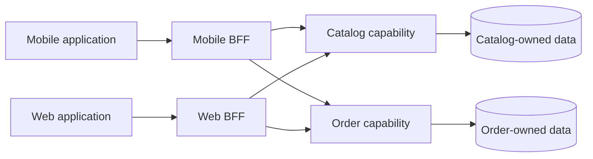

The BFFs shape client responses; domain capabilities retain their rules and ownership. For a small product, two BFFs may be unnecessary. The pattern is useful when client requirements genuinely diverge. The separate data symbols indicate logical ownership, not a requirement to buy a database server for each box.

### KISS, SOLID, and decisions that can evolve

KISS encourages the simplest understandable solution that meets the requirements. It does not mean ignoring known failure windows. An outbox can be necessary complexity for reliable publication, while ten speculative service boundaries may be unnecessary complexity. Simplicity must be evaluated against the real requirements, including failure behavior.

**SOLID** encourages clear responsibilities, extension without repeatedly changing stable code, substitutable implementations that keep their promises, focused interfaces, and business rules depending on suitable abstractions. Apply these principles to ease change and testing, not to multiply empty interfaces and forwarding classes.

Record important choices with context, alternatives, and consequences. An architecture decision record explaining why a modular monolith was chosen helps future engineers recognize when its assumptions change. Diagrams should show trust boundaries, storage ownership, and meaningful arrows; they are models of behavior rather than infrastructure decoration.

### Object-oriented programming and interfaces

Low-level design explains how one component keeps its promises inside the code. **Encapsulation** keeps state changes behind methods that protect an invariant. A reservation object should not allow arbitrary callers to replace its status with any string. Its operations can express valid transitions such as confirm, expire, or cancel. Persistence still needs concurrency protection because an object in one process cannot exclude a writer in another process.

An **interface** describes a contract, such as a payment provider accepting an operation identity and returning a known or uncertain result. **Polymorphism** allows different implementations to obey that contract. **Composition** builds behavior from collaborators rather than requiring a deep inheritance tree. Use inheritance only when substituting the subtype preserves the promises callers depend on, including errors and side effects.

For a report service, separate report rules, storage, and notification dependencies so a calculation can be tested without sending email. Define who owns deadlines, cancellation, duplicate handling, and error translation. UML can illustrate these relationships, but adding a class per database table or an interface per function does not by itself produce a useful low-level design.

### DRY, KISS, and YAGNI

**DRY**, or Don't Repeat Yourself, means keeping a business rule's knowledge in one authoritative place. If three endpoints calculate the same tax rule independently, a policy change may update only two of them. Share the rule where its meaning is genuinely the same. Similar-looking code in unrelated domains does not always represent the same rule, so premature sharing can couple changes that should remain independent.

**KISS**, or Keep It Simple, favors an understandable design that meets the actual requirements. A local transaction can be simpler than a distributed saga when the data belongs together. A durable outbox can still be necessary simplicity if the alternative loses accepted events on a crash. Simplicity is measured against the required behavior, not just line count.

**YAGNI**, or You Aren't Gonna Need It, discourages building hypothetical capabilities before there is a reason for them. Do not add configurable multi-region routing to a small internal tool solely because a future customer might request it. Keep real trust, backup, and correctness requirements, and record assumptions so the team knows when the design must evolve.

### UML diagrams

**UML**, the Unified Modeling Language, offers diagram types for different questions. A class diagram shows types and relationships; a sequence diagram shows participants and messages over time; a component diagram shows larger modules and dependencies; a state diagram shows allowed states and transitions. Select the diagram for the question instead of fitting every concern into one crowded picture.

For an order, a state diagram can make clear that pending may become paid, cancelled, or expired, and that a late callback needs a defined transition. A sequence diagram can then show the request, database commit, lost reply, and retry. These diagrams complement each other: timing does not define every allowed state, and a state list does not show which participant sends each message. Show important failure paths and transaction boundaries, not only a successful sequence.

### Design patterns

A design pattern names a recurring arrangement of responsibilities. **Strategy** separates an interchangeable policy, such as shipping-price calculation, from the workflow that uses it. **Factory** centralizes creation when choosing and configuring an implementation is meaningful. **Adapter** translates an external provider's contract into the application's own contract. **Observer** notifies interested local participants when something changes.

For payments, a provider adapter can translate response formats while preserving the difference between rejected and unknown outcomes. A strategy can choose a pricing rule without changing the checkout workflow. Neither pattern automatically makes a remote payment atomic with the local order. Likewise, an in-process observer does not provide the durable delivery of an external message broker.

Use a pattern when it simplifies a real variation point, dependency, or responsibility. Describe what problem it solves and which costs it adds. An interface with one trivial implementation can be unnecessary today; the same boundary can be valuable when it isolates a costly or failure-prone dependency in tests.

### Maintainability

Maintainability is the ability to understand, diagnose, and change a system without disproportionate effort or risk. It depends on cohesive modules, clear data ownership, observable behavior, useful tests, and documented decisions. A service with a fashionable technology stack can still be hard to maintain if nobody knows who owns a failed job or how to restore its data.

Consider changing a discount rule. A maintainable design makes the authoritative rule easy to find, tests its important cases, and exposes the change through a compatible contract. The team can deploy the change, measure its results, and recover if needed. Track practical evidence such as change lead time, repeat incidents, and recovery effort rather than assuming that more services or more abstraction automatically improves maintainability.

### Multi-tenant architecture and isolation

A **tenant** is a customer or organization whose users share one application boundary. Multi-tenancy lets several customers use shared infrastructure while keeping their records, permissions, configuration, and resource consumption appropriately separate. It is not only a database-table decision. Tenant identity must remain correct through requests, cache entries, background jobs, object storage, logs, exports, and administrative operations.

**Worked example:** two clinics use the same appointment service. Clinic A's user requests appointment 73. The service derives the permitted tenant from verified identity and membership, then queries within that scope. Accepting `tenant=B` from a request without checking membership would let the caller choose its own authority. An appointment ID that is difficult to guess is still not an authorization check. A cache key such as `appointment:73` can also leak information if identifiers overlap between tenants; include the required tenant and representation context.

| Storage arrangement | Useful when | Main responsibilities |
| --- | --- | --- |
| Shared tables with a tenant key | Many small tenants have similar requirements | Scope every access, enforce suitable constraints, and test isolation |
| Separate schemas | Logical separation and some customization help | Manage schema migrations, connections, permissions, and tenant count |
| Separate databases | Stronger operational separation or tenant-specific recovery matters | Provisioning, upgrades, backups, cost, and routing across many databases |

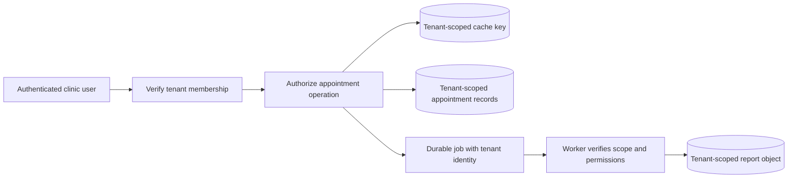

Shared storage needs more than a filter added by convention. Consider database-enforced row policies where appropriate, tenant-scoped unique keys and foreign keys, and deliberately privileged administrative paths. Separate databases reduce some accidental cross-tenant query risks but do not fix a routing layer that selects the wrong database or a report download that skips permission checks. Test both ordinary and privileged paths using fictional tenants.

A **noisy neighbor** is a tenant whose workload harms others through shared resources. One clinic running a large export can exhaust a common connection pool even if every query is correctly authorized. Apply per-tenant concurrency, request and job budgets, fair queueing, and limits on expensive queries. Monitor latency and backlog by useful tenant cohorts without exposing private identifiers or creating unbounded metric labels.

Large tenants may move to dedicated resources. A migration needs a tenant-to-placement mapping, a copy and catch-up phase, a verified routing change, and protection against writes reaching both old and new owners incorrectly. Plan rollback, backup/restore scope, encryption keys, retention, and data residency. The simplest initial arrangement can be shared tables if its controls meet the requirements; dedicated infrastructure is a tradeoff, not an automatic definition of security.

**Practice check:** all database queries contain a tenant filter, but users occasionally download another clinic's report. Where should you investigate?

**Answer:** trace the complete path: job creation and worker context, result metadata, object key, cache key, signed access, and the download authorization. Database filtering alone does not establish end-to-end isolation. Add a regression test at the boundary that actually returned the other tenant's data.

### A learning-platform example

A course platform can begin with accounts, content, enrollment, and billing modules in one application. Videos live in object storage and use CDN delivery; transcoding is asynchronous. This already involves distributed responsibilities without requiring every business module to become a microservice.

If transcoding later needs specialized hardware and independent scaling, extract it behind a stable job contract. Keep simple modules together until a real ownership or operational need justifies another split. The architecture evolves from evidence rather than from a rule that every large application must have the same shape.

### Explain it back

Explain when a modular monolith is a good decision, when a service boundary earns its cost, and why MVC or MVVM does not determine whether a backend is distributed. These ideas describe different levels of architecture and should not be used interchangeably.

### Key Points to Remember

- Split deployments for clear ownership, independent releases, or distinct resource needs, not to enable ordinary modularity or queues.
- Coordinated releases and long dependent call chains may indicate a distributed monolith.
- Database-per-service defines write ownership, not mandatory physical separation.
- BFFs shape client data; domains own rules. MVC, MVP, and MVVM address another architectural level.

### Interview Catch

**The question:** "We have a large codebase. Should we create a microservice for each database table?"

**The trap:** Choosing network boundaries from storage implementation details. Closely related invariants may then require distributed coordination, and small changes can demand several simultaneous deployments.

**A stronger answer:** Identify business capabilities, data owners, atomic changes, and responsible teams. Start with modules; extract services when independent releases or capacity justify network and operational costs. Define compatible interfaces and recovery for cross-service workflows. One service per table does not establish those guarantees.

**Follow-up to expect:** "Why not put all orchestration in the API gateway?" Distinguish edge policy and client composition from durable business workflow ownership, and explain the coupling created by centralizing unrelated domain behavior.

## 10. Load Balancing and Application Scaling

### Distributing work is different from creating capacity

A load balancer selects an eligible backend for incoming traffic. Imagine a restaurant host directing guests to available tables. The host can use existing space more effectively, but cannot make the kitchen cook unlimited meals. Similarly, balancing requests across API instances does not remove a database bottleneck or increase a payment provider's request allowance.

**Vertical scaling** adds CPU, RAM, or other resources to one machine. **Horizontal scaling** adds instances, providing capacity and redundancy when work can be shared safely. Instance-local state can break requests routed elsewhere. Neither guarantees linear gains: a shared database, lock, or provider may remain the bottleneck.

Autoscaling changes resource allocation according to policy and measurements. Load balancing distributes traffic among the resources already available. Confusing them leads to claims such as "the load balancer handles any traffic spike" without explaining where additional capacity comes from or how long it takes to start.

#### Vertical scaling

**Vertical scaling**, or scaling up, gives one machine more CPU, RAM, storage performance, or network capacity. A database whose active indexes no longer fit in memory may benefit from a larger memory budget without changing its data model. A CPU-heavy application may complete more work on a larger instance, provided the work can actually use the additional cores.

This is often the simplest first capacity change. The tradeoffs include hardware or service-tier limits, cost jumps, and possible restart or migration downtime. It does not automatically remove a single point of failure. More RAM will not fix a serialized business lock, and a larger application server will not increase a remote provider's quota. Measure the saturated resource and the resulting throughput before assuming a larger machine solved the bottleneck.

#### Horizontal scaling

**Horizontal scaling**, or scaling out, adds machines or application instances and shares eligible work among them. For example, four stateless product API instances can serve independent requests behind a load balancer. Sessions and accepted operations must live in shared or otherwise recoverable state so the next request can use another instance safely.

The capacity gain depends on how much work can be divided. All four instances may still contend for the same database, hot key, or payment quota. Connection pools and retries multiply with the fleet. A background queue can distribute independent jobs, but it cannot split a required per-account ordering rule without changing the design.

Scale up and scale out are complementary choices, not a universal ranking. Start with measurements, define the state and coordination model, and include startup delay, draining, and failover. A useful scaling experiment increases load gradually while checking latency, completed work, errors, and pressure on shared dependencies. Adding instances is only successful if the complete service improves under its actual workload.

### L4 and L7 balancing

An L4 balancer uses transport-level information such as address, port, and connection identity. It can support TCP or UDP traffic without understanding each application request. Its selection is often connection-oriented, so one long-lived connection may remain attached to the same backend for a long time.

An L7 balancer understands application information such as HTTP host, path, headers, and request boundaries. It can route image requests differently from payment APIs or direct a small portion of eligible traffic to a new release. TLS termination is often involved when the balancer needs to inspect HTTPS requests. Protect the backend connection according to the trust model rather than assuming internal traffic is harmless.

Global routing selects among regions or broad endpoints; regional balancing selects among local backends. Products can combine these functions, but a diagram should still make the ownership of routing and health decisions clear. A global endpoint is not proof that data is globally writable with no conflicts.

### How balancing algorithms choose

Round robin rotates requests across backends. It is simple and works reasonably when instances and request costs are similar. Weighted round robin sends more traffic to instances assigned larger weights, which can represent capacity differences or a controlled rollout. The weights must reflect reality; a nominally larger instance with a saturated dependency may not be ready for more work.

Least-connections routing prefers backends with fewer active connections. It can help with long-lived connections of variable duration, but HTTP/2 multiplexing makes connection count a weak proxy for request load. Least-outstanding-requests considers active requests instead. Even that may misjudge a backend running one extremely expensive report versus another serving several cached reads.

Response-time or workload routing depends on potentially stale measurements. Sending every request to the latest "fastest" server can oscillate load. **Power-of-two-choices** compares two candidates and selects the less-loaded one, avoiding a full-fleet scan. Use an inexpensive signal that reflects actual work.

**Hash-based routing** keeps related requests together but can overload the owner of a hot key or shared IP. **Consistent hashing** limits reassignment when membership changes. It does not move data safely, replicate it, split a hot key, or guarantee database read consistency.

IP hash is a particular hash-based routing choice: the balancer hashes the client's IP address to select an instance. It can preserve useful affinity for some workloads, but many users behind one NAT or corporate proxy may share that address. A mobile client's address may change as it moves between networks. IP hash therefore does not guarantee an even workload or a durable user session. Keep session recovery and authenticated user identity separate from the routing hint.

### A consistent-hashing ring with virtual nodes

Consistent hashing is a way to choose a node for a key while limiting how many assignments change when nodes join or leave. Begin with the simpler alternative: calculate a key's hash and take the remainder after dividing by the node count. This can distribute many keys reasonably well, but changing the node count changes the divisor. Many keys may then map to different nodes, which can cause a large cache-miss burst or a large data move.

A hash ring treats the hash space as a circle. Both keys and node positions are mapped into that space. To locate a key, move clockwise from the key's position to the first node position. Real systems use a large hash space; a circle from 0 through 99 is enough for an example. Put node A at 10, node B at 40, and node C at 70. A key at 22 belongs to B. A key at 55 belongs to C. A key at 85 wraps around and belongs to A.

If B leaves, the interval that belonged to B moves to its next eligible successor, C. The key at 22 now maps to C, while the key at 85 still maps to A. Most unaffected intervals do not need new assignments. If a new node is placed at 30, it takes the relevant interval from its successor instead of forcing every key in the system to move. The word "consistent" describes this limited remapping. It is unrelated to a database's promise that every read sees the latest write.

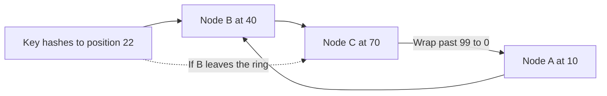

One position per physical node often distributes ownership unevenly because the gaps between positions differ. Virtual nodes solve part of that problem by giving each physical node several positions on the ring. The node owns several smaller intervals spread around the circle instead of one large interval. A higher-capacity machine may receive more virtual positions under a weighted policy. More positions generally smooth distribution across many keys, but increase metadata and movement bookkeeping. They are logical ownership points, not extra machines or CPU cores.

**Real-life scenario: expanding a product cache.** Three cache nodes serve a large catalog. You add a fourth node before a planned sale. Consistent hashing limits which keys get a new home, reducing the amount of cached data that becomes unavailable at its expected location. Clients still need a consistent view of membership during the transition. A new assignment is initially a cache miss unless data is transferred or warmed. Limit database fallback and warm useful keys gradually. An assignment algorithm does not physically move cached values by itself.

The same technique needs more care for primary storage. Moving a shard requires copying data, following writes made during the copy, switching routing, and preventing an old owner from accepting incompatible changes. Replication also needs a separate policy, often placing copies on distinct physical failure domains rather than several virtual nodes on one machine. The ring answers where a key should go. It does not supply backups, durable writes, migration correctness, or consensus about membership automatically.

A hot key remains an important limit. If one popular product receives half the traffic, giving the cluster more virtual nodes does not divide requests for that one key among every machine. Consider sharing repeated reads, a short-lived local cache, supported replication for reads, or a representation that can be split safely. If the work must remain strictly ordered for one entity, extra nodes do not remove that business constraint.

**Explain it aloud:** "Hash keys and node positions into a ring, then choose the next node clockwise. Virtual nodes spread each machine's ownership across smaller intervals. Membership changes move only affected ranges, but migration, replication, and hot-key handling are separate jobs." A useful follow-up is to draw the assignment of key 22 before and after node B fails and explain what the first reader does at the new owner.

### Health checks and graceful removal

**Liveness** asks whether a process needs restarting; **readiness** asks whether it should receive work; **startup** checks allow initialization. A slow shared database need not mean every API process is unhealthy. Restarting them can remove capacity and create connection storms without fixing the database.

Readiness should reflect what the instance can serve, and health observations have delay. A request can fail immediately after a successful probe. Timeouts, bounded retries, and idempotency are still required. Health checks reduce avoidable routing to bad instances; they do not predict the future perfectly.

Connection draining stops new assignments while allowing eligible in-flight work to finish within a limit. During shutdown, a queue worker should stop receiving new messages and settle or release existing work correctly. A WebSocket server may ask clients to reconnect. After the deadline, interrupted work must remain recoverable rather than disappear.

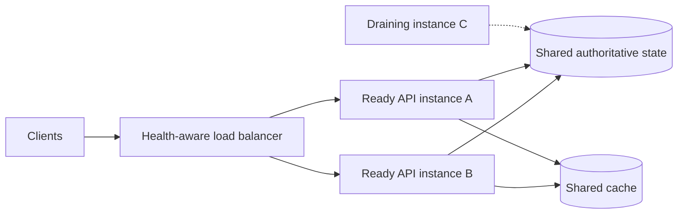

New requests go to ready instances. The draining instance can finish existing work but receives no new assignments. Shared state makes an instance replaceable; the cache improves eligible reads but is not the only copy of accepted business operations.

### Statelessness and session affinity

A **stateless instance** holds no irreplaceable client state needed by the next request. State still exists in databases, protected shared sessions, tokens, or durable workflows. Another instance can continue without losing accepted work. Statelessness means replaceability, not that all data is disposable.

Sticky sessions try to route a client back to the same backend. They can help legacy applications, but do not preserve in-memory sessions after that backend dies. They also complicate load distribution and scaling. Prefer a deliberately shared or externally represented session model when possible, while recognizing the security and revocation requirements of that model.

### Find the bottleneck before scaling

If a service is CPU-bound, profiling and more compute may help. If it is database-bound, more API instances can amplify query pressure and connection count. If every instance has a pool of 100 database connections, multiplying the fleet by ten changes the database's possible demand dramatically. Pool sizing and instance count must be considered together.

Match autoscaling signals to the workload: CPU for computation, in-flight requests and latency for APIs, queue age and completion rate for workers. Include startup delay and downstream limits. Bursts may still require spare capacity and admission control before new instances are ready.

### Applied example: ticket-sale traffic

A ticket sale creates a burst of browsing and reservation requests. Cache public event details and distribute static content through a CDN. Load-balance stateless API instances, but protect the authoritative seat-reservation transaction with strict concurrency rules. A waiting room or rate limit can keep the reservation service within sustainable capacity.

The system should reject or queue new attempts truthfully rather than claim a reservation succeeded before it is durable. Adding servers helps the divisible frontend work; it does not remove the fact that two customers cannot both own the same seat.

### Key Points to Remember

- Load balancing distributes capacity; autoscaling changes it. Neither removes shared bottlenecks automatically.
- Route using meaningful load signals. Equal request or connection counts can hide unequal work.
- Separate liveness, readiness, and draining; avoid fleet-wide restarts for a slow shared dependency.
- Budget total connection pools and concurrency, including startup delays and admission limits.

### Interview Catch

**The question:** "We doubled the API replicas, but latency became worse. Why did horizontal scaling fail?"

**The trap:** Assuming capacity increases linearly across a system with shared dependencies. More replicas may send more concurrent queries, exhaust database connections, or amplify retries against the same bottleneck.

**A stronger answer:** Compare traffic, query latency, and connection waiting before and after scaling. Count all instance pools. Bound concurrency, fix costly queries, and scale the saturated resource. Measure completions and queue age; low API CPU does not prove spare database capacity.

**Follow-up to expect:** "Would sticky sessions preserve a user's session after a server dies?" Explain that affinity only influences routing; durable or shared session state must survive the lost instance independently.

## 11. Relational Data, Indexes, and Transactions

### Model facts and invariants before choosing tables

A data model represents the facts the application owns and the relationships it must preserve. In a library system, a book title, a physical copy, and a loan are different facts. Storing them as one undifferentiated record can make it difficult to represent several copies or retain loan history correctly.

A primary key gives a record identity. A foreign key can enforce a relationship to another record. A unique constraint prevents duplicates within a stated key scope. These constraints are not merely database conveniences: they can protect business invariants against concurrent callers and programming mistakes.

An **invariant** must always hold: one active loan per physical copy, or at most one local ledger entry per payment operation. Protect the relevant checks and writes together. A screen's availability check can become stale before saving; concurrent stored changes must still obey the rule.

### Normalization and denormalization

Normalization separates facts to reduce harmful duplication. The publisher's current address should not require updating thousands of unrelated mutable book records. Relationships make shared facts explicit and reduce inconsistent updates. Relational databases provide joins so applications can reconstruct useful views from these facts.

#### Denormalization

**Denormalization** deliberately duplicates facts or precomputes results, such as daily sales totals. Faster reads require maintained derived data: define update rules, missed-update repair, and rebuilding from original records.

An immutable historical snapshot is not always an accidental denormalization bug. An invoice may correctly retain the customer's billing address and agreed price at purchase time even after the current profile changes. Model whether a value means "current fact" or "fact as accepted at this event."

Suppose an order-history screen needs the product name, customer display name, and total for every row. A derived view can store those display fields together and avoid repeated joins on a busy read path. Identify the authoritative record for each field, decide whether updates are synchronous or delayed, and state the maximum acceptable delay. If a consumer misses an update, it needs replay or a rebuild procedure, not an assumption that the duplicate stays correct forever.

Do not denormalize solely because joins exist. First inspect the query plan, selected columns, indexes, and actual latency. Denormalization spends additional storage and write or repair work to reduce read work. It is attractive when repeated read savings justify that cost and the consistency contract is explicit. Sensitive fields and deletions must propagate to derived copies as deliberately as ordinary updates.

### Indexes are extra data structures

An index organizes selected values so matching queries avoid scanning every row. A B-tree-style index can support ordered lookup and ranges. A composite index orders by several columns; its usefulness depends on the query's filters and sorting. An index beginning with account ID and creation time can be effective for one account's ordered history, while a global scheduler may need a different arrangement.

Indexes consume storage and add write work. Inserting one row may update several index structures as well as the base record. A covering index can avoid extra lookups by including needed data, but wider indexes cost more to maintain. Select indexes from real access patterns and query plans rather than adding one to every column.

The **query optimizer** uses statistics and estimated costs. Stale statistics, uneven customer sizes, limited memory, and competing queries can produce poor plans. An index may not help when most rows match. Inspect actual reads and returned rows, not just whether a query uses an index.

### B-Trees and B+ Trees in a real query

A database index should reduce expensive storage-page reads, not merely reduce the number of comparisons in an abstract algorithm. A binary tree has at most two child directions at each node. A B-Tree keeps many sorted keys and child pointers in one node, usually designed around storage pages. That gives it a large branching factor: one page read can narrow the search to a much smaller part of the dataset. The tree stays balanced, so a growing table does not normally turn it into one long chain of pages.

A B+ Tree is a related design in which internal nodes guide the search and the leaf level contains indexed entries with the required records or references to records. In the usual explanation, leaf pages are linked in key order. The search first follows internal separator keys to the right leaf. Once there, a range query can move along adjacent leaves rather than restart from the root for every next value. Database engines have their own implementations, and a product may use the name B-Tree broadly for a B+ Tree-like index. Check the engine's terminology rather than assuming every page layout is identical.

**Real-life scenario: an account's order history.** Suppose the important query is "show account 17's orders from September 1 through September 7, newest first." An index beginning with account ID and then creation time can keep that account's relevant entries together in a useful order. A unique order ID can break ties between identical timestamps. The database navigates to the first eligible key and reads the required range. If the query only needs fields available from the index, it may avoid fetching the full base row for every result. Otherwise, it follows the stored row references.

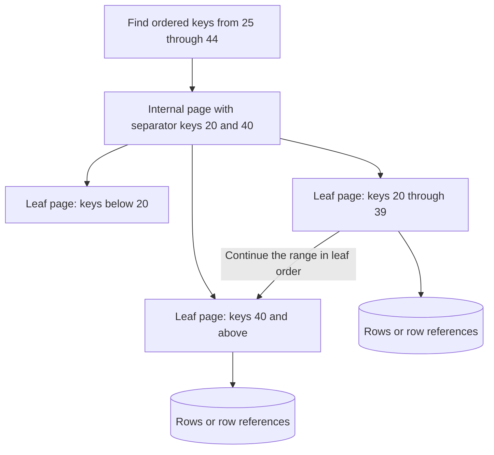

This is a small conceptual index, not a claim about the number of keys on a production page. Notice the two kinds of work: descending to a starting leaf and scanning the range. An index can find the beginning quickly, but returning a million matching rows still takes work proportional to the output and its storage access. "Indexed" does not mean every query is cheap.

Writes have costs too. An insert may update a leaf page, split a full page, and propagate changes upward. Extra indexes add more pages to maintain and more logging. Random insertion positions can affect locality and page splits, while steadily increasing keys can create a busy rightmost insertion region in some workloads. The useful choice depends on concurrency, storage, page fill, and the engine's implementation. Do not choose a key solely because someone said sequential IDs or random IDs are always faster.

Composite column order matters. An index organized by account and time can be excellent for one account's ordered history but may not be the best way to scan every account for one time window. Selectivity also matters: a filter matching almost every row may be served better by a scan. Use the actual query plan, number of pages read, returned row count, and measured latency to decide whether the index is helping. Foreign keys and unique constraints protect relationships and duplicate rules; a non-unique lookup index does not automatically enforce those rules.

**Explain it aloud:** "A B+ Tree uses high-branching internal pages to find a leaf and an ordered leaf level to read a range efficiently. It makes suitable reads cheaper, but it takes space and adds work to writes. I choose the columns and their order from the query, then check the physical plan." Try explaining why the same index may help an account history screen but not a global reporting query.

### LSM trees, SSTables, and compaction

A **Log-Structured Merge tree**, usually called an **LSM tree**, organizes writes so that many small changes can become larger sequential storage operations. A common implementation records a write in a recovery log and inserts it into a sorted memory structure called a **memtable**. When the memtable fills, it becomes immutable and is flushed into a sorted on-disk file. An **SSTable**, or sorted string table, is one name for that immutable file. Exact formats and durability ordering depend on the storage engine.

An update does not usually edit every old file immediately. A newer version of the key goes into a newer structure. A read must find the newest version visible under its consistency and transaction rules, potentially checking memory and several files. Indexes and Bloom filters help avoid unnecessary file reads. A Bloom filter can say that a key is definitely absent from one file; it cannot return the value or decide which version is current.

**Worked example:** a device reports temperature under key `sensor-17:10:00`. Version 4 is already in an SSTable. Version 5 enters the log and memtable. A read may find version 5 in memory even though the old file still contains version 4. Later, a flush creates another file. **Compaction** merges eligible files, combines sorted key ranges, and removes obsolete versions when retention and snapshot rules allow it. The visible result should not change merely because compaction rearranges the physical files.

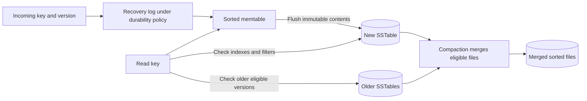

The important costs are **write amplification**, where one application write causes several physical writes over time; **read amplification**, where a lookup checks several places; and **space amplification**, where old and new files coexist temporarily. Leveled and tiered compaction make different choices among these costs. Compaction also competes with user traffic for storage bandwidth and CPU. Fast short benchmarks can hide a backlog that later stalls writes.

A deletion is often recorded as a **tombstone** so an older stored value does not reappear. Removing a tombstone too early can resurrect deleted data if an old file, snapshot, or lagging replica still matters. Garbage collection requires the engine's actual safety conditions, not just a fixed delay copied from another product. B+ Trees and LSM trees are implementation choices, not synonyms for SQL and NoSQL; choose using measured reads, writes, ranges, latency, and operational costs.

**Practice check:** a benchmark shows low write latency for five minutes, followed by periodic slowdowns. Should you add more API servers immediately?

**Answer:** first inspect compaction debt, flush pressure, disk bandwidth, cache behavior, and read/write amplification. More callers may increase the storage backlog. Measure a long enough workload to include steady-state compaction before choosing a capacity change.

### Logical SQL order versus physical execution

SQL is declarative: the query states the desired result, while the database chooses an execution plan. A useful simplified logical sequence is FROM/JOIN and their conditions, WHERE, GROUP BY, HAVING, SELECT, DISTINCT, ORDER BY, and row limiting. This explains why filtering groups belongs in HAVING and why aliases are not visible everywhere in the same way.

The optimizer may reorder valid joins, push filters earlier, or choose scans versus index seeks while preserving meaning. Logical order explains the result; the physical plan explains execution cost. Check engine-specific rules, especially for outer joins and window functions.

Avoid repeated small queries when a set-based query can retrieve the needed result efficiently. At the same time, a huge join that multiplies rows or returns unnecessary data is not automatically better than every other approach. Measure database work, bytes transferred, and application processing together.

### ACID in ordinary language

Atomicity means a transaction's changes commit together or roll back together. If transferring funds requires a debit and credit, a local transaction should not leave only one side committed. Consistency in ACID means committed changes respect the invariants enforced by the database and transaction; it is not the same as every replica immediately showing the same value.

**Isolation** defines what overlapping transactions can observe or affect. **Durability** means committed changes survive the configured failures. Transaction support does not fix one isolation or replication policy. Specify the actual settings instead of treating "ACID" as the complete guarantee.

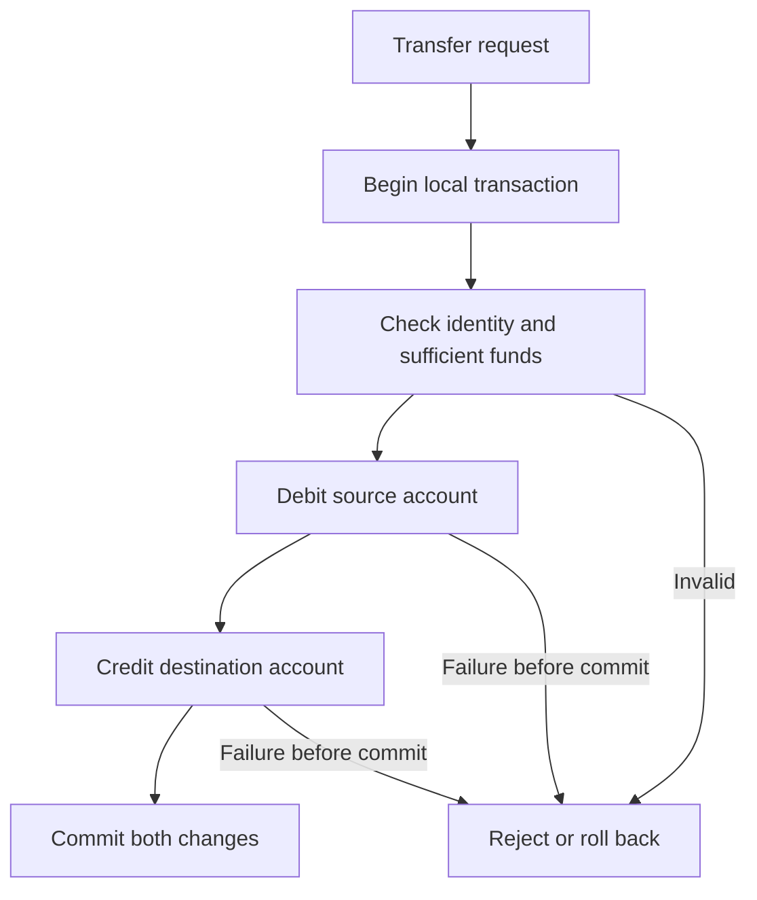

This diagram assumes both balances and required rules fit the same supported transactional boundary. It does not make a bank's external payment network part of that local transaction. If an external participant is involved, uncertain outcomes and workflow recovery become additional responsibilities.

### Write-ahead logs and crash recovery

A database may change pages in memory before those pages reach durable storage. Writing every modified page immediately would be expensive, especially when a transaction touches many scattered locations. A **write-ahead log (WAL)** records recovery information before affected data pages are allowed to become durable. Recovery can use those records to restore a valid database state after a crash. The log is not merely an application audit log, and its presence alone does not specify when a commit is safe to acknowledge.

**Worked example:** an order transaction creates order 73 and its line items. The engine records the necessary changes and a commit decision under its recovery protocol. Under a synchronous local durability policy, it makes the required log records durable before acknowledging success. The modified data pages can be written later. If the process crashes after acknowledgement but before those pages are flushed, recovery uses the retained durable log to recover the committed order. How uncommitted changes are excluded or undone depends on the engine.

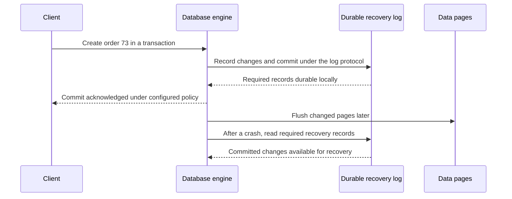

This sequence illustrates local crash durability, not every possible failure. If the disk is destroyed, a log on that same disk is gone too. Replication can protect another failure domain when the acknowledgement policy waits for the required copies. Backups and point-in-time recovery protect different risks, such as accidental deletion or corruption. A replica that promptly copies a bad deletion is not an independent historical backup.

**Checkpoints** record progress so recovery does not need to start from the beginning of all history. Log retention must still account for backups, replication, change-data-capture readers, and active recovery needs. Deleting old-looking log files manually can break those guarantees. **Group commit** lets several transactions share a durable log flush, improving throughput while adding some waiting; it does not mean unrelated transactions become one business transaction.

The acknowledgement boundary must be explicit. Some configurations acknowledge before the local log is forced to durable media, accepting possible recent-write loss. A successful operating-system write is not automatically proof that a power failure cannot lose buffered bytes. Conversely, a client timeout after a durable commit does not mean the transaction rolled back. Preserve an operation identity and query the saved result before creating a duplicate order.

**Practice check:** the client received success, the server lost power, and some data pages had not been written. Must the order be lost?

**Answer:** not if the configured durability protocol made the required recovery records durable and the relevant storage survived. Recovery can reconstruct committed changes. State those assumptions; WAL does not promise survival of arbitrary storage destruction or unsafe acknowledgement settings.

### Isolation, anomalies, and write skew

A dirty read observes another transaction's uncommitted data. A non-repeatable read sees a changed committed value when reading again. A phantom occurs when repeating a predicate query yields a changed set because another transaction inserts or removes matching rows. Names such as read committed, repeatable read, and serializable describe guarantees, but implementations vary.

**Snapshot isolation** supplies a consistent view and detects some write conflicts, but can allow **write skew**. Two transactions see both doctors on call; one removes doctor A, the other removes B. Their separate row updates leave nobody on call without a same-row conflict. Protect the shared rule across both rows.

Serializable execution provides behavior equivalent to some serial ordering of transactions under the database's model. This can require waiting or abort-and-retry. Use a suitable isolation level, explicit constraints, or atomic conditional operations to protect the actual invariant. A lower isolation level is not wrong when the invariant remains safe; a higher one is not free.

### MVCC and optimistic concurrency

**Multi-Version Concurrency Control (MVCC)** keeps versions of records so a transaction can read the version allowed by its snapshot and isolation rules. A reader may see a previously committed value while another transaction creates a newer version. This can reduce interference between readers and writers, but does not mean the engine uses no locks. Writers can still conflict, schema changes can require locks, and visibility rules differ across databases and isolation levels.

**Worked example:** two operators load product 42 at application version 8. Both see a price of 100. Operator A saves price 105 with the condition that the stored version must still be 8, and increments it to 9. Operator B then tries to save price 110 with the same condition. The database atomically finds that version 8 is no longer current and rejects B's update. B can reload the accepted change and make a new decision. This is **optimistic concurrency control**: work proceeds without holding a long-lived edit lock, but saving checks whether its assumptions remain valid.

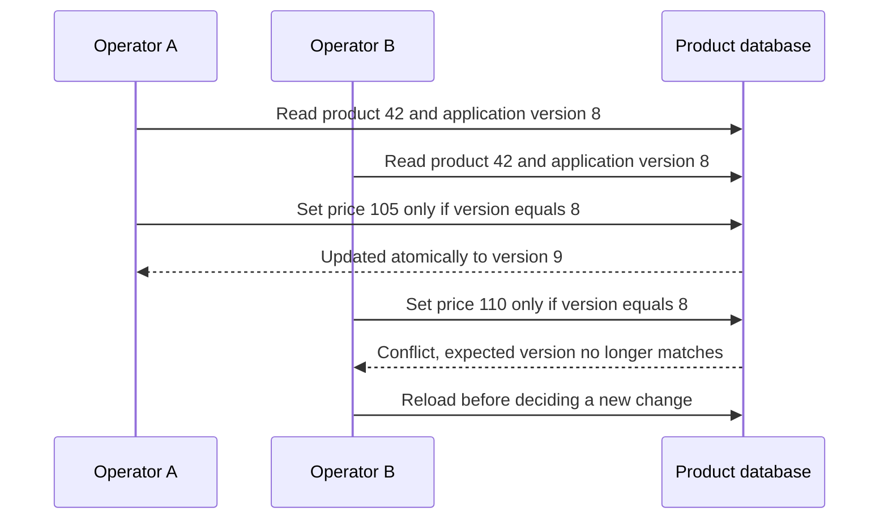

The version check must be part of the stored update or transaction, not a separate application read followed by an unconditional write. Otherwise another writer can change the value between checking and saving. An application version column is also not automatically the same thing as the engine's internal MVCC metadata. Define who increments it and ensure every relevant writer follows the rule.

**Pessimistic locking** instead acquires an appropriate lock before protected work proceeds. It can make a short, contended transaction easier to reason about, but creates waiting and possible deadlocks. Do not hold database locks while waiting for a person to finish editing or for a slow external provider. Lock ordering, deadlines, short transactions, and safe retries are part of that design.

MVCC alone does not prevent write skew across several records. Two transactions can read a valid shared snapshot and update different rows in a way that violates a cross-row rule. Use suitable serializable execution, constraints, locking, or a different atomic representation for that invariant. Old versions also cost storage: long-lived snapshots can delay vacuum or garbage collection and increase read work. Monitor snapshot age and version cleanup alongside transaction latency.

**Practice check:** both operators used transactions. Why was a version condition still useful, and can B blindly retry with version 9?

**Answer:** the transaction boundary alone does not express whether overwriting a change made since the edit began is acceptable. The condition detects stale intent. B should reload and reconcile the business decision rather than silently replacing A's accepted value. Retrying execution and deciding a new intent are different actions.

### Tuning a slow database-backed API

First identify the query and its actual workload. Inspect execution plans, scanned versus returned rows, indexes, joins, locks, I/O, and connection waiting. Check whether the application creates an N+1 query pattern or holds a transaction open while making a slow remote call.

Shorten unnecessary transactions, retrieve only needed data, use suitable indexes, and batch compatible work. Bound connection pools and concurrency. Read replicas can offload eligible reads, but they may lag and do not automatically improve write contention. Cache only when the freshness and invalidation contract is understood.

### A practical checkpoint

Explain how to stop two customers borrowing the same physical book, why an index does not enforce every business rule, and why a transaction's ACID consistency differs from distributed read consistency. Then describe how you would investigate a slow query without first changing database products.

### Key Points to Remember

- Model identities and invariants first; enforce them against all writers with suitable constraints or atomic operations.
- Index usefulness depends on column order, selectivity, output size, statistics, and plans. Account for write and storage costs.
- Logical SQL order describes meaning; physical plans describe execution.
- Choose isolation for the invariant. Snapshot isolation can still allow cross-row write skew.

### Interview Catch

**The question:** "Both requests run inside transactions under snapshot isolation. Can they still leave no doctor on call?"

**The trap:** Assuming a consistent snapshot also serializes all conflicting business decisions. Two transactions can each see the other doctor available, update different rows, and jointly violate the shared condition.

**A stronger answer:** Protect "at least one doctor on call" with suitable serializable execution, explicit locking, or another atomic representation. Handle rejected transactions with safe retries that do not duplicate external effects. Explain the waiting or throughput cost; transaction boundaries alone are not enough.

**Follow-up to expect:** "Would an index alone prevent this?" Explain that faster lookup is not the same as enforcing the invariant; a correctly scoped constraint or concurrency mechanism must protect the accepted state.

## 12. Database Models and Distributed Data

### Databases

A **database** manages records and the operations used to read and change them. An application needs more than a place to put bytes: it needs identities, query behavior, concurrency rules, access control, and recovery after failures. The database's indexes, constraints, transactions, and replication settings determine which parts of that contract it can enforce.

For a booking system, begin with rooms, dates, customers, and reservations. Write the important questions, such as finding available rooms and retrieving one customer's bookings. Then state the invariant: two accepted reservations must not own the same room and date. This gives a concrete basis for choosing a model and transaction boundary. A database product name is the end of that reasoning, not the starting requirement.

Saved data also needs an operating plan. Define who can change it, how schema versions evolve, which failures a commit survives, how backups are restored, and how deletion reaches derived stores. A fast development query says little about production behavior until it uses representative data sizes and access patterns.

### Select a model from access patterns

Relational databases suit relationships, constraints, flexible queries, and multi-record transactions. **NoSQL** covers several models, not one consistency guarantee; some support strong reads or scoped transactions. Relational systems can also be distributed. Compare the actual product, operation, and configuration, not just the family label.

A key-value store retrieves data by a key and fits simple lookups such as session state or cached objects. A document database stores structured aggregates and can fit data commonly read and written together. A wide-column system organizes large partitioned datasets around known key and range patterns. A graph database emphasizes relationships and traversal. A search index is optimized for text retrieval and ranking, usually as a derived view rather than the only transactional source of truth.

**Polyglot persistence** uses different stores for different jobs: relational orders, indexed product search, and object-stored images. Each extra store needs access control, monitoring, appropriate backups, and synchronization. Add one only when that benefit earns its operational cost.

### SQL vs NoSQL

**SQL databases** commonly use a relational model: records live in tables, relationships are explicit, and SQL expresses queries over them. **NoSQL** is an umbrella term for several non-relational models, including key-value, document, wide-column, and graph stores. It does not mean one fixed schema policy, one consistency guarantee, or the absence of all transactions.

| Decision | Relational starting point | Non-relational starting point |
| --- | --- | --- |
| Data shape | Related entities, constraints, and joins | A model suited to key lookup, aggregates, partitions, or graph traversal |
| Important reads | Flexible queries across related records | Known access patterns matched to the selected model |
| Atomic updates | Supported local or distributed transaction scope | Product-specific record, partition, or multi-record scope |
| Scaling | Larger instances, replicas, partitioning, or a distributed SQL product | Product-specific partitioning, replication, and capacity rules |
| Main check | Query plans, contention, schema evolution, and recovery | Query limits, hot partitions, consistency settings, and recovery |

An order ledger with related line items and enforced uniqueness often has a straightforward relational design. A large stream of device readings with known device-and-time queries may fit a partitioned wide-column model. A relationship-heavy investigation may benefit from a graph model. These are starting points to evaluate, not guarantees that one family always wins a workload.

Do not assume SQL cannot scale horizontally or that NoSQL cannot provide strong reads. Compare the actual operation, transaction boundary, indexes, deployment, and failure behavior. Adding a second store also adds synchronization and maintenance work. Prefer the simplest combination that meets the measured requirements, with an explicit reason for every extra database.

### Database examples and the questions they answer

Database families describe useful starting points, not fixed promises about speed or consistency. A product may support several models, and its indexing, transaction, and replication settings change what an operation guarantees. Begin with your records and queries. Ask which data is read together, what must change atomically, how writes are distributed, and how old a read may be. Then compare specific products against those requirements.

**Key-value data: Redis and DynamoDB.** A key-value lookup begins with a known identity, such as a session ID or a cart key, and retrieves the associated value. Redis offers in-memory structures as well as optional persistence and replication; a disposable cache and a durable record store need different settings. DynamoDB is a managed key-value and document database with partition and sort-key access patterns, secondary indexes, and supported conditional and transactional operations. It is not simply "Redis hosted elsewhere." Read consistency, index behavior, capacity, hot partitions, and replication mode must be evaluated for the actual table and query. A fast exact-key lookup does not imply that arbitrary filtering across all records is equally cheap.

**Document data: MongoDB and Couchbase.** A document can keep a related aggregate in a JSON-like structure, such as a product with its variants and descriptive attributes. This can fit a screen that commonly reads those fields together. Flexible structure does not mean structure no longer matters. Decide which fields are required, how versions are validated, which indexes queries need, and how large a document may grow. Embedding an unbounded order history in one customer document can create size and update problems. These products provide additional query and transaction capabilities, but inspect their actual scope and performance instead of assuming every multi-document operation is one cheap atomic update.

**Wide-column data: Cassandra and ScyllaDB.** These systems are often chosen for large distributed workloads with known access patterns and high write demand. In Cassandra-style modeling, the partition key decides which records are placed together, while clustering columns organize records within that partition for supported retrieval patterns. A conversation ID plus a time bucket can identify a chat-history partition; a message ordering key can organize entries inside it. "Wide-column" here is not the same as a columnar analytical warehouse. Plan partitions from queries and traffic. A single huge or extremely popular partition can remain a limit even when the rest of the cluster is idle.

**Graph data: Neo4j.** A graph stores entities and relationships directly. It can fit questions such as "which accounts connect to this suspicious payment through shared devices?" or "which stations can be reached with at most two changes?" Traversal depth, fan-out, indexes for starting nodes, and permission checks all matter. A graph database does not make an unlimited search through a densely connected graph cheap. Bound the question and measure the number of relationships the traversal explores. A relational database can also represent relationships; a graph model is most useful when relationship traversal is central to the workload.

**Real-life scenario: one online shop, several storage jobs.** The shop keeps accepted orders and payment records in a relational database with appropriate constraints. Product discovery uses a derived search index. Images live in object storage. A cache may keep reusable product descriptions, while a separate system may analyze browsing events. This is polyglot persistence only where each extra store earns its maintenance cost. Using four stores for four jobs is not a requirement for a small first version. One well-modeled database may meet the initial needs more simply.

For every additional store, explain how data gets there, how it is kept current, how deletion reaches it, and how it is rebuilt or restored. A catalog update may reach a search index later than the main database. A cached session may expire. An analytics store may accept a different delay than checkout. The right choice follows these contracts, not a label such as "schema-free" or "ultra-fast."

**Explain it aloud:** "A key-value model starts with a key, a document model groups an aggregate, a wide-column model organizes known partition queries, and a graph model focuses on relationship traversal. I compare products using the exact operation, transaction scope, traffic pattern, and recovery guarantee." Then name the simplest product that meets the actual problem rather than listing all of them as mandatory components.

### Replication copies data

In leader-follower replication, a leader accepts writes and followers copy them through the replication protocol. Read traffic may go to followers when their freshness is acceptable. Failover promotes or selects an eligible replacement under ownership rules. Older material may call this master-slave replication; the responsibilities are more clearly described as leader and follower.

**Synchronous replication** waits for required replica acknowledgements, improving protection under its protocol at a latency and availability cost. **Asynchronous replication** can acknowledge before remote copies catch up; failover may then lose recent writes. Choose according to latency goals and acceptable data loss, and check what each acknowledgement proves.

Multi-leader replication allows writes at more than one participant and must resolve concurrent changes. It can suit disconnected or geographically distributed editing with explicit conflict semantics. It is not automatically safe for conflicting reservations or balances. Leaderless approaches also have specific quorum, versioning, and repair protocols; the absence of a named primary does not eliminate coordination.

### Read-your-writes and replica lag

A user updates a profile and immediately refreshes. If the write reached the leader but the next read uses a lagging follower, the old value may appear. This can look like the update was lost even when it is durable. Read-your-writes behavior can be provided by reading the appropriate primary, tracking a version/replication position, or using another supported session-consistency mechanism.

Cache invalidation does not update a lagging replica. A cache miss may reload an old profile from that replica and retain it after replication catches up. Trace freshness end to end: chosen database copy, returned version, and cache lifetime.

### Leaderless quorums with a worked example

Leaderless replication does not require every write to pass through one permanent primary for a key. A coordinator, which need not be a fixed leader, sends operations to a set of replicas and collects enough responses under the database's rules. The design still needs a way to select versions, handle competing updates, and repair replicas. Removing a permanent leader does not remove all coordination or make every response equally current.

Let $N$ be the number of replicas in the relevant fixed replica set. Let $W$ be the number that must acknowledge a write, and $R$ the number whose replies are required for a read. The familiar overlap condition is:

$$
R + W > N
$$

Suppose $N=3$, $W=2$, and $R=2$. A successful write of version 8 reaches replicas A and B while C still has version 7. A later read from B and C overlaps that successful write at B. Under a suitable version-selection rule, the read can discover version 8 instead of blindly returning C's older value. In a fixed set of three, any set of two readers overlaps any set of two acknowledged writers. The inequality explains that intersection; it is not the entire database protocol.

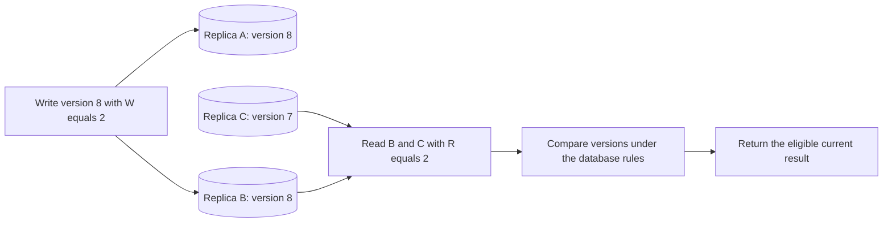

Now change the example to $W=1$ and $R=1$. A write acknowledged only by A and a read answered only by C need not meet at all. The read can be stale even after the write returned success. Larger read or write requirements can improve the desired behavior, but they may increase latency or prevent progress when too many replicas are unavailable. Choose the values together with the operation's actual consistency contract and failure policy.

There are important limits to the simple arithmetic. Concurrent writers may create versions that need conflict resolution. A timestamp comparison may be affected by clock assumptions. A read that sees a partly completed write needs a defined rule. Membership may change. Some systems can temporarily place writes on substitute nodes through a sloppy quorum, so the neat fixed-set intersection argument no longer directly describes the participants used. Hinted handoff and anti-entropy repair help copies catch up, but they do not by themselves prove linearizable reads for every history. Also check what an acknowledgement means: a response is not automatically a durable flush.

Read repair can help update a stale copy discovered during a read, while background anti-entropy compares replicas to find differences not touched by recent reads. Deletes need special care. A deletion marker, often called a tombstone, may need to remain long enough that an old replica cannot reintroduce the deleted record during repair. Correct retention and repair schedules matter as much as the happy-path read count.

**Real-life scenario: a distributed preference store.** A user's theme preference can often tolerate a briefly stale view, with explicit resolution if two devices change it while disconnected. A payment ledger or exclusive reservation may need a stronger rule. It is unsafe to assume that the same $R$ and $W$ values protect both just because the replica sets overlap. Use supported conditional or transactional operations where the business needs them, and verify the concrete product's behavior.

**Explain it aloud:** "R plus W greater than N makes read and acknowledged-write sets intersect under fixed membership. The database still needs correct versioning, conflict handling, commit rules, and repair. Quorum overlap is a useful ingredient, not a universal proof of strong consistency." Contrast this with consensus, which establishes an agreed decision or log history under a complete protocol.

### Vertical partitioning

**Vertical partitioning** splits a record's columns into separate tables or storage units, usually connected by a shared key. It differs from horizontal partitioning, which splits rows. Imagine a customer record containing a name, avatar, preferences, billing details, and a large biography. A profile list reads names and avatars often but does not need the other fields on every request.

One design keeps `customer_id`, name, and avatar in a frequently accessed profile table, while another table holds the larger or more sensitive fields. A common read then touches fewer bytes. The split may also support different access policies or storage choices. Those benefits are not automatic: a query must actually avoid the separated fields, and permissions still need enforcement.

When an operation needs both halves, it may require a join or extra request. If both tables share a supported transaction boundary, a change can still commit atomically. If the split crosses independent stores or services, define how updates and deletions stay coordinated, and how readers handle missing or delayed data. More boundaries can cost more than the saved read I/O.

Vertical partitioning is not the same as adding a larger database machine, which is vertical scaling. It is also not a general synonym for normalization or a columnar analytical engine. State exactly which fields move, which reads become cheaper, how common writes behave, and how the application retrieves a complete record when needed.

### Partitioning and sharding split data

Partitioning divides data into groups. Sharding commonly means placing different groups on different database nodes. Hash-based sharding distributes keys; range-based sharding groups nearby keys; directory-based sharding uses a mapping service. Each choice affects range queries, hot spots, rebalancing, and routing.

Choosing account ID as a shard key can keep an account's history local, but one unusually active account can become a hot shard. Choosing time alone can concentrate current writes in the newest partition. A compound or bucketed key can spread load, at the cost of querying and merging multiple groups. There is no universally correct shard key without workload information.

Cross-shard queries and transactions cost more and may have restricted support. IDs must remain unique across shards, using coordination or a suitably collision-resistant scheme. Sharding changes ownership, routing, updates, and recovery; it is not just a server-count setting.

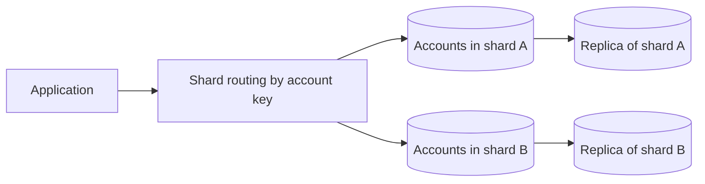

Shards hold different subsets; replicas hold copies of a subset. These axes solve different problems. The routing map must be updated safely during rebalancing, and each shard's replication still needs a failure policy.

### Federation and functional partitioning

Database federation can mean separating data by function or domain, such as keeping billing and catalog data in different owned databases, rather than spreading one table's rows by a shard key. Some platforms use the word for querying multiple stores through one interface, so clarify the intended meaning.

Functional separation can reduce contention and improve ownership, but removes the convenience of arbitrary local joins and transactions across the separated data. A reporting system may need projections or explicit aggregation. The benefit is not free simply because the databases have different names.

### Rebalancing and migration

Moving a shard while writes continue requires a plan for copying data, catching up changes, switching ownership, and preventing old writers from corrupting the new location. A directory or routing layer can simplify indirection but becomes important infrastructure itself. Test migration on realistic data volumes rather than assuming a background copy is instantaneous.

**Expand-and-contract** preserves compatibility: add the new structure, migrate readers and writers, then remove the old one. **Backfills** update existing records in bounded, resumable batches while monitoring load and errors. A code rollback does not undo deleted columns or transformed data.

### Choosing a path to scale

Begin with measured query tuning and an appropriate data model. Consider vertical scaling, connection/concurrency control, caching, read replicas, archival, and functional separation before selecting sharding. Sometimes one of these solves the problem with much less operational complexity.

For a growing transaction history, time-bucketed archival can keep active data manageable while retaining older records under policy. For a globally busy chat system, partitioned writes and per-conversation retrieval may eventually justify distributed storage. The design should explain why the simpler approach stopped meeting requirements and what new limitations the distributed choice introduces.

### Key Points to Remember

- Choose specific storage guarantees from queries, invariants, transaction scope, and operational needs, not SQL/NoSQL labels.
- Replication copies; sharding divides. Design both ownership and recovery.
- Shard keys trade locality for distribution. A hot account or time partition can remain saturated in a large cluster.
- Read-your-writes needs an explicit path. Replica lag can also refill an invalidated cache with old data.

### Interview Catch

**The question:** "One customer generates most of our traffic. Will adding ten shards automatically solve it?"

**The trap:** Assuming a larger cluster distributes a single key's work. If every operation for that customer still maps to one shard, the same hot placement may remain saturated.

**A stronger answer:** Measure the workload and its ordering and transaction needs. Consider buckets, another key, shared reads, workload isolation, or dedicated capacity. Explain cross-bucket queries and migration ownership. Never split an atomic business rule without another mechanism that preserves it.

**Follow-up to expect:** "Can we just read from any replica after a write?" Discuss replication lag and the mechanism needed for the requested session or read-your-writes guarantee.

## 13. Caching and Freshness

### A cache is a reusable answer, not automatically the truth

A cache keeps data or a computed result so later requests can avoid repeating more expensive work. A product page might reuse a description instead of reading the database for every view. A route service might reuse a calculation. The value comes from repeated access and acceptable reuse, not simply from installing a fast product.

The **authoritative source** owns the official record; a cache normally holds a rebuildable copy. If losing the "cache" loses accepted payments or the only pending-job record, it is acting as primary storage and needs matching durability and recovery guarantees.

Before adding caching, decide what can be cached, the key, how stale the answer may be, how it changes, and how failures behave. A cached stock count can improve browsing, but the final reservation must still enforce the authoritative inventory rule. A current permission decision may require stricter freshness than a product description.

### Where caches sit in the request path

Cache placement determines which work can be avoided and which users share the answer. A browser cache can avoid a network request entirely for a reusable response. A CDN cache can avoid a trip to the origin and serve many users near an edge location. A reverse-proxy cache can protect application servers from repeated eligible requests. A local in-process cache avoids another network call inside the application. A distributed cache lets several application instances share stored answers. These layers can coexist, but every extra copy needs a freshness and access policy.

For example, an immutable product image can be cached in the browser and CDN for a long time if a content change creates a new URL. A public product description may be reused for a shorter period. A private order response has different permission requirements. A cached result must not cross user or tenant boundaries just because its URL looks similar. Include the inputs that change the response in the correct cache key, and apply the required authorization even when the data is already available in a fast layer.

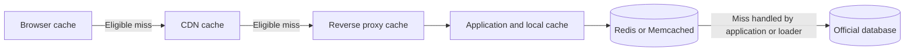

The diagram shows possible placements, not a requirement to install every layer. It also does not mean Redis normally queries the database on its own. In cache-aside, application code handles the miss; a read-through abstraction supplies a configured loader. A request may bypass some or all caches. Draw the route for the actual data instead of treating every HTTP response as equally reusable.

Redis and Memcached are common distributed-cache choices, but their features differ. Memcached provides a comparatively simple in-memory key-value cache; cached data is normally treated as disposable. Redis provides additional structures and optional persistence and replication, which can suit other jobs as well. Neither product name settles eviction, replication, failover, or whether losing data is acceptable. Compare the selected setup and client behavior. If the only record of an accepted payment or job lives there, you have taken on primary-storage responsibilities, not just caching.

A local near-cache can reduce traffic for very popular keys, but every application instance now has another copy that can be stale. Invalidating the distributed cache does not automatically invalidate all local copies or browser copies. Define how a version change reaches them, how long an old copy may remain, and what happens if invalidation is missed. Observed freshness is the behavior of the complete read path, not merely one Redis TTL in isolation.

**Real-life scenario: a product price changes during a sale.** A browser may still show an old price, the CDN may have an earlier public response, and an application cache may have another version. The purchase contract should say whether a displayed quote is valid until an expiry or whether checkout validates the current accepted price. Never assume that every visible copy changing together is the only way to protect correctness. Keep the final price agreement and stock reservation explicit in the official transaction.

**Explain it aloud:** "Place a cache where it avoids expensive repeated work, then define who may share each answer and how old it may be. Multiple cache layers improve reuse, but they add copies to refresh or invalidate. Critical decisions still follow their official data rules." Start small and add a layer when measurements justify the benefit.

### Cache-aside and read-through

In cache-aside, the application first checks the cache. On a hit it returns the value; on a miss it loads from the source and stores an entry for later reuse. Writes commonly commit to the source and then invalidate or update the cache. This keeps the authoritative write path understandable and works well for many read-heavy datasets.

**Read-through** moves miss handling into a cache layer with a configured loader. Callers become simpler, but loading failures, simultaneous misses, authorization, and freshness still need explicit rules.

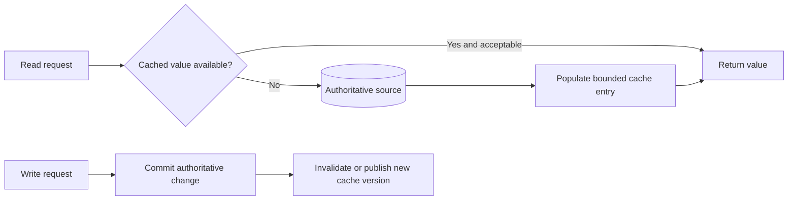

The diagram shows the normal path. It does not make the source commit and cache invalidation atomic. A crash between them or a concurrent stale refill needs a policy, discussed below.

### Write-through and write-behind

Write-through updates the backing data and cache through the write flow so new reads can benefit immediately. This can reduce misses after updates, but a database and remote cache are not automatically one transaction. Decide which write is authoritative, how partial failure is reported, and how repair occurs. Returning success because only the cache changed can violate the intended durability contract.

**Write-behind/write-back** accepts changes into a buffer and writes them to storage later, potentially combining updates. Until then, the buffer may hold the only accepted copy. It must survive the promised failures, and batch retries or reordering must not duplicate effects or overwrite newer values.

Write-behind can be appropriate for a carefully engineered workload with an explicit durability contract. It is not a default recommendation for payments simply because it benchmarks faster. The acceptance boundary must honestly reflect what has been persisted.

### Refresh-ahead and stale-while-revalidate

Refresh-ahead renews selected entries before they expire. It can keep popular expensive results ready, but refreshing everything wastes resources on unused keys. Popularity signals, refresh limits, and failure behavior are necessary. Refreshing during an origin outage must not become another source of overload.

Stale-while-revalidate serves an allowed older value while refreshing it in the background. A news article summary can often tolerate a short delay. A revoked access permission may not. State the maximum allowed age and what happens when refresh repeatedly fails; "stale" should not quietly become "forever."

These patterns can be combined selectively. A catalog may use cache-aside for most products, refresh-ahead for popular ones, and stale-while-revalidate only for non-critical descriptions. Correctness depends on the data's meaning rather than a single global caching policy.

### Keys, expiration, and eviction

A cache key must include every input that changes the answer. Tenant, locale, currency, resource version, and authorization scope may matter. A shared key named `profile` cannot safely represent every user's private profile. Authorize access before returning a cached value just as you would before querying the database.

**TTL** limits entry lifetime. Absolute expiry fixes an end time; sliding expiry extends it on access and can keep stale popular data alive without an absolute cap. **Eviction** makes room; **invalidation** marks or removes a value that should no longer be used. Distinguish capacity misses from freshness decisions.

LRU favors recently used entries; LFU favors frequently used entries according to the implementation's tracking. Neither knows business importance. Size limits matter as well as entry counts, because a few large values can dominate memory. Negative caching stores an absence or selected failure briefly to avoid repeated expensive misses, but must not hide newly created valid data for too long.

#### FIFO eviction is different from TTL expiry

**FIFO** evicts the earliest-inserted entry under memory pressure, even if it is still popular. **LRU** favors recent reads; **LFU** favors frequent reads under its tracking rules. Compare hit rate, memory, bookkeeping, and real traffic rather than declaring a universal winner.

TTL expiry ends permission to reuse a value, independently of free space. Eviction can happen before TTL; expiry can happen without memory pressure. Physical cleanup may be lazy, so rely on documented logical expiry rather than when bytes are reclaimed.

**Real-life scenario:** a weather service keeps frequently requested cities in a limited cache. LRU or LFU can help decide which entries occupy memory. A separate TTL controls how long a reading is considered reusable. A popular city must not keep an old reading forever just because users keep asking for it. Capacity policy and freshness policy answer different questions and may need to work together.

### The stale-fill race

Suppose a reader misses the cache and fetches product version 10. Before it fills the cache, a writer commits version 11 and invalidates the key. The original reader then stores version 10. The invalidation succeeded, but the cache is stale again. A simple "write database, delete cache" slogan does not exclude this race.

Options include immutable versioned keys, version-checked publication, coordinated loaders, or explicitly bounded staleness. A key such as `product:42:version:11` prevents version 10 overwriting version 11, but discovering the current version still needs a freshness rule. A delayed second deletion can reduce races, not prove safety for every timing and failure.

Read replicas complicate this further. A cache miss can load old data from a lagging follower even after a successful invalidation. Examine the entire read path before promising that all users see an update within a fixed interval.

### CDC and Debezium for cache invalidation

Change Data Capture can turn committed database changes into events that update or invalidate derived data. Debezium provides connectors for supported databases, using the connector's supported change mechanism and snapshot process. A typical pipeline reads committed changes, records its progress, sends change events, and lets a consumer invalidate or publish a suitable cache version. This can cover writes made by more than one application, where relying on every writer to remember the same cache-delete call would be fragile.

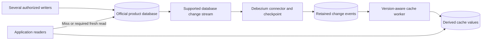

CDC is asynchronous. Between the database commit and the cache worker handling its change event, readers can still see the old cached answer. The connector can be delayed, a consumer can fail, and required source history can expire if it falls too far behind. Plan checkpoints, restart behavior, monitoring of source-to-cache delay, and a snapshot or rebuild path. Do not call the database and cache one atomic transaction simply because a change stream connects them.

Keep the ordering and version rules explicit. A repeated change event should be harmless. An older update arriving late must not replace a newer cached value or recreate a product that was deleted. A delete may need a versioned marker or other retained evidence so a late fill cannot restore removed data. If the consumer merely deletes the key, a reader that fetched an earlier database version can still refill that old value afterward. CDC reduces forgotten invalidation, but the stale-fill race still requires the appropriate publication and read rules.

Write-through has a related limitation. It means the normal write path synchronously updates backing data and the cache according to its contract; it does not mean both independent systems magically commit at the same instant. Decide which write is official, what success means if the second write fails, and how missing or stale cache state is repaired. Combining write-through with CDC can provide repair coverage, but you still need to explain the time between steps and the result returned to the user.

**Real-life scenario: prices updated by both an admin tool and an import job.** The two writers commit price changes to the same official database. CDC sees both supported change paths and sends events to the cache worker. The import can create a burst, so the worker needs enough capacity and a visible lag measurement. Checkout protects the accepted price through an official rule even while the browsing cache catches up. If the change feed fails, the site needs a bounded fallback or an explicitly allowed stale period, not an unmeasured promise that caches are always current.

**Explain it aloud:** "CDC makes committed changes available to other systems and helps keep caches repairable. It does not remove propagation delay, duplicate events, old refills, or privacy deletion requirements. I combine it with version-aware updates, appropriate reads, and a measured freshness target." Then show where you would look if the database has the new price but users still see the old one.

### Stampedes, avalanches, and penetration

A **cache stampede** sends many loaders for one missing hot value to the source. **Request coalescing/single-flight** shares one ongoing load. Early refresh, bounded loaders, and permitted stale responses also help. A distributed loader lock needs crash and expiry handling; indefinite waiting is not recovery.

A **cache avalanche** sends many keys to the source together because of synchronized expiry or cache failure. Add TTL **jitter** (small random differences), cap fallback reads, and shed optional features. A database sized for ordinary misses may not survive all cache traffic at once.

Cache penetration is repeated origin work for keys that do not exist or are not cacheable. Validate input, apply quotas, and use short negative caching when suitable. A correctly maintained Bloom filter can reject definite misses before expensive lookup, but it must be updated for new data and cannot replace authorization.

### Cache breakdown and probabilistic early refresh with XFetch

Cache-failure names are not standardized across every article or product. Cache breakdown commonly describes one very hot key expiring so that many requests hit the source. That overlaps strongly with cache stampede or thundering herd. Cache avalanche usually describes a wider event, such as many keys expiring together or a cache cluster failing. Cache penetration describes repeated misses for absent keys. The useful distinction is the failure pattern and the resource it threatens, not memorizing four labels as if they always refer to completely separate mechanisms.

For one hot key, a scheduled refresh before expiry can keep a useful answer ready. A single-flight loader lets callers share one in-progress regeneration. A lock can coordinate loaders across instances if needed, but its failure and expiry behavior must be safe. A permitted stale response can keep users served during refresh. Each option needs a limit on concurrent source work. A cluster with many nodes does not automatically prevent one key from expiring everywhere or prevent all clients from regenerating it together.

XFetch is a probabilistic early-expiration approach. It lets requests sometimes choose to refresh before the actual expiry instead of waiting for every caller to observe the same sudden miss. The decision uses the remaining lifetime, an estimate of how long regeneration takes, and a random value. A common way to express the early-refresh test is:

$$
	ext{now} - \beta\,\Delta\,\ln(U) \geq \text{expiresAt}
$$

Here $U$ is a newly sampled random value strictly between 0 and 1, so its natural logarithm is negative. $\Delta$ estimates the time needed to rebuild the value, and $\beta$ controls how early the algorithm is willing to refresh. Use matching time units. Subtracting a negative value looks ahead from now. If that look-ahead reaches expiry, the request may become an early refresher under the chosen implementation. This is a teaching formula, not a production library configuration to copy without checking.

For example, let rebuilding take about one second and let $\beta=1$. A request that samples $U$ near 0.135 looks ahead about two seconds. It may refresh when the entry has only 1.5 seconds left. A different request with $U=0.5$ looks ahead only about 0.69 seconds and would not refresh yet. As expiry approaches, more random outcomes qualify. Expensive regeneration creates a larger useful early-refresh window. The goal is to spread likely refresh decisions before the deadline, not to extend every entry's official freshness limit without permission.

**Real-life scenario: a popular live standings page.** Thousands of users read the same calculated result. If everyone waits for a five-second TTL to end, the database may suddenly receive thousands of identical calculations. Early refresh gives traffic a chance to produce the next value before that synchronized miss. Single-flight or another suitable coordination rule can still limit overlapping regenerations. Measure source load, returned-value age, and refresh failure. Probability does not guarantee that exactly one worker runs, especially when many requests arrive together.

XFetch is not a cure for a completely unavailable cache or permanently missing keys. At low traffic there may be no request to trigger early refresh; at high traffic several requests may qualify. For absent keys, validate input and use short negative caching or a correctly maintained Bloom filter where appropriate. For broad expiry, spread TTLs with jitter and limit fallback. For a source outage, decide whether stale content is allowed and for how long. These are different recovery decisions.

**Explain it aloud:** "A stampede is many callers rebuilding the same missing value. XFetch makes early refresh probabilistic and relates it to rebuild cost. It reduces synchronized expiry pressure, but still needs bounded loading and an honest freshness rule." A strong follow-up is to ask what happens if the first refresher crashes and whether its old value may still be shown.

### Cold cache and warm cache

A **cold cache** has few useful entries for the current workload, so many requests must load data from the origin. A **warm cache** already contains frequently requested, still-valid entries. Warm and cold describe readiness for a workload, not different cache products. A full cache can still be cold for a newly popular set of keys.

A restart, deployment, node replacement, mass expiry, or routing change can make a cache cold. If normal traffic was mostly served from memory, the resulting misses may suddenly overwhelm the database. Warm selected high-value keys gradually, limit concurrent rebuilds, randomize eligible expiry times, and keep fallback bounded. Preloading every possible key wastes memory and can create its own origin load spike.

Measure cache hit rate, miss latency, rebuild time, and origin pressure separately. Test both cold startup and steady warm traffic. A benchmark that silently warms the cache before measurement cannot prove that the service survives a restart during peak load. Likewise, prewarming must obey the same freshness, tenant isolation, and permission rules as an ordinary fill.

### Hot keys and distributed caches

A distributed cache shares values among application instances, but adds a network dependency. One extremely popular key can overload a shard even when overall capacity looks healthy. Local near-caches, replicated read paths where supported, request coalescing, or a changed data representation may help. Adding more shards does not automatically spread one key's traffic.

In-process caches are very fast but separate across instances. Invalidating one instance does not invalidate the others. Use bounded lifetimes or a reliable invalidation mechanism when needed, and retain a repair strategy if invalidation events are missed. The fastest copy is not always the easiest copy to keep correct.

### A practical example: product browsing and checkout

Cache descriptions and immutable image references for browsing, using tenant and locale in the key where relevant. Keep price validity explicit: a quote can include a version or expiry, and checkout validates the accepted pricing rule. Reserve stock through an atomic authoritative operation rather than decrementing a displayed cached count.

If the cache fails, cap database fallback, shed optional recommendation requests, and return a truthful temporary failure when essential capacity is exhausted. Serving every miss at unlimited concurrency can turn one failed cache into a database outage. Caching is successful when it improves performance without obscuring correctness or recovery.

### Key Points to Remember

- Define authority and acceptable age. Cached displays do not replace critical purchase or permission checks.
- TTL alone does not bound replica lag, sliding expiry, layered caches, or stale refills.
- An old reader can refill after invalidation. Use suitable version rules or explicitly bounded staleness.
- Coalesce loads and cap fallback to protect the origin during stampedes, hot-key bursts, and outages.

### Interview Catch

**The question:** "We update the database, delete the cache entry, and use a five-minute TTL. Is the cache now guaranteed correct?"

**The trap:** Treating successful invalidation as an atomic transaction with all readers. A concurrent reader can fetch old data first and refill it after deletion; a lagging replica can supply another stale fill later.

**A stronger answer:** Define acceptable age and trace reads through replicas and cache fills. Consider versioned values, conditional publication, coordinated loaders, or bounded staleness. Protect the database during mass misses. Reserve stock with an authoritative operation, never merely a cached display.

**Follow-up to expect:** "What if ten thousand requests miss the same key together?" Explain single-flight or other coalescing, bounded loading, and whether serving an older value is permitted for this specific data.

## 14. Redis and Content Delivery Networks

### What Redis contributes

Redis provides in-memory structures with optional persistence and replication for caches, shared state, counters, quotas, rankings, and messaging. These jobs need different guarantees. Specify structures, retention, failure survival, and atomicity: losing a rebuildable description differs from losing the only accepted-job record.

Strings can hold serialized values or counters. Hashes organize fields under a key. Sets support membership, sorted sets support ordered scores such as leaderboards, and lists can organize sequences. Streams provide an append-oriented record structure with consumer-group capabilities. Pick the structure that makes required operations efficient without allowing unbounded keys or values.

Redis is often described as single-threaded because many command-execution paths are serialized. That simplifies some local atomic operations and avoids certain locking costs, but it is not a timeless claim that every Redis activity uses one thread. I/O, persistence, modules, and implementation versions can use additional threads or processes. Its performance also comes from memory access, efficient structures, event-driven I/O, batching, and avoiding unnecessary work.

### Atomic operations do not make arbitrary workflows atomic

A Redis increment is atomic within its supported scope; scripts also prevent command interleaving but can block other work if long-running. Cluster placement and transaction rules constrain related keys. Separate calls can still interleave even when each command is atomic.

Redis transactions do not behave exactly like a relational database transaction with general rollback semantics. Read the actual behavior and failure cases. If a payment API call succeeds and then a Redis write fails, Redis cannot undo the external payment. The same distributed-boundary rules apply regardless of how fast the local store is.

Pipelining reduces round trips by sending several commands before waiting for each response. It can improve throughput but does not automatically make the commands one transaction. Bound batches so memory, latency, and fairness remain acceptable.

### Persistence, replication, and memory policy

**Snapshots** periodically save state; **append-only persistence** logs changes with configurable storage synchronization. Frequent synchronization reduces potential loss at extra cost. Replicas may lag, so check whether failover can lose acknowledged writes under the chosen settings.

Memory eviction policies decide what can be removed under pressure. A cache can often tolerate eviction. A session store may force users to authenticate again. A primary job ledger cannot silently lose accepted work just because a cache-style eviction policy made room. Separate workloads or choose policies that match their durability needs.

A leaderboard is a useful Redis example: score updates and ordered reads can be efficient with a sorted set. Decide whether Redis holds authoritative scores or a rebuildable projection from durable events. The second model can tolerate cache loss if replay is reliable; the first requires stronger persistence and recovery guarantees.

### Redis Pub/Sub versus Streams

**Redis Pub/Sub** delivers to connected subscribers, not an offline mailbox. Missing a "refresh" hint can be acceptable when clients later reload authoritative state. Required financial work needs retained, recoverable records when receivers disconnect.

Streams retain records according to their policies and support consumer-group processing concepts. Retention, pending entries, acknowledgements, recovery, and persistence still require design. A stream is not automatically equivalent to Kafka, RabbitMQ, or Azure Service Bus in every guarantee and operational behavior.

### What a CDN does

A Content Delivery Network serves eligible content from distributed locations closer to users and reduces traffic to the origin. Product images, scripts, video segments, and public documents are common candidates. Geographic proximity can reduce network delay, while cache reuse reduces repeated origin work.

A pull CDN fetches an object from the origin when an eligible request misses at the edge, then reuses it under cache rules. A push CDN or pre-positioning workflow uploads/distributes content before demand. Pull is convenient for large unpredictable catalogs; pre-positioning can help planned releases and known assets. Product terminology varies, and many platforms combine methods.

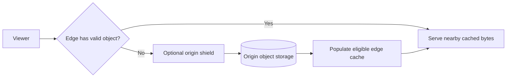

The origin shield can reduce many edges simultaneously fetching the same missing object. It is still another dependency with capacity and failure behavior. The diagram assumes cache eligibility and authorization are configured correctly; proximity alone says nothing about permission.

### Dynamic CDN content and edge workers

Static content is an obvious CDN candidate, but "dynamic" does not automatically mean "uncacheable." A public page or API response generated by application code may be reusable for many callers for a short time. A product category response can be cached by language, currency, and other relevant inputs. A private account balance or a response containing a user's session data has a different contract. Decide cache eligibility from meaning and permissions, not just from whether the URL ends in .jpg or .json.

A pull cache fetches an eligible object when an edge first needs it. A push or pre-positioning workflow makes selected content available before demand. Both still need an official origin, failure handling, invalidation or versioning, and rules for private access. Preloading every possible page is usually wasteful when most are never read. For a scheduled event, however, warming known reusable assets before the start can reduce a synchronized origin burst.

Edge compute or edge workers run supported logic near the edge. Examples include choosing a regional route, normalizing an approved cache key, checking a signed asset request, resizing an eligible image, or assembling a limited public response. Running a small function near users can reduce some round trips. It does not guarantee that a database call to a distant region becomes local or that temporary worker memory becomes a durable global store. Execution time, memory, network access, consistency, and pricing limits depend on the platform.

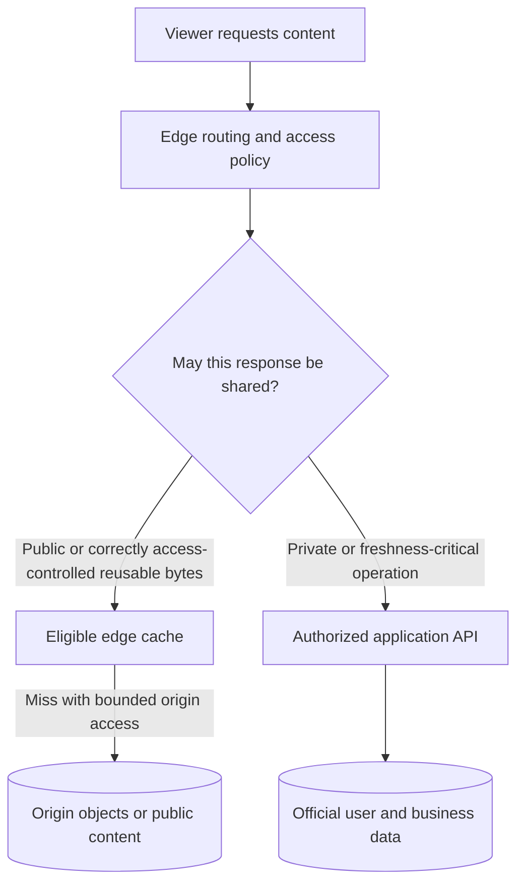

**Real-life scenario: a concert video platform.** Video segments with stable versioned names can be served from an edge cache after the required access checks. An edge worker may validate a short-lived signed request. The user's subscription change is still an official business operation and may require a service or store with current entitlement data. If a signature expires, having the bytes cached is not permission to serve them. Renew access through the supported flow instead of turning private content public to avoid a playback error.

Avoid creating one cache entry for every irrelevant request difference. At the same time, never merge differences that affect privacy or meaning. Configure Vary, cookies, query strings, and authentication handling deliberately. A default cache rule is not a complete review of a dynamic endpoint. Test two users, two locales, an expired link, and a changed permission, as well as the happy-path cache hit.

**Explain it aloud:** "A CDN can cache reusable dynamic responses as well as static files. Edge workers add nearby processing, but access control, data freshness, and durable business state still need their own rules." Name the work saved at the edge and the work that must still go to the official owner.

### HTTP caching, versioned assets, and privacy

Cache-Control directs freshness and reuse behavior, while validators such as ETag support conditional requests. A `304 Not Modified` response lets the client reuse an existing representation when the validator matches under the protocol. A versioned filename or content hash makes immutable asset deployment easier because new content gets a new identity rather than relying entirely on worldwide invalidation.

**Vary** and CDN cache keys distinguish responses by relevant inputs, such as language or access scope. Missing distinctions can leak private content. Signed URLs and cookies need explicit expiry and validation even on cache hits; stored bytes do not grant permission.

Invalidation requests are useful but may not be instantaneous everywhere. Versioned immutable objects reduce reliance on timing, while mutable "latest" pointers still need explicit caching rules. An expired signed URL can also break delayed downloads even when the underlying object still exists.

### Video delivery example

A video platform stores original uploads, transcodes them into several qualities, and publishes small media segments and manifests. A CDN serves popular segments near viewers. Adaptive clients choose an appropriate representation as network conditions change. The application API handles identity, entitlement, metadata, and progress rather than proxying every video byte through a general-purpose request handler.

This divides responsibilities: object storage retains media, processing jobs generate variants, the CDN distributes reusable bytes, and authoritative services decide access. A CDN outage, missing segment, bad manifest, or entitlement error can all interrupt playback for different reasons. Observability should distinguish them.

### Key Points to Remember

- Choose Redis structures, eviction, persistence, and recovery for the data's importance.
- Local atomicity excludes unrelated external effects. Pipelining reduces round trips, not transaction boundaries.
- Pub/Sub is live delivery; Streams retain records and track consumers under configured policies.
- CDNs need correct keys, authorization, validators, versioning, origin protection, and signed-link expiry.

### Interview Catch

**The question:** "Redis is fast and supports persistence. Can we replace our durable job queue with Redis Pub/Sub?"

**The trap:** Assigning product-wide guarantees to every feature. Persistence of Redis data does not make Pub/Sub retain offline subscribers' messages.

**A stronger answer:** Define job retention, acknowledgements, replay, and crash guarantees. Use Pub/Sub for disposable hints backed by authoritative state. Required jobs need retained work, recoverable consumer progress, safe duplicate handling, and limits on stored and running tasks.

**Follow-up to expect:** "The CDN still has a private video, so can an expired signed link play it?" Explain that cached bytes and authorization are separate concerns, and define how access is renewed without making protected content public.

## 15. Consistency, CAP, and Coordination

### Consistency describes what readers may observe

Name the guarantee behind "strong consistency." **Linearizability** makes each operation appear instantaneous between its start and finish, respecting completed-before-started real-time order. **Serializability** makes transactions equivalent to some serial order, which need not match real time. They are not interchangeable.

**Eventual consistency** promises convergence after updates stop and required communication and processing succeed, not arbitrary answers or a fixed five-second delay. A search index may lag a product update; change delivery, conflict resolution, and catch-up rules must still make it converge.

Weak consistency is a broad label for models without a stronger stated visibility promise. Causal consistency preserves relevant cause-and-effect order, such as seeing a reply only with the post it depends on under the model. Read-your-writes ensures a client sees its own accepted changes, while monotonic reads avoid moving backward to an older observed version. State which behavior the user experience requires.

#### Causal and read-your-writes consistency in everyday use

**Causal consistency** preserves dependencies. A chat reply depends on the question its author read; the view must include the causal context required by the model. Independent posts can remain concurrent, without one global real-time order.

**Read-your-writes** means your saved profile name remains visible on refresh. Reads may use the writer, carry a version/replication position, or use session consistency. Specify the session or identity scope; other users and devices may still see older data.

**Monotonic reads** prevent moving from observed version 9 back to version 8. Routing across delayed replicas needs context to preserve that guarantee. Own-write visibility, non-regression, causal order, and latest-write visibility solve different problems.

**Real-life scenario: editing a shared document.** Your own saved edit should remain visible when you refresh. A comment about that edit may need its causal context. Another person's independent edit may arrive later and require a merge or conflict decision. A money transfer has different rules from merging a paragraph. A consistency model says what observations are allowed; the business still defines which conflicting changes may be accepted and how they are resolved.

**Explain it aloud:** "Causal consistency preserves dependencies, read-your-writes preserves my own accepted changes for the stated scope, and monotonic reads avoid moving backward. None automatically means that every client always sees one latest global value." Then describe the metadata or read path that provides the particular guarantee.

### CAP during a network partition

**CAP** describes behavior during a **network partition**, when running nodes cannot communicate reliably. Two disconnected regions receiving final-seat reservations cannot both remain available under CAP's definition while behaving like one linearizable copy. They cannot determine what the other region accepted.

Protecting consistency may require rejecting or delaying operations. Accepting independent local changes needs explicit conflict semantics. "Pick any two forever" is misleading: partitions are a failure condition, and different operations can choose different behavior. State what this operation promises during failure.

The availability in the theorem is not the same as a product's monthly uptime percentage. Likewise, ACID consistency concerns enforced invariants, not the same formal property as CAP's consistency. Avoid combining these words into a vague claim that a database is simply "consistent" in every possible sense.

```mermaid
flowchart LR
	UserA[User in region A] --> ReplicaA[(Regional data A)]
	UserB[User in region B] --> ReplicaB[(Regional data B)]
	ReplicaA -. Communication unavailable .- ReplicaB
	ReplicaA --> ChoiceA[Coordinate or reject conflicting operation]
	ReplicaB --> ChoiceB[Or accept under explicit conflict policy]
```

The diagram presents design choices, not a recommendation to mix incompatible policies arbitrarily. For a seat reservation, refusing a conflicting purchase can be better than overselling. For a collaborative note, accepting edits and exposing conflicts may be appropriate. The business meaning determines what reconciliation can legitimately do.

### BASE and PACELC

BASE is commonly expanded as Basically Available, Soft state, Eventual consistency. It describes a family of design preferences rather than a complete protocol or a universal property of NoSQL databases. A system using eventual projections can still enforce strong local transaction rules for its authoritative records.

PACELC adds the observation that even when there is no partition, a distributed system often trades latency against consistency. Waiting for distant replicas can improve a guarantee while increasing response time. The model is useful for asking better questions, but a four-letter classification does not replace reading an operation's actual contract.

#### Working through PACELC with a regional application

Read **PACELC** as "if Partitioned, consider Availability versus Consistency; Else, consider Latency versus Consistency." Healthy distant replicas still require communication time, so coordination cost matters outside outages too.

Imagine a shopping site serving customers in two distant regions. A product description may be read from a nearby replica so that browsing is quick. That local copy may briefly lag a recent edit. If the business allows this delay, the read favors lower latency over always observing the latest remote write. For an exclusive reservation, the operation may instead need an official owner or the database's supported coordination. The extra wait protects a stronger rule. These can be two valid choices inside the same application.

Now break communication between the regions. The browsing view may continue serving an allowed older description. The reservation path may refuse or defer a conflicting write that cannot safely reach its authority. If the business chooses to accept changes independently on both sides, it must define how conflicts are resolved and whether any promise can later be withdrawn. Normal-operation latency and partition-time availability are related concerns, but they are not the same decision.

```mermaid
flowchart TD
	Operation[Choose the guarantee for this operation] --> Partition{Required communication is partitioned?}
	Partition -->|Yes| Failure[Can we safely accept local work?]
	Failure -->|No| Wait[Reject or defer to protect consistency]
	Failure -->|Yes under explicit rules| Local[Accept with a defined recovery policy]
	Partition -->|No| Normal[Compare local latency with coordination cost]
	Normal --> Fast[Use an allowed nearby or older view]
	Normal --> Coordinated[Wait for the required consistency checks]
```

Do not turn a PACELC label into a universal claim about a database brand. Different operations, read modes, regions, and configurations may behave differently. Also avoid assuming that any slower operation is automatically more consistent. A slow query can simply be inefficient. Explain the specific communication or coordination the stronger guarantee requires, then measure its cost and decide whether that guarantee is needed for this operation.

**Explain it aloud:** "CAP asks what happens when communication breaks. PACELC also asks what we pay for consistency when communication works. I can use a nearby delayed product view for browsing and a coordinated reservation for checkout because the two operations make different promises."

### Quorums and consensus

A **quorum** is the required responding or agreeing set. Overlapping read and write sets under stable membership let a read encounter a written version. Linearizability also requires correct concurrent-write, version-selection, membership, and recovery rules. Counts alone do not define the protocol.

Consensus protocols let participants agree on a value or ordered history despite specified failures. Raft, for example, uses terms, leader election, replicated logs, and majority-based rules. A leader cannot safely assume every local write is committed merely because it appended it to its own disk. Followers, elections, and commit rules protect the agreed history under the protocol's assumptions.

You do not need to implement consensus from scratch for most application designs. Use a proven database or coordination service with the needed guarantees. Understand enough to know why losing quorum can stop writes, why a stale leader must not keep acting, and why a two-node design has difficult failure decisions without an additional witness or suitable protocol.

### Replicated state machines and Raft step by step

A replicated state machine keeps the same logical state on several machines by applying the same committed commands in the same order. For example, a small coordination store may apply "assign worker group 7 to owner 42," followed by "change its configuration to version 9." Replicas that start from compatible state and apply deterministic commands can reach the same result. Inputs such as generated IDs or timestamps must have a defined representation; every replica must not invent a different value while applying the same command.

Consensus helps participants agree on a decision or ordered log despite the failures covered by the protocol. The usual Raft and Paxos discussions assume crash failures and unreliable timing, not arbitrary malicious replicas that lie in every message. Majority rules do not automatically provide Byzantine fault tolerance. Also distinguish safety from liveness: safety means the protocol does not accept conflicting committed histories; liveness means it can keep making progress under the required communication and timing conditions. It may preserve safety by stopping writes when enough participants are unavailable.

Raft organizes work around a leader, followers, terms, and a replicated log. A term is a leadership epoch used to identify newer election information. Followers expect communication from the leader. When an election is needed, a candidate asks for votes in a newer term. Voting rules include whether the candidate's log is sufficiently up to date. Randomized election timeouts help avoid repeated simultaneous elections, but timeouts are not proof that the old process has physically stopped.

With three voting nodes, a majority is two. Suppose the leader receives a new configuration command in its current term. It appends the command to its log and asks followers to replicate it. Once the required majority has durably replicated a current-term entry under Raft's commit rules, the leader can commit it and apply the state-machine change. Followers learn the commit position and apply committed entries in order. A local append on one isolated leader is not enough to promise that the command is committed.

```mermaid
sequenceDiagram
	participant Client
	participant Leader as Leader in term 12
	participant FollowerA as Follower A
	participant FollowerB as Follower B
	Client->>Leader: Set configuration version 9
	Leader->>Leader: Append current-term log entry
	Leader->>FollowerA: Replicate entry
	Leader->>FollowerB: Replicate entry
	FollowerA-->>Leader: Entry recorded
	Leader->>Leader: Majority reached, commit and apply
	Leader-->>Client: Committed result
	Leader->>FollowerA: Advance commit position
	FollowerB-->>Leader: Later replication acknowledgement
```

This example shows the normal path for a current-term entry. Real Raft includes rules for prior-term entries, log matching, membership changes, snapshots, and recovery. Do not replace those rules with "any two disks contain something, so it is committed." If the leader becomes isolated, the remaining majority may elect a valid replacement. The old leader must not continue serving unsupported successful writes or stale reads as though it still has current authority. Supported read-index or lease-based read mechanisms have their own checks; the name leader alone does not make a read current.

**Real-life scenario: coordinating configuration ownership.** Three nodes agree which worker owns each partition. One fails. The remaining two can continue under the protocol if other requirements are met. If two fail, the remaining node cannot simply declare itself a majority. Operators restore enough valid participants or follow a documented recovery procedure that acknowledges its risks. Forcing a stale node to become the owner because it is reachable can discard previously committed decisions.

**Explain it aloud:** "Raft agrees on a log, not just a leader's name. Elections, terms, replication, and commit rules keep accepted history safe during leadership changes. A majority allows progress under the protocol; losing it may stop writes to avoid conflicting histories." This is a conceptual explanation, not enough detail to implement a production consensus engine from scratch. Use a proven database or coordination service.

### Paxos and ZooKeeper Atomic Broadcast

Paxos is a family of consensus protocols. Basic Paxos chooses one value for one decision. Its roles are commonly called proposers, acceptors, and learners; one machine may perform more than one role. Proposal or ballot numbers identify attempts to establish a decision. The numbers are not simply business timestamps, and a larger number does not grant permission to forget an already chosen value.

In the prepare phase, a proposer asks a quorum of acceptors to promise not to accept lower-numbered proposals. Each reply also reports the highest-numbered proposal the acceptor previously accepted, if one exists. After enough promises, the proposer must follow the value-selection rule: if relevant earlier accepted values are reported, it uses the value from the highest-numbered accepted proposal in those replies. It cannot choose a new favorite value merely because it obtained a higher ballot number.

In the accept phase, the proposer asks acceptors to accept that selected value with its ballot. An acceptor accepts only if its promises still permit it. When the required quorum accepts, the value is chosen. A later proposer encounters enough information through overlapping quorums and the selection rules to preserve an already chosen value. A partly accepted value is not necessarily already chosen, but it can still constrain what the next valid proposal must carry. Durable protocol state and recovery rules are essential to that argument.

```mermaid
flowchart TD
	Proposer[Proposer selects a new ballot] --> Prepare[Prepare: ask acceptors for promises]
	Prepare --> Replies[Quorum replies with prior accepted proposals]
	Replies --> Select[Follow the prior-value selection rule]
	Select --> Accept[Accept: propose the selected value]
	Accept --> Quorum[Required quorum accepts]
	Quorum --> Chosen[One value is chosen for this decision]
```

Competing proposers can keep interrupting each other's progress even when safety is preserved. Practical systems use leadership and other mechanisms to improve liveness. Multi-Paxos applies agreement across a sequence of decisions; a stable leader can reduce repeated preparation work under the protocol. It is useful to recognize these ideas in databases, but a simplified two-phase picture is not a complete implementation or a reason to hand-write a consensus library.

ZooKeeper Atomic Broadcast, usually called ZAB or Zab, supports ZooKeeper's ordered replicated state changes. Its problem includes preserving an ordered stream across leader changes. Leadership activation and synchronization establish a suitable shared history before ordinary proposals proceed. An active leader assigns ordered transaction IDs, called zxids, that include an epoch and a counter. Proposals are recorded and committed under the quorum and ordering rules, and replicas apply the committed changes in order.

ZAB, Raft, and Multi-Paxos share goals around agreed history, but they are not identical message exchanges with different names. ZAB's activation and broadcast rules are part of its safety argument. Also distinguish the replication protocol from every client API guarantee. Ordinary ZooKeeper reads can be served from a replica and may be stale. The [ZooKeeper internals documentation](https://zookeeper.apache.org/doc/current/zookeeperInternals.html) describes these consistency limits. Do not claim that using ZooKeeper makes any arbitrary read or external side effect linearizable.

**Real-life scenario: an application leader registry.** Several application instances need to agree which one should coordinate a job group. They use a supported coordination service rather than a local variable on each machine. The service's internal consensus or atomic-broadcast protocol protects its own records. The chosen application owner still needs to stop when it loses ownership and protect delayed external writes. Agreeing on ownership inside ZooKeeper is not automatically the same as fencing a database or payment provider outside it.

**Explain it aloud:** "Paxos explains how one value remains chosen across competing proposals; Multi-Paxos extends agreement to a sequence. ZAB preserves ZooKeeper's ordered change history across leadership epochs. The guarantees belong to their actual protocol and API boundary, not to every action an application performs afterward."

### Leases, locks, and fencing

A distributed lease grants temporary ownership, such as permission for one worker to process a partition. A paused worker may resume after its lease expired and another worker became owner. Merely storing "I hold the lock" in memory does not stop the old worker from making a delayed write.

A **fencing token** increases with each ownership generation. After accepting owner 42, the protected resource rejects delayed writes from owner 41. Enforce the check where the effect happens; attaching a token without receiver-side validation provides no protection.

Prefer a database constraint or conditional update when it directly protects the invariant. A distributed lock adds failure and operational complexity and should not be used as a reflex for every concurrency problem. For external systems that cannot enforce fencing, use their supported idempotency and status mechanisms and acknowledge remaining limitations.

### Redlock, ZooKeeper locks, and Consul sessions

First decide whether the lock only avoids duplicate effort or protects a rule that must never be broken. If two cache refreshes happen during a rare failure, the result may merely cost extra work. If two workers both withdraw money, correctness is at risk. Use a database constraint or conditional transaction when it directly protects the required rule. A distributed lock creates another service, another failure detector, and another ownership lifetime to understand.

A single Redis lock can use a conditional set with an expiry and a unique random value representing that acquisition. Releasing it must compare that value before deleting the key, so an old client cannot delete a newer client's lock. This random ownership value is not the same as an increasing fencing token. It can identify which acquisition should be released, but it does not order all ownership generations at the protected resource. An asynchronously replicated Redis primary can also fail before its lock reaches a replacement, creating a risk of another acquisition after failover.

Redlock attempts to acquire a lock on a majority of independent Redis masters within a valid time window. The client accounts for time spent acquiring the locks and an allowance for clock behavior. If it cannot satisfy the acquisition and timing conditions, it releases the acquisitions it made and retries under a bounded policy. These independent masters are not simply replicas of one primary. The [Redis distributed-lock documentation](https://redis.io/docs/latest/develop/clients/patterns/distributed-locks/) explains its assumptions, crash-recovery considerations, and consistency cautions.

Redlock does not make an arbitrarily paused process stop running when its lease ends. Clock changes, long pauses, delayed requests, and restart behavior matter. For correctness-critical writes, ask how the actual resource rejects a stale owner. Increasing a lease duration or renewing it can reduce ordinary expiry, but neither is a universal proof against delayed effects. The engineering discussion around Redlock concerns these failure assumptions; do not present it as interchangeable with a consensus-backed, resource-enforced ownership protocol.

ZooKeeper's common lock recipe uses ephemeral sequential nodes under a lock path. A session creates its candidate node, checks the ordered candidates, and proceeds when it is the eligible owner under the recipe. Other candidates watch an appropriate predecessor instead of all repeatedly polling one key. Ephemeral nodes are removed when the session expires, allowing waiting candidates to progress. A disconnected client must treat session and ownership uncertainty correctly; an absent heartbeat is not evidence that its process cannot resume.

A sequential identity or another suitable coordination version can contribute to fencing, but only if the protected resource checks it under a sound contract. Watch notifications tell the client to recheck state; they are not a substitute for checking the current ownership condition. Use a maintained implementation of the recipe. Races between listing nodes, setting a watch, and a predecessor disappearing are part of its correctness, not optional details to omit from a hand-written loop.

Consul sessions bind ownership to session state and configured health or TTL rules. A session can acquire an advisory lock on a KV entry. Invalidation releases or deletes associated state according to its settings. The [Consul session documentation](https://developer.hashicorp.com/consul/docs/automate/session) explains that failure detection can suspect a still-running owner, and that TTL is not a promise of an exact instant of release. Lock delay can reduce some risks during handover, but it does not physically stop the old worker or automatically protect every external resource.

**Real-life scenario: two workers updating one export manifest.** Worker A owns generation 41, then pauses. Its lease expires and worker B becomes generation 42. B validates and publishes the newer manifest. When A resumes, its delayed write must be rejected by the manifest store or a conditional publication step. Merely asking A whether it still thinks it owns the lock is unsafe. The store must compare the ownership or data version atomically with the effect it accepts.

```mermaid
sequenceDiagram
	participant Old as Worker A
	participant Coordinator as Ownership service
	participant New as Worker B
	participant Store as Protected resource
	Old->>Coordinator: Acquire ownership generation 41
	Note over Old: Process pauses beyond lease
	New->>Coordinator: Acquire newer generation 42
	New->>Store: Publish with generation 42
	Store-->>New: Accepted, newer owner recorded
	Old->>Store: Delayed publish with generation 41
	Store-->>Old: Rejected as stale
```

The diagram assumes the resource implements the required fencing check. If an external API cannot do that, use its supported idempotency and status rules where possible and state any remaining uncertainty. A coordinator cannot retroactively erase an email or charge that an old worker already sent. Expiry helps other work resume; fencing or another correctly placed guard protects the effect.

**Explain it aloud:** "A lock service chooses a temporary owner. A safe release token prevents deleting someone else's lock. A fencing token lets the resource reject delayed work from an older owner. These are different responsibilities, and the last one must be enforced where the change happens."

### Clocks, conflict resolution, and IDs

Wall clocks can drift or move because of synchronization corrections. A timestamp from another device is not automatically proof of causal order. Logical clocks and version vectors can represent ordering or concurrency relationships under specific models, but they add metadata and interpretation costs.

**Last-write-wins** selects one value by an ordering rule, potentially discarding a meaningful concurrent change. **CRDTs** (conflict-free replicated data types) use designed operations to make structures such as sets and counters converge. They do not make every conflict mergeable: combining two final-seat reservations does not honor exclusivity.

ID generation also has tradeoffs. Database sequences are simple within an ownership boundary. UUIDs allow decentralized creation with a sufficiently large identity space, while ordered ID schemes can improve locality but may involve time and worker-identity coordination. An ID's sort order is not necessarily a trustworthy business event order.

### Lamport clocks and vector clocks

A machine's **wall clock** estimates real time. Synchronization can correct it, machines can disagree, and a device can be offline. Comparing two wall-clock timestamps therefore does not always establish which action caused another. A **monotonic clock** is useful for measuring elapsed time on one machine, but is not a shared global order. Distributed protocols need explicit rules for the ordering information they exchange.

**Lamport clocks** use a logical counter. A participant advances its counter for an event. On receiving a message, it advances beyond both its local value and the counter carried by the message. If event A happened before event B through local execution or a chain of messages, A's Lamport value is smaller than B's. The converse is false: a smaller value does not prove a causal relationship. Adding a participant ID can break ties to create a deterministic order, not reconstruct a universal physical timeline.

**Worked example:** two replicas begin with vector `[0,0]`, whose components track logical progress for A and B. A independently edits a title and produces `[1,0]`. B independently edits the same title and produces `[0,1]`. Neither vector is less than or equal to the other in every component. They represent concurrent changes, even if their physical timestamps happen to differ. After A receives B's version, it merges the componentwise maxima and advances its own counter for a new resolution event, producing `[2,1]` under this convention.

```mermaid
sequenceDiagram
	participant A as Replica A
	participant B as Replica B
	A->>A: Edit title, vector becomes 1 0
	B->>B: Independent edit, vector becomes 0 1
	B->>A: Send concurrent title and vector 0 1
	A->>A: Detect incomparable vectors
	A->>A: Resolve under application policy, advance to 2 1
	A->>B: Publish resolved value and vector 2 1
```

A **vector clock** can distinguish causal order from concurrency in its stated participant model. One vector precedes another when every component is no greater and at least one is smaller. Metadata grows with tracked participants, and membership changes, restarted identities, and pruning need a real design. Version vectors, dotted versions, and other schemes make different tradeoffs; a two-node classroom example is not a complete protocol for millions of devices.

Ordering metadata does not decide what to do with a conflict. A shared document may merge independent changes or ask a user to choose. A final-seat reservation cannot simply combine two accepted owners. Nor does a Lamport clock replace a replicated commit protocol. Choose the smallest mechanism that answers the real question: elapsed duration, deterministic sorting, causal dependency, concurrent updates, or exclusive acceptance.

**Practice check:** event X has Lamport value 40 and event Y has value 41. Can you conclude that X caused Y?

**Answer:** no. Causal order implies increasing Lamport values, but unrelated events can also have increasing values. You need additional causal information, such as appropriate vector metadata or a known message chain, to establish that relationship.

### Replica repair and conflict resolution

Replication can leave copies different after dropped messages, temporary outages, or concurrent writes. **Repair** discovers and transfers missing or outdated data. **Conflict resolution** decides which result should be accepted when versions are not simply older and newer. Sending every value to every machine eventually does not answer which concurrent value is correct for the application.

**Read repair** can update stale replicas when a read detects disagreement. It helps keys that are read, but does not necessarily repair cold data. **Anti-entropy** compares replica state periodically or in the background. A **Merkle tree** summarizes data ranges with hashes so participants can narrow a difference to smaller subtrees instead of transferring every record. The participants must agree on range definitions and serialization; a hash mismatch identifies disagreement, not the winning version.

**Worked example:** two replicas maintain a grow-only counter of received reactions. A owns one counter component and B owns another. A has state `[2,0]`; B has `[0,3]`. Merging by the maximum of each component gives `[2,3]`, whose displayed total is 5. Receiving `[0,3]` again leaves the result unchanged, avoiding double counting from repeated state delivery. This is a simple **state-based CRDT**. Its merge is designed to tolerate repetition and reordering; adding arbitrary totals from both replicas would count shared history more than once.

```mermaid
flowchart LR
	A[Replica A components: 2 and 0] --> Merge[Merge each component with maximum]
	B[Replica B components: 0 and 3] --> Merge
	Merge --> State[Merged components: 2 and 3]
	State --> Total[Displayed reaction total: 5]
	State --> Repeated[Merge B again]
	Repeated --> Same[Components remain 2 and 3]
```

The example depends on each participant owning its component and preserving identity and monotonic progress across recovery. Other CRDTs handle decrements, sets, or richer structures with different metadata and semantics. Operation-based variants may need specific delivery properties. Using the word CRDT does not make a custom merge correct. Use a proven design and state which operations and invariants it supports.

**Last-write-wins** is simpler for some replaceable values, but may discard meaningful concurrent changes. Clock skew can also select a value that was not the most recent real-world action. Application-level merging can preserve both edits, apply field-specific rules, or require manual resolution. No convergence rule makes two conflicting payments or seat promises harmless after the fact.

Deletion deserves special attention. Tombstones, repair horizons, retained history, and long-offline replicas must be coordinated so an old copy cannot reintroduce deleted data. Repair consumes bandwidth, disk, and CPU, so throttle it without letting lag grow beyond the recovery contract. Track convergence delay and unresolved conflicts rather than assuming successful message delivery means all copies agree.

**Practice check:** replicas exchange equal Merkle root hashes. Does that prove every business rule is valid?

**Answer:** it supports agreement about the represented data under the hashing and comparison scheme. Both replicas can agree on the same invalid business state. Data agreement, permitted access, and application invariants require separate validation.

### Gossip, heartbeats, and failure detection

A **heartbeat** is a periodic sign that a participant was recently responsive. If a heartbeat is late, a detector may suspect failure. The server might actually be dead, but it might also be paused by garbage collection, overloaded, or separated by a slow network. In a network with unbounded delays, a timeout alone cannot distinguish those cases perfectly. Treat a health observation as evidence for a policy, not proof of physical failure.

**Gossip** spreads membership or other information through repeated exchanges with a small selection of peers. Over several rounds, information can reach a large cluster without one node contacting everybody on every round. The actual convergence speed depends on cluster size, exchange rules, traffic, and failures. Gossip is useful for distributing observations, but it is not by itself a consensus protocol or permission for two leaders to accept conflicting writes.

**Worked example:** node A misses B's direct probe. Before declaring B unavailable, A asks C to try an indirect probe. C reaches B and reports a response. This can help distinguish a bad A-to-B path from an unresponsive B, although observations can still become stale. A SWIM-style design uses direct and indirect probing, suspicion, and membership dissemination with defined rules; the simple sequence here illustrates the responsibility, not a complete SWIM implementation.

```mermaid
sequenceDiagram
	participant A as Node A
	participant B as Node B
	participant C as Node C
	A->>B: Direct health probe
	B--xA: Reply unavailable on this path
	A->>C: Ask for an indirect probe of B
	C->>B: Probe B through another path
	B-->>C: Responsive
	C-->>A: Report recent response from B
	A->>A: Update suspicion under membership policy
```

Timeouts trade faster reaction against false suspicion. A short timeout can remove healthy capacity during congestion; a long one can route requests to a failed server for too long. **Accrual detectors** express a changing suspicion level based on observed arrival behavior instead of only a fixed yes/no threshold. Regardless of detector style, clients still need request deadlines because a node can fail after its last successful probe.

Membership versions and incarnation identifiers help prevent an old failure report from overriding a newer legitimate join. Authentication prevents arbitrary peers from inventing membership changes. Downstream ownership needs stronger safeguards: a suspect old writer may later resume, so promotion of a replacement must use the storage or coordination protocol's quorum and fencing rules. Do not let one machine's timeout unilaterally authorize conflicting writes to protected data.

**Practice check:** the old leader stopped sending heartbeats. Can a replacement safely write while the old process continues running?

**Answer:** only under a protocol that establishes valid ownership and prevents stale effects. Heartbeat suspicion can trigger recovery, but quorum decisions, terms, leases with valid assumptions, or resource-side fencing must protect the actual writes.

### Snowflake IDs, UUIDv4, UUIDv7, and ticket services

A unique ID answers "which record or operation is this?" It does not automatically answer "which business event happened first?" or "may this caller access the record?" Start with the required uniqueness scope, the creation rate, the number of writers, and whether IDs must be created while a central service is unavailable. Then consider index behavior, storage size, privacy, and what happens after a clock or worker failure.

The classic Twitter Snowflake-style layout fits an ID into 64 bits: an unused sign bit, 41 bits for milliseconds since a chosen epoch, 10 bits for worker identity, and 12 bits for a sequence within that millisecond. Variants use different field widths and epochs. In the classic layout, the worker field has room for 1,024 values and the sequence for 4,096 values per millisecond per worker. Those are format capacities, not a measured promise that every implementation produces IDs at that rate. The 41-bit time field also has a finite lifetime, roughly 69 years from its chosen epoch.

```mermaid
flowchart TD
	Identifier[One classic 64-bit Snowflake-style ID] --> Sign[1 unused sign bit]
	Identifier --> Time[41 timestamp bits]
	Identifier --> Worker[10 worker identity bits]
	Identifier --> Sequence[12 per-millisecond sequence bits]
	Worker --> Ownership[Workers must not reuse an active identity]
	Time --> ClockPolicy[Clock rollback needs an explicit policy]
	Sequence --> Capacity[Exhaustion must not silently wrap]
```

To generate one, a worker reads the eligible timestamp, uses its assigned worker identity, and advances the sequence for that timestamp. If the sequence is exhausted, it must wait for an eligible later time or follow another safe policy. If the clock moves backward, the implementation may pause, reject generation, or use a carefully designed logical-time scheme. It must not silently reuse the same timestamp, worker, and sequence combination. Worker IDs also need safe allocation across replicas, restarts, and failover. Two processes using the same worker identity can defeat the layout's uniqueness argument.

UUIDv4 uses a 128-bit UUID format with version and variant bits and 122 bits available for randomness. With a good generator, collisions are extremely unlikely at ordinary application volumes, and nodes can generate IDs independently. "Extremely unlikely" is not a mathematical guarantee that a collision can never occur. Use a proven library, a suitable random source, and a uniqueness check where the data model requires one. Random placement may affect some indexes, but the effect depends on the engine and workload.

UUIDv7 puts a 48-bit Unix millisecond timestamp near the front of the UUID. The remaining layout includes version and variant bits plus fields that can carry randomness or supported sub-millisecond and monotonic generation information. This gives useful time-oriented locality without reducing the format to a simple global counter. Implementations must follow the standard's rules. IDs generated by different machines within one millisecond do not automatically encode the exact order of business commits, and a timestamp prefix can reveal approximate creation time. The current standard is [RFC 9562](https://www.rfc-editor.org/rfc/rfc9562.html).

A centralized ticket service issues IDs from a controlled allocator. A database sequence or auto-increment field is a common simpler choice when one database already owns creation. It makes ownership straightforward, but callers now depend on that allocator's capacity and availability. Sequence caches, retries, aborted transactions, and reserved blocks can create gaps. A normal primary key sequence is not automatically a gap-free legal invoice numbering process. Model any such business requirement separately.

Allocating disjoint ID ranges can reduce central calls. For example, an allocator may durably reserve 1 through 10,000 for worker group A and 10,001 through 20,000 for group B. Each group can issue IDs from its range without contacting the allocator for every record. Persist range ownership and never hand an active range to another generator accidentally after recovery. Unused IDs in a lost range may be acceptable gaps. Global creation order is no longer identical to numeric order, because both groups can issue at the same time.

**Real-life scenario: orders created in several regions.** UUIDs can let regions create identities independently, while Snowflake-style IDs can offer a compact time-oriented layout when worker allocation and clocks are controlled. A central ticket service may be simpler when a single authoritative database already creates every order. No choice makes conflicting reservations safe. Keep the order ID separate from the rule protecting stock, and keep a retry's business operation key stable even if several internal records are generated during processing.

**Explain it aloud:** "I choose IDs for uniqueness scope, independent generation, index behavior, and failure recovery. Snowflake-style IDs need safe worker and clock rules. UUIDv4 uses randomness; UUIDv7 adds time-oriented structure. Sequences and reserved ranges simplify some coordination but add allocator responsibilities. None is an authorization check or a universal business ordering guarantee."

### A practical design decision

In a shopping system, product search may use an eventually updated index, profile edits may require read-your-writes, and inventory reservation may require an authoritative atomic check. These are compatible choices for different operations. Do not force every read and write into one oversimplified consistency category.

Explain the behavior during disconnection and after recovery. If two sides accepted conflicting work, name the rule that resolves it and the information users may lose. "Eventually consistent" is the start of that explanation, not its conclusion.

### Key Points to Remember

- Name the needed model: linearizable, serializable, causal, read-your-writes, or eventual guarantees differ.
- CAP concerns partitions; its terms differ from uptime and ACID consistency.
- Quorums need complete membership, version, commit, and recovery rules.
- Lease expiry does not stop old workers. Enforce fencing at the protected resource.

### Interview Catch

**The question:** "During a partition, can both regions accept reservations for the final seat and let eventual consistency fix it later?"

**The trap:** Treating convergence as preservation of a business invariant. A conflict policy may choose one winner later, but it cannot make two conflicting promises simultaneously valid for both customers.

**A stronger answer:** Ask whether overbooking is allowed. If the seat must have only one owner, use an official owner or a supported coordination mechanism that protects that rule. During a partition, refuse or defer a reservation that cannot meet the required guarantee. If the data can safely be merged, explain the merge rule and what users may gain or lose. "The copies eventually agree" does not explain whether the promises already made to two customers were valid.

**Follow-up to expect:** "Our distributed lock expired; why can the old worker still corrupt state?" Explain paused processes, delayed requests, and resource-side fencing or another supported protection against stale effects.

## 16. Availability and Recovery Architecture

### Design for specified failures

**Fault tolerance** maintains correct service through specified failures. **Redundancy** provides spare components; successful recovery also needs detection, safe ownership transfer, capacity, and protected state. **High availability** describes the resulting service outcome. Surviving one instance failure does not imply surviving regional loss or widespread corruption.

A **failure domain** shares a possible failure cause: process, machine, rack, zone, or region. Two processes share host-power risk; two machines may share a rack network. Redundancy must cross the relevant domains.

Software and dependencies also create shared failures. Ten services may receive one bad configuration; two regions may depend on one identity provider. Check what a backup is genuinely independent of.

Identify the critical user journey before counting replicas. A user may still browse products when recommendations fail, but cannot complete checkout if the authoritative order store is unavailable. Model essential dependencies separately from optional improvements so graceful degradation remains truthful.

### Availability in sequence and in parallel

If a request requires every component in a sequence, and their availability events are independent under a simplified model, overall availability is the product of their availabilities:

$$
A_{sequence} = A_1 A_2 \cdots A_n
$$

Three required dependencies each available 99.9% yield approximately 99.7003% in that model, not 99.9%. Adding synchronous dependencies can therefore reduce the availability of the whole operation even when each dependency looks individually reliable.

If either of two interchangeable components can serve the request, a simplified independent-failure model gives:

$$
A_{parallel} = 1 - (1 - A_1)(1 - A_2)
$$

Two 99% available alternatives yield 99.99% under those assumptions. Real systems are less simple: shared networks, software defects, failover delay, insufficient spare capacity, and state loss correlate failures. The formula teaches why redundancy can help, not a promise that buying a second server delivers four nines.

### Active-passive and active-active

In active-passive deployment, one site or participant normally serves while another is prepared to take over. A warm standby may have current data and some ready capacity; a cold recovery environment takes longer to restore. Test whether the standby can actually serve peak load, access keys, resolve dependencies, and assume ownership.

In active-active deployment, several sites serve work. Stateless read traffic can be comparatively straightforward to distribute. Conflicting writes to shared business entities require explicit ownership, partitioning, coordination, or conflict rules. Active-active application servers do not automatically imply an active-active writable database.

**Failover** transfers responsibility after failure; **failback** returns it later, possibly after both sides changed. Prevent **split brain**, where two participants accept conflicting work as owner. Routing alone is insufficient: establish current data, write authority, and protection against delayed writes from the old owner.

```mermaid
flowchart LR
	Clients[Clients] --> Routing[Health and ownership aware routing]
	Routing --> Primary[Active region]
	Routing -. After controlled failover .-> Standby[Standby region]
	Primary --> DataA[(Primary data)]
	DataA -->|Replication with measured lag| DataB[(Recovery data)]
	Standby --> DataB
	DataA --> Backup[(Isolated recovery history)]
```

The backup is a separate recovery mechanism, not another live replica. The replication arrow needs a stated protocol and data-loss policy. A healthy standby application cannot compensate for a recovery database that lacks required recent state.

### Recovery objectives

**RTO (Recovery Time Objective)** targets how quickly service returns. **RPO (Recovery Point Objective)** sets the acceptable data-loss interval: five minutes permits losing up to five minutes of recent data in the stated scenario. Payment intent may need near-zero loss; analytics may tolerate rebuilding. Set targets per workflow and dataset.

The restore time includes more than copying data. It includes detecting the incident, deciding to fail over, provisioning capacity, recovering keys, validating integrity, changing routing, and reconciling external effects. Measure these through realistic drills. A backup dashboard showing successful uploads does not prove restoration meets the RTO.

RPO also needs precision. If replication is asynchronous, determine what happens to writes accepted by the old primary but absent at the new one. External systems may already have acted on those writes. A payment provider can remember a charge that a restored local database no longer shows. Recovery needs business reconciliation, not just database startup.

### Backups, snapshots, and point-in-time recovery

Replication also copies mistakes, including accidental deletion. **Backups** retain independent recovery copies or history. **Point-in-time recovery** restores a backup and replays retained logs to a supported point before the mistake. Live replicas do not replace this logical-error recovery path.

Protect backups from the same credentials and failures that threaten production. Retain encryption keys, document restore access, and test representative data volumes. A backup that cannot be decrypted during an outage is not an operational recovery path. Retention should also respect privacy and legal requirements rather than keeping sensitive data forever without purpose.

Snapshots can accelerate recovery, but their consistency boundary matters. A storage-level snapshot taken across unrelated services is not automatically one coherent business moment. Coordinate or reconcile the resulting state according to the systems involved.

### Degradation and admission control

Graceful degradation provides a reduced but correct service. Showing cached article content while search indexing is delayed can be appropriate. Reporting "payment successful" when the result is unknown is not. Accepting a durable report request for later work is different from accepting it into volatile memory and hoping the worker survives.

**Admission control** accepts only work the system can safely retain and complete. Near a queue's storage or delay limit, reject new jobs with a truthful retry contract. Queues absorb bursts; they do not provide infinite space or processing capacity.

The right fallback depends on the data. A last-known weather reading may be useful with a freshness policy. A last-known permission should not automatically authorize a sensitive action after access was revoked. Degradation must preserve the essential business and security rules.

### A practical checkpoint

For a booking service, describe a machine failure, a database-primary failure, and a regional failure separately. State what remains durable, who takes ownership, what users see, and how you verify recovery. Then explain why three replicas do not replace restore-tested backups.

### Key Points to Remember

- Cross the required failure domains, including shared dependencies and configuration risks.
- Availability formulas assume independence and usable spare capacity; measure real failover delays.
- RTO is recovery time; RPO is acceptable loss. Include detection, keys, ownership, capacity, and reconciliation in drills.
- Replication copies mistakes. Keep restore-tested backups and point-in-time history.

### Interview Catch

**The question:** "Two servers each have 99% availability. Does that guarantee 99.99% availability for the application?"

**The trap:** Applying the parallel formula without its assumptions. Both servers may depend on one database, fail together after a bad release, or lack enough spare capacity when one disappears.

**A stronger answer:** Define the user operation, shared dependencies, and whether either server can serve it alone. Include detection, rerouting, spare capacity, and state access. Test those assumptions in recovery drills. The formula describes an idealized benefit, not a measured deployment guarantee.

**Follow-up to expect:** "We restored yesterday's database, but a payment provider has newer charges. What now?" Explain stable external operation identities and reconciliation between restored local records and effects that already occurred elsewhere.

## 17. Search, Data Pipelines, and Analytics

### Search is a specialized read problem

A transactional database is good at storing authoritative records and enforcing rules. A search engine is optimized for finding relevant documents from terms, filters, and ranking signals. Searching millions of descriptions by scanning every row is often inappropriate even when the database is excellent at exact order lookups.

An **inverted index** maps terms to matching documents, avoiding full scans. Text analysis tokenizes, normalizes, applies language rules and synonyms, and may use **stemming** to connect word forms. Ranking orders matches using relevance and product signals; filters and pagination narrow results. These choices shape the product experience, not just storage.

A search index is commonly a derived projection. When a product changes, an event or change-data pipeline updates its indexed representation. The index may lag, so clicking a search result should still validate current product state. Deletion, privacy changes, and access restrictions need reliable propagation; a stale public search result can be more than a cosmetic issue.

### Web search at a high level

A web search system discovers pages, fetches them under crawl rules, extracts content and links, stores representations, and builds indexes. A query service retrieves and ranks candidates from those indexes. Large-scale storage and distributed processing are necessary because the corpus and update rate exceed a single machine's practical capacity.

This explanation does not claim the exact current architecture of any search company. The transferable ideas are crawl scheduling, politeness, deduplication, partitioned storage, incremental indexing, and serving latency. A product title about trillions of pages should lead you to ask how data is divided, retained, and retrieved, not simply which database name appears in a diagram.

### Operational versus analytical workloads

OLTP, online transaction processing, handles many relatively focused operations such as creating orders or updating reservations. OLAP, online analytical processing, handles larger aggregations and historical questions, such as revenue by region over several years. Running every large analytical scan on the same resources as checkout can harm critical latency.

A **data warehouse** organizes prepared analytical data. Column-oriented storage lets a revenue report read dates and amounts across many records without loading other fields. Row-oriented storage often suits reading or changing most of one record. Choose by access pattern, not a universal ranking.

A data lake stores varied raw or processed data, often in object storage with files and metadata. Without governance, discovery, quality, and retention rules, it can become a collection that nobody can trust. Storage volume alone does not create usable analytics.

#### ClickHouse, Snowflake, and BigQuery in an analytical workload

ClickHouse, Snowflake, and BigQuery are examples of systems used for analytical workloads. They are not interchangeable products, and their operating models differ. ClickHouse commonly supports high-volume columnar analytics with attention to sorting, partitioning, compression, and query patterns. Snowflake provides managed analytical capabilities with warehouse compute that can be sized for different workloads. BigQuery provides managed analytical query processing with its own storage, execution, quota, and pricing model. Check the chosen service and edition rather than transferring one product's default to another.

**Real-life scenario: a retailer's revenue dashboard.** Checkout reads and writes a small set of rows quickly: an order, its lines, and the relevant stock or payment state. A regional revenue report may read millions of amounts and dates, group them by country, and compare several years. A columnar engine can read the needed columns and skip eligible partitions instead of loading every field of every order. That makes the analytical layout useful, but query cost still depends on how much data is read, how it is organized, and what work is performed.

Send committed changes or suitable batches to the analytical system through a recoverable pipeline. Agree on the dashboard's delay and how corrected or late records change totals. Keep a reliable source from which the report can be rebuilt. Running an analytical query successfully does not make its copied data the official authority for accepting a new purchase. Conversely, OLTP does not mean that every transactional database must use only row storage; products can combine storage and execution features. The distinction is primarily about workload and promises.

Manage analytical concurrency and cost. A hundred dashboard refreshes can repeat the same expensive query, while one unbounded ad hoc query may scan far more data than its user expected. Use suitable partition pruning, selected columns, cached or materialized results where valid, and quotas. Test updates and deletion handling as well as fast scans. Also distinguish the product Snowflake from Snowflake-style unique IDs: they share a name but solve different problems.

**Explain it aloud:** "OLTP protects many focused business operations. OLAP answers large historical and aggregate questions. I separate their resource needs where necessary and state how current the analytical copy is." This explains the reason for an analytical engine without implying that a column store automatically replaces the order database.

### What a lakehouse adds

A **lakehouse** adds table management and analytics to lake data. A **table format** tracks files, versions, and updates; a **catalog** exposes tables and metadata. With a suitable engine, they support schema and transaction-related features. Object storage alone does not provide these guarantees.

The word lakehouse does not automatically provide the same transaction behavior as a row-level OLTP database, nor does it remove data-quality work. Evaluate the chosen table format, engine, catalog, update pattern, isolation, and recovery. A reporting dataset and a live inventory reservation have different needs.

### ETL, ELT, and change data capture

ETL extracts data, transforms it, and loads the result into a destination. ELT loads data before applying transformations in the destination's processing environment. Both require definitions of source identity, schema, quality, access, and update semantics. The order of the letters does not determine whether the resulting data is correct.

**Change Data Capture (CDC)** follows committed inserts, updates, and deletes instead of repeatedly scanning whole tables. Consumers checkpoint progress and handle restarts, schema changes, deletion, and source-log retention. If needed history expires, a new snapshot and safe catch-up may be required without missing or duplicating changes.

```mermaid
flowchart LR
	Transactions[(Operational database)] --> Changes[CDC or outbox feed]
	Changes --> Stream[(Durable event stream)]
	Stream --> SearchWorker[Indexing processor]
	Stream --> AnalyticsWorker[Validation and transformation]
	SearchWorker --> Index[(Search index)]
	AnalyticsWorker --> Lake[(Lake or lakehouse tables)]
	Lake --> Reports[Analytical queries and reports]
```

Each consumer has its own progress and error policy. Search and analytics can catch up independently, but neither should pretend it is instantly synchronized merely because the stream accepted a record. Monitor source-to-result delay, not just transport throughput.

### Batch and stream processing

Batch processing handles a bounded collection, such as yesterday's sales. It can be efficient and easy to rerun when the input is retained and output publication is idempotent. Streaming processes arriving events continuously or in small groups to reduce freshness delay. It requires careful handling of ongoing state, checkpoints, and late data.

**Event time** describes when an event happened; **processing time** describes when it is handled. A phone may upload yesterday's activity today. Decide whether late events revise yesterday's window. A **watermark** estimates event-time progress, not certainty that no older event will arrive. Define late-data acceptance, correction, or rejection.

Retries and replays can count an event twice unless identity and aggregation semantics prevent it. An "exactly-once" processing claim has a boundary: checkpointed internal state does not automatically make an external email or database write exactly once. We return to that distinction in the messaging chapters.

### Windows, watermarks, and stream recovery

A continuous stream has no natural final record. To answer a bounded question such as "sales per minute," a processor groups events into **windows**. A tumbling window divides time into non-overlapping intervals. A sliding window can overlap several intervals. A session window groups activity separated by less than a chosen inactivity gap. The right window follows the business question; it is not just a performance setting.

**Worked example:** three purchases have event times 10:00:10, 10:00:40, and 10:00:50. The third phone is offline and uploads its purchase at 10:03. An event-time window for 10:00 should consider all three if the allowed lateness policy permits that correction. A processing-time window instead groups the delayed event with work handled at 10:03. Neither answer is inherently correct for every report. Specify whether the report describes when purchases happened or when they reached your system.

```mermaid
flowchart LR
	Events[Events with IDs and event times] --> Validate[Validate schema and deduplicate]
	Validate --> Window[Update keyed event-time window]
	Watermark[Estimated event-time progress] --> Policy[Apply lateness and closing policy]
	Window --> Policy
	Policy -->|Eligible result or correction| Sink[(Versioned window result)]
	Policy -->|Too late under the contract| Late[(Late-event review or backfill)]
	Window --> Checkpoint[(State and source progress checkpoint)]
```

A **watermark** estimates progress through event time. It does not prove that no older event can arrive. With several source partitions, one idle or slow partition can delay a combined watermark unless the engine has an explicit idleness policy. Incorrectly treating a temporarily silent partition as permanently complete can produce missing or late corrections. State what the engine does with idle sources and resumed traffic.

Choose whether late data updates a previously emitted result, produces a correction record, goes to a separate stream, or is rejected under a documented policy. A dashboard may tolerate corrections, while a finalized financial report needs a controlled reconciliation process. Window state also needs a retention limit so abandoned keys and allowed lateness do not consume memory forever.

A **checkpoint** coordinates recoverable processing state with source progress under the engine's protocol. After failure, replay can revisit already-seen events. An external sink must support the required transaction or idempotency contract; checkpointed internal state alone does not make an arbitrary HTTP side effect exactly once. One option is an upsert keyed by metric, entity, and window, with a monotonic result version so an older replay cannot replace a newer correction.

**Practice check:** after restoring a checkpoint, the processor emits the same window total twice. Should the dashboard add both values?

**Answer:** not if each event represents the current total for that window. Replace or upsert the versioned result under a stable key. If outputs are deltas instead, they need their own identity and duplicate handling. The output contract determines whether addition is correct.

### Data quality, lineage, and recovery

Validate schema and meaningful business constraints, quarantine invalid records with useful diagnostics, and avoid silently coercing corrupt input into plausible results. Lineage records where data came from and which transformations produced it. This helps explain why a report changed and which datasets need rebuilding after a bug.

Backfills process historical data under new or corrected logic. They should be resumable, rate-limited, and separated from live critical work when needed. A backfill that floods the same downstream database can damage production even when the transformation code is correct.

Version transformations and make output publication deliberate. If a new aggregation is wrong, retain the ability to compare, rebuild, and switch to a verified result. Privacy deletion also has to reach derived copies and retained exports according to policy, not only the original transaction table.

### Live reactions as an example

A live-stream platform may receive large bursts of emoji reactions. It can aggregate counts over short windows and send summarized updates to viewers instead of broadcasting every individual reaction to everyone. This reduces fan-out dramatically when the product only needs an approximate live display.

The same simplification would be wrong for financial transfers, where every accepted operation has independent meaning. The architecture depends on whether the business requires each event, an aggregate, or only the latest state. This is the central lesson behind many large-scale analytics and streaming examples.

### Key Points to Remember

- Derived search and analytics need freshness, deletion propagation, version-aware updates, and rebuilding.
- Separate OLTP latency needs from resource-heavy OLAP scans where required.
- Define event-time windows, lateness, checkpoints, and duplicate-safe aggregation.
- Evaluate lakehouse formats, catalogs, engines, isolation, and update behavior; the name alone guarantees nothing.

### Interview Catch

**The question:** "Our stream processor has exactly-once support. Will replaying events never change yesterday's sales total?"

**The trap:** Confusing an internal processing guarantee with data meaning and external output semantics. Late events, corrected source data, changed transformations, or uncoordinated writes can still change the result.

**A stronger answer:** Define event IDs, windows, lateness, and transformation versions. Coordinate checkpoints with outputs where supported, or make output writes idempotent. Retain lineage and rebuild paths. A valid late-data correction differs from incorrectly counting one event twice.

**Follow-up to expect:** "A deleted product remains in search. Where would you look?" Trace the authoritative change through CDC or events, index updates, caches, and client state, including any stalled or expired recovery checkpoint.

## 18. Cloud Infrastructure and Containers

### Bare metal, virtual machines, and containers

Bare-metal deployment runs on a physical machine without a guest virtual-machine layer for that workload. It can provide predictable access to hardware but requires the organization to manage that environment. A virtual machine runs a guest operating system over a hypervisor, providing a stronger machine-like isolation boundary and flexibility in operating systems and provisioning.

A **container** packages an application and user-space dependencies while sharing a host kernel under isolation and resource controls. A **VM** normally has its own guest OS and kernel. Development platforms may run containers inside a supporting VM, but the distinction still affects isolation, compatibility, and resources.

Containers improve packaging consistency and deployment repeatability. They do not make an application stateless, secure, observable, or scalable by themselves. A process writing its only authoritative data into a disposable container file system still risks losing it when the container is replaced.

### Images, runtimes, and resource limits

A container image describes packaged layers and configuration used to start a workload. A runtime creates and manages the running container. Docker is a widely used toolchain around these tasks; the broader ecosystem includes standards and runtimes beyond one product. Kubernetes does not require every developer workflow to use the same local packaging tool.

Keep images minimal enough to reduce unnecessary surface and improve distribution, but retain what the application legitimately needs. Pin and update dependencies, scan artifacts, run with appropriate non-root permissions, and avoid embedding secrets. An image digest identifies immutable content more reliably than a mutable tag alone.

Resource limits and requests affect scheduling and runtime behavior. A container with too little memory can be terminated; a CPU limit can throttle it. Choosing limits from guesses can create latency spikes or instability. Measure realistic workloads, including startup, large requests, and failure recovery.

### Cloud service models

Infrastructure as a Service supplies lower-level resources such as virtual machines and networks. Platform as a Service manages more of the runtime environment. Software as a Service exposes a finished application capability. The exact responsibility boundary varies by product, but the customer still owns important choices such as data access, configuration, and appropriate use.

**Serverless** shifts much capacity management to the provider, often fitting uneven events and short triggered jobs. Check execution limits, cold starts, concurrency, state, and billing. You still own permissions, retries, monitoring, and interrupted-work recovery.

For a steady high-volume pipeline, repeated orchestration, data transfer, and per-operation billing can dominate cost. Consolidating tightly coupled processing can sometimes reduce overhead. That is a workload-specific tradeoff, not proof that serverless is always wrong or that every service should become one process.

### Cloud-native principles

Cloud-native design commonly emphasizes automated deployment, observable services, replaceable instances, explicit configuration, managed dependencies where appropriate, and resilience under routine change. Running an old stateful process inside a container does not automatically provide these properties.

Separate environment configuration from images and keep secrets in protected services. Treat local storage as temporary unless guaranteed otherwise. Define startup, shutdown, health, and interruption behavior so another instance can recover saved work. Routine replacement should be supported, not exceptional.

### Kubernetes architecture

Kubernetes reconciles **desired state** with observed state. Its API accepts declarations such as three replicas; controllers correct differences; a scheduler selects nodes; runtimes execute containers; node agents report status. Protect the API and stored control-plane state, although ordinary application requests do not all pass through them.

A Pod is a scheduling unit containing one or more closely related containers. A Deployment manages replaceable replicas for suitable workloads. A Service provides a stable access abstraction for changing endpoints. StatefulSets provide stable identity and ordering-related orchestration features for selected stateful workloads, but do not implement a database's replication or backup protocol on its behalf.

```mermaid
flowchart TD
	Desired[Declared workload configuration] --> APIServer[Kubernetes API]
	APIServer --> Controllers[Controllers reconcile desired state]
	APIServer --> Scheduler[Scheduler selects eligible nodes]
	APIServer --> ControlState[(Control-plane state)]
	Scheduler --> NodeA[Worker node A]
	Scheduler --> NodeB[Worker node B]
	NodeA --> PodA[Application pod]
	NodeB --> PodB[Application pod]
	Clients[Application clients] --> Service[Service or ingress routing]
	Service --> PodA
	Service --> PodB
```

The control plane decides desired placement; application requests travel through the serving path. Not every user request passes through the Kubernetes API server. This distinction is important when explaining what an orchestration failure affects immediately versus over time.

### Scaling and stateful workloads

Horizontal autoscaling can change replica count using resource or custom metrics. Cluster capacity also has to exist or be provisioned. Pending pods are not useful serving capacity. Startup time, image download, readiness, connection pools, and downstream limits all affect whether scaling helps quickly enough.

**Persistent volumes** retain data across pod replacement under provider guarantees; they do not ensure safe competing writers or regional recovery. Databases still need replication, quorum, ownership, backups, and upgrade procedures. Managed databases can reduce that work when their guarantees fit.

Service meshes and sidecars can add traffic policy, identity, and telemetry, but also add resource use and another operational layer. Use them when their shared capabilities justify the cost. A small application can be reliable without a mesh or Kubernetes at all.

### A practical decision

A small internal API may be well served by a managed application platform and database. A large organization with many services may benefit from a standardized container platform. A specialized low-latency processor may need dedicated hardware. Choose the deployment model based on control, isolation, workload, team capability, cost, and recovery requirements.

At this point, the foundations have covered the main request path, compute and data costs, application structure, caching, distribution, and failure domains. The next part uses these ideas to explain reliable communication, long-running work, and operational behavior in more depth.

### Key Points to Remember

- Containers share a kernel; packaging alone does not provide security, persistence, or recovery.
- Kubernetes manages desired state and lifecycle, separately from the normal serving path.
- Volumes and StatefulSets do not implement database consensus, transactions, backups, or upgrades.
- Evaluate managed/serverless limits, startup, load, transfer costs, and team capability against the required control.

### Interview Catch

**The question:** "We moved the database into a StatefulSet. Are replication and disaster recovery handled now?"

**The trap:** Mistaking stable pod identity and orchestrated storage attachment for database-level correctness. The orchestrator does not decide which writes form the database's committed history.

**A stronger answer:** Separate pod placement and storage attachment from database replication, commit acknowledgements, ownership, and restores. Set recovery targets, plan upgrades, and test storage and regional loss. Consider managed databases when they meet these needs with less maintenance.

**Follow-up to expect:** "Autoscaling created more pods, but throughput did not improve. Why?" Check available node capacity, startup/readiness delay, resource limits, connection pools, and the downstream bottleneck before increasing replica counts again.

## Part II: Communication and Reliable Workflows

The first part explained the components and constraints of a system. This part examines what happens when work crosses boundaries and continues over time. A request can finish while a notification remains pending. A message can arrive twice. A worker can commit its change and disappear before acknowledging it. These are normal distributed-system possibilities, not unusual edge cases that a product name automatically fixes.

## 19. Message Buses, Queues, and Events

### Why services communicate through messaging

Suppose checkout must create an order, arrange fulfillment, update loyalty points, and send a receipt. Calling every participant synchronously makes checkout depend on all their response times and availability. Some actions genuinely belong before confirmation, but others can happen afterward. Messaging lets a producer durably hand off eligible work so downstream components can proceed independently.

Messaging reduces **temporal coupling**: sender and receiver need not always be available together. A durable broker buffers offline work and bursts while consumers progress independently. In exchange for later completion, track pending status, schema compatibility, safe retries, duplicates, and monitoring.

A producer sends messages; a consumer receives and handles them. A broker accepts, stores, and routes messages under its configuration. A message bus describes a shared communication backbone and conventions among components. The bus may use a broker, but the term alone specifies neither durable storage nor exactly-once processing. An in-process event bus is very different from a replicated external broker.

### Commands and events express different meanings

A command asks a logical owner to do something, such as `ReserveInventory` or `GenerateInvoice`. It can be accepted, rejected, or fail. An event reports something that has happened, such as `InventoryReserved` or `InvoiceGenerated`. Naming an intention as a completed event can cause other systems to act on a fact that is not yet true.

Events should expose an intentional integration contract rather than serialize every internal database field. Consumers need stable meaning, identity, and versioning. Avoid forcing every consumer to understand the producer's implementation details. When meanings change, provide a migration path that accounts for old messages still waiting in queues or retained logs.

Messages can carry data or a reference. Embedded data supports processing during sender outages but copies sensitive or stale values. References are smaller but require data and access to remain available through delayed processing and replay. Choose by retention, required version, and privacy.

### A shared queue divides work

In a typical work queue, consumers compete for jobs from one destination. One job is assigned to one consumer for an attempt. Several workers can increase throughput for independent work. If a consumer fails before settlement, the same job may later be delivered again under the broker's recovery rules.

This model fits image conversion, report generation, and invoice processing. It does not broadcast one message to every worker. Sending ten indistinguishable copies does not guarantee one copy to each of ten distinct recipients; the routing and delivery state must preserve the intended target.

### Topics and subscriptions distribute independent copies

Publish-subscribe lets one logical event reach several interested consumers. A topic is a named publication channel, and a subscription represents an independent receiving interest with product-specific durability and filtering. Billing and analytics can each process an order event and maintain separate progress.

```mermaid
flowchart LR
	Jobs[Conversion job producer] --> Queue[(Shared job queue)]
	Queue --> WorkerA[Conversion worker A]
	Queue --> WorkerB[Conversion worker B]
	Orders[Order service] --> Topic[Order events topic]
	Topic --> Fulfillment[(Fulfillment subscription)]
	Topic --> Loyalty[(Loyalty subscription)]
	Topic --> Analytics[(Analytics subscription)]
```

The queue side divides jobs. The topic side distributes an event to independent logical receivers. Each subscription may itself have several competing workers. A slow analytics consumer need not block fulfillment, although shared broker capacity can still become a common limit.

### Fan-out, routing, and filtering

**Fan-out** creates work for multiple destinations, such as campaign recipients or billing, fulfillment, and analytics. Track each recipient's identity and progress. Retrying the whole group after one failure can duplicate completed effects; independent progress supports targeted recovery.

Content-based routing uses metadata to select destinations. A regional event can go only to interested regional consumers. A routing filter is not automatically an authorization boundary: consumers must not have excessive receive rights simply because clients are expected to ignore other messages.

At high target counts, creating one broker entity per recipient may exceed operational or product limits. Alternatives include a durable target ledger, partitioned dispatchers, or a synchronization API backed by authoritative desired state. The simple teaching topology should not be presented as a universal million-device design.

### A message envelope

The payload describes business content; the envelope supplies identity, routing, schema, and diagnostic context. Separate the identity of one business operation from the identity of a transport send. This makes retries and replay easier to reason about.

```json
{
  "messageId": "send-7f921",
  "operationId": "invoice-order-4201",
  "messageType": "GenerateInvoice",
  "schemaVersion": 1,
  "correlationId": "checkout-4201",
  "tenantId": "tenant-17",
  "orderId": "4201",
  "occurredAtUtc": "2026-09-08T10:00:00Z"
}
```

Keep the **operation ID** stable for the same invoice intent. The **message ID** identifies a send; the **correlation ID** traces related work. Correlation is not deduplication: one checkout can create several valid operations. Define the timestamp's meaning; independent clocks do not guarantee global event order.

### Claim-check and large payloads

The claim-check pattern stores a large payload outside the broker and sends a reference. A document-processing job can point to an immutable uploaded PDF rather than copying megabytes into every queue hop. This reduces broker pressure and can let several processors reuse the same source object.

Validate references, permissions, and size; retain objects through delayed work and replay. Renew expired signed access through a supported flow, never by making private files public. Checksums detect accidental byte changes; signatures or source verification are needed to establish origin.

### When direct calls are still right

A user requesting the current details of an order may reasonably use a synchronous API. A checkout may need an immediate authoritative reservation result. Messaging is useful when buffering, fan-out, independent progress, or delayed work solves a real problem. It is not a rule that every microservice interaction must use a queue.

State the completion contract at each boundary. "The broker accepted the command," "the handler saved the result," and "the user received the notification" are three different events. The following chapters explain why those distinctions matter during failures.

### Key Points to Remember

- Competing consumers share jobs; independent subscriptions/groups maintain separate progress.
- Commands request actions; events report committed facts. Name them truthfully.
- Operation, transport, and correlation IDs serve different recovery and diagnostic purposes.
- Messaging adds retention, routing, duplicates, compatibility, and operations work. Use direct calls when immediate results are needed.

### Interview Catch

**The question:** "Billing and analytics both listen to one shared queue. Why does each service receive only some order events?"

**The trap:** Choosing a work-sharing topology for a broadcast requirement. Adding more workers or sending indistinguishable duplicates does not establish independent processing for each logical recipient.

**A stronger answer:** Give billing and analytics independent durable subscriptions or consumer groups. Workers within each can share that service's jobs. Define permissions, retention, retries, and duplicate handling. More workers on one queue divide deliveries; they do not broadcast them.

**Follow-up to expect:** "Can we put the entire uploaded video in every message?" Explain the claim-check pattern, authenticated object references, integrity, and an object lifetime long enough for retry and replay.

## 20. Kafka, RabbitMQ, Pulsar, and Azure Messaging

### Compare responsibility and semantics before speed

Compare routing, retention, consumer progress, ordering, transactions, tooling, and operational cost before throughput. Should completed jobs disappear or remain replayable? Does each service need independent progress or recipient-specific delivery? Tiny-message benchmarks without durable acknowledgements do not answer those questions.

Estimate payload size, peaks, offline backlog, ordering scope, and recovery rate. Check permissions, managed options, and team capability. State the configured feature and guarantee, not only the broker name.

### Kafka's retained partitioned log

Kafka topics contain **partitions**, each an ordered append-only log. Consumers read **offsets** and save progress; reading normally does not delete records. Retention limits age or size; **compaction** can retain latest keyed values rather than every historical change. Independent consumer groups reuse the retained data for jobs such as fulfillment and analytics.

Conventional groups assign partitions among consumers. Parallelism depends on partition count and assignment; ordering is per partition, not topic-wide. Keying by order ID can keep one order together, but a hot key remains a bottleneck. More consumers cannot automatically split a required ordered sequence.

```mermaid
flowchart LR
	Producers[Event producers] --> PartitionA[(Topic partition A)]
	Producers --> PartitionB[(Topic partition B)]
	PartitionA --> FulfillA[Fulfillment group worker A]
	PartitionB --> FulfillB[Fulfillment group worker B]
	PartitionA --> Analytics[Independent analytics group]
	PartitionB --> Analytics
```

Fulfillment workers share partitions within their group. Analytics independently consumes the topic. Each group's progress is separate, while the underlying retained records are governed by topic storage policies. A slow consumer can lose the ability to replay old records if retention removes them first.

### Why Kafka can be efficient

Kafka combines sequential appends, batching, compression, partition parallelism, operating-system page caching, and efficient network transfer where supported. Together they reduce scattered I/O, round trips, transferred bytes, and copying. Neither "disk is slow" nor "everything is in memory" explains the full design.

Acknowledgement and replica-eligibility settings determine write safety and latency. Idempotent producers prevent certain duplicate sends; transactions coordinate supported Kafka operations, not unrelated payment APIs. Committing an offset before work finishes risks loss; committing afterward permits repeats. Use supported transactions or duplicate-safe effects.

Rebalancing changes partition assignments when consumers join, leave, or fail. A worker must be ready to stop handling an assignment and recover correctly after an interruption. It cannot assume that it owns a partition forever. Monitor consumer lag, meaning how far processing is behind, both as a record count and as time. Also check failures, uneven traffic between partitions, and the age of the oldest record that still needs processing. A group can fall so far behind that required records expire before it reads them.

### RabbitMQ and routed work

RabbitMQ routes from **exchanges** to queues through **bindings**: direct exchanges match keys, topic exchanges match patterns, and fan-out exchanges publish to bound queues. **Publisher confirms** report broker acceptance; **consumer acknowledgements** report handled deliveries. Broker acceptance does not prove business completion.

This model fits many jobs, commands, and integrations where you need specific routing and a clear decision about each delivery. Settlement means telling the broker how that delivery ended, for example by acknowledging it or rejecting it under the chosen policy. Queue type, replication, persistence, acknowledgement mode, prefetch, and dead-letter settings all affect recovery. Check them together. RabbitMQ also has stream-oriented features, so it is inaccurate to describe every RabbitMQ workload as one simple queue model.

Bound **prefetch**, the number of unacknowledged deliveries, and processing concurrency. Hoarding work causes uneven utilization, memory pressure, waiting, and slow recovery. Negative acknowledgements may immediately requeue or dead-letter; they do not automatically provide exponential retry delays.

### Amazon SQS, delay queues, and redrive policies

Amazon Simple Queue Service, or AWS SQS, is a managed message-queue service. A producer sends a message, a consumer receives it, and the consumer deletes it after the required processing succeeds. The receiving worker does not permanently own the message just because it received bytes. A visibility timeout temporarily hides a received message from ordinary delivery while the worker handles it. If the worker does not delete it in time, the message becomes eligible again. That helps recover crashed workers but requires safe handling of another attempt.

SQS Standard queues provide a scalable work-queue model with at-least-once delivery and best-effort ordering. A consumer must tolerate repeated messages and must not depend on a universal strict order. SQS FIFO queues add ordering within a message group and send-deduplication features. Separate groups can make progress independently; one busy ordered group can still be a limit. Choose a grouping key from the business ordering requirement, not merely from a desire to call the entire queue FIFO.

The documented FIFO send-deduplication interval is five minutes. Repeating a send with the appropriate deduplication identity in that interval helps avoid adding a duplicate send to the queue. This is different from guaranteeing that an external business effect happens only once. A worker can charge a provider, lose its acknowledgement, and later receive work again after visibility expires. The [SQS FIFO documentation](https://docs.aws.amazon.com/AWSSimpleQueueService/latest/SQSDeveloperGuide/FIFO-queues-exactly-once-processing.html) describes its deduplication feature; the application must still protect effects outside that feature's boundary.

Delay queues hide a new message for a configured period before its first eligible delivery. Visibility timeout hides a message after it has been received. Both involve time, but they serve different stages. SQS queue delay supports up to 15 minutes under the documented limit. Per-message timers and FIFO behavior have specific restrictions. Use a supported scheduler or a saved scheduling design when work must wait beyond the queue's supported delay. Do not keep a process sleeping for a day as the only record of a future obligation.

```mermaid
flowchart TD
	Send[Send job with stable business identity] --> Delay[Optional initial delivery delay]
	Delay --> Visible[Message becomes available]
	Visible --> Receive[Worker receives under visibility timeout]
	Receive --> Outcome{Required processing outcome}
	Outcome -->|Safely completed| Delete[Delete message]
	Outcome -->|Not deleted before visibility ends| Again[Eligible for another attempt]
	Again --> Policy{Receive policy exhausted?}
	Policy -->|No| Visible
	Policy -->|Yes under redrive policy| DeadLetter[(Dead-letter queue)]
	DeadLetter --> Inspect[Repair and authorize controlled redrive]
```

A redrive policy connects failure handling to a DLQ, including a maximum receive count in the supported configuration. A redrive allow policy controls which source queues may use that DLQ. These are different from the operator action of moving repaired messages back to a processing destination. Inspect the cause, business validity, prior effects, retention, and destination capacity before redrive. Moving every message back at maximum speed can recreate the incident or send expired work to users.

**Real-life scenario: resizing uploaded images.** Each message carries an asset and job identity with a reference to the original file. A worker receives the job, creates staged output, validates it, and records a completed result before deleting the message. If the worker crashes after saving the result, a later attempt can recognize completion and avoid conflicting output. A malformed file can repeatedly crash processing and move to a DLQ under policy. Fix the parser, input, or policy before attempting that file again. Message deletion and a database commit are not automatically one atomic transaction.

Be careful with strict ordering. Moving one failed message from an ordered group to a DLQ can allow later work to proceed without it. That is useful only if the business allows the gap. A financial sequence that requires every earlier adjustment may need to pause that entity or enter a controlled repair state. A DLQ avoids endless ordinary retries; it does not decide that skipping an earlier business event is safe.

**Explain it aloud:** "SQS delay controls when new work first becomes visible. Visibility timeout controls recovery after a consumer receives it. Redrive isolates repeatedly unsuccessful work. FIFO groups and send deduplication help with defined ordering and send behavior, but my processing still needs stable identities and safe recovery." Always check current service limits and the chosen queue settings.

### Pulsar's separation of serving and storage

Apache Pulsar separates serving brokers from durable storage, commonly BookKeeper ledgers. **Exclusive** subscriptions use one consumer; **failover** supports a standby; **shared** divides work; **key-shared** preserves key-based distribution under its rules. The mode determines parallelism and ordering behavior.

Separating serving from storage can help some scaling and multi-tenant workloads, but it also creates components that need monitoring, maintenance, and recovery. Compare storage recovery, subscription behavior, partitioning, and retention with your requirements. Then consider whether the platform is managed for you or operated by your own team. Separating compute and storage is a design choice with benefits and costs, not a reason by itself to prefer Pulsar for every workload.

### Azure messaging services

**Azure Service Bus** provides durable queues and topic subscriptions with settlement, dead-letter subqueues, scheduling, and sessions where supported. Check tier limits, transaction scope, and SDK auto-completion. Save required work before reporting handler success.

**Azure Event Hubs** serves large event streams such as telemetry; **Azure Event Grid** routes events such as storage-object creation to subscribers. Their delivery, retention, and consumer models differ from Service Bus business commands. Choose by the configured contract.

In .NET, **MassTransit** and **NServiceBus** provide consumer, retry, and workflow conventions over supported transports. **Polly** provides call resilience such as retries and circuit breakers. These reduce plumbing, not the need to define identity, persistence, and recovery. They cannot strengthen storage guarantees or decide whether a payment is safe to repeat.

### Practical selection examples

For a document-conversion service, a durable work queue with controlled acknowledgements, bounded workers, and DLQ handling may be a natural fit. For a stream of application activity used by analytics, fraud detection, and search projections, a retained log with independent consumer groups can be attractive. For a storage-object-created notification, a managed event router may avoid building custom polling.

Evaluate operational familiarity and ecosystem support alongside features. The simplest supported product that satisfies retention, routing, durability, and recovery requirements is often better than a more elaborate platform selected for a single impressive benchmark.

### Key Points to Remember

- Compare semantics, operational limits, and team capability under matching durability settings.
- Kafka groups track independent offsets over retained partitions. One hot ordered key can still limit progress.
- Verify RabbitMQ, Pulsar, and Azure feature contracts rather than transferring guarantees between products.
- Batching and broker transactions do not include arbitrary external effects. State every exactly-once boundary.

### Interview Catch

**The question:** "Kafka supports transactions. Can our consumer charge a payment provider exactly once without additional protection?"

**The trap:** Extending a supported broker-processing transaction to an unrelated remote API. The charge can succeed while the consumer loses the reply or its later offset commit fails.

**A stronger answer:** State Kafka's transaction scope. Protect the external payment with a stable provider idempotency key, status lookup, and recoverable local state. Coordinate offsets where supported and reconcile gaps. Kafka cannot roll back an unrelated provider's accepted charge.

**Follow-up to expect:** "Will more consumers accelerate one overloaded partition?" Explain assignment limits, per-key ordering, skew, and which work can be split without violating the business sequence.

## 21. Delivery Guarantees and Idempotency

### Follow one message through its lifecycle

Follow the lifecycle: a producer sends, the broker acknowledges acceptance, a consumer receives and performs work, the result is saved, and the consumer **settles** the delivery. Lease-based delivery gives temporary ownership. A crash between any two steps leaves participants with different knowledge; identify what is durable at each point.

**Pending** work awaits processing; **in-flight** work is received but unsettled. Lock or visibility expiry lets another worker recover abandoned work. It does not stop a paused old worker from resuming, so the business effect still needs duplicate protection.

Retention controls how long stored records remain; TTL controls an item's configured lifetime under product-specific rules. Durable storage survives specified failures, not arbitrary destruction or indefinite disconnection. An accepted message that expires under policy is not guaranteed to be applied eventually.

### Offline delivery belongs here, not in a separate architecture

If ten stores have independent durable deliveries and two are powered off, the eight available stores can finish while the other two retain pending work. In a pull model, a powered-off consumer does not receive messages, so disconnection itself does not consume processing attempts. On reconnection it can receive eligible retained work.

If central workers actively call store endpoints, those failed calls are real delivery attempts and need a durable retry schedule. The sender may know only that the endpoint is unavailable, not whether electricity, networking, or software caused it. If retention has expired, the system needs authoritative desired state, a snapshot, or retained required history for catch-up. A DLQ is not automatically the mailbox for every offline recipient.

### At-most-once and at-least-once

At-most-once delivery avoids intentional redelivery at the cost of possible loss. A receive-and-delete mode can lose work if the consumer crashes immediately after receiving. It may fit selected disposable signals, but is risky for required business changes.

At-least-once delivery retries unacknowledged work, so duplicates are possible. This is often a practical basis for reliable processing because uncertainty is resolved by another attempt. Its guarantee is conditional on the broker's storage, retention, recovery, and configuration; it is not a promise that permanently invalid input eventually succeeds.

For **exactly-once** claims, name the effect and boundary. A stream transaction may coordinate offsets and output records, not an external payment, email, or database write. Explain separately how each business effect avoids loss and repetition.

### The lost-acknowledgement problem

```mermaid
sequenceDiagram
	participant Broker
	participant Consumer
	participant Database
	Broker->>Consumer: Process operation X
	Consumer->>Database: Commit identity and business effect
	Database-->>Consumer: Committed
	Consumer--xBroker: Settlement is lost
	Broker->>Consumer: Redeliver operation X
	Consumer->>Database: Find committed operation X
	Database-->>Consumer: Already completed
	Consumer->>Broker: Settle without repeating effect
```

The second delivery is legitimate recovery from an uncertain outcome. Acknowledging before the database commit would create the opposite problem: the message could disappear while its effect never happened. The solution is not to pick a timing that eliminates every gap; it is to commit correctly and make redelivery safe.

### Idempotency in plain English

An idempotent operation has the same intended effect when repeated as when applied once. "Add 100 to the balance" is not naturally idempotent. "Apply financial operation X exactly once in this ledger" can be made duplicate-safe by recording X atomically with its effect. "Set configuration to version 12" can be safe to repeat but still needs protection against overwriting newer version 13.

An **idempotency key** identifies business intent, not each attempt. Keep it stable, scope it by tenant and operation as needed, and reject reuse with different input: charging 100 must not silently become 200 under the same key. Return the saved result for a completed operation.

Retain deduplication records through the expected retry and replay horizon. Removing them too early can allow an old message to act again. Retaining sensitive request data forever is not automatically necessary; choose a minimal record and policy that protects both correctness and privacy.

### Atomic inbox and local effect

A consumer inbox records processed message or operation identities. For local database effects, insert the identity and apply the business change in the same transaction, with a unique constraint protecting concurrent attempts. If the transaction fails, both the identity and effect roll back. If the identity already committed, return or acknowledge the recorded result without repeating the change.

A separate "already processed?" check can race: both consumers read no. Saving the marker before the effect in another transaction is also unsafe: a crash can mark unfinished work complete. Commit identity and local effect together with atomic uniqueness protection; the table name alone provides no guarantee.

External effects need their own protection. Use a payment provider's idempotency key and status lookup where supported, preserve uncertain state, and reconcile. A local database cannot roll back an email already accepted by a remote provider. Some operations retain a residual duplicate risk that must be honestly stated and managed.

### Broker deduplication and settlement vocabulary

Broker duplicate detection commonly suppresses repeated sends with the same transport identity within a configured scope or window. It does not necessarily prevent redelivery after a consumer's lost settlement. Preserve the business identity separately when a replay needs a new transport ID to avoid suppression.

In Azure Service Bus, **PeekLock** grants temporary delivery ownership; **Complete** settles success; **Abandon** releases for another attempt; **DeadLetter** isolates for inspection; **Defer** requires explicit later retrieval. **ReceiveAndDelete** removes on receipt, risking loss on worker failure. With SDK auto-completion, return success only after required work is safely saved.

### A practical checkpoint

Walk through a crash before commit, after commit, and after settlement. Explain what the broker knows, what the database knows, and whether the business effect can repeat. Then explain why a stable operation identity matters even when the network and broker are functioning correctly most of the time.

### Key Points to Remember

- Acceptance, settlement, and business completion differ. Commit required effects before settlement, then tolerate redelivery.
- Commit local operation identity and effect atomically to handle at-least-once delivery.
- Keep scoped business keys stable and validate input. Transport deduplication does not protect every external effect.
- Offline retention is policy-bound; expired history needs another recovery source. Expired leases do not stop old workers.

### Interview Catch

**The question:** "The worker updated the database but crashed before completing the message. Should we prevent the broker from delivering it again?"

**The trap:** Treating redelivery as the bug and disabling the mechanism that recovers uncertain processing. Completing first avoids this duplicate window only by opening a lost-effect window.

**A stronger answer:** Commit inbox identity and local effect together, then settle. On redelivery, acknowledge the recorded result without repeating it. External effects need provider idempotency, status checks, and tracked uncertainty; a local inbox does not extend its transaction to a remote charge.

**Follow-up to expect:** "How long should we retain processed identities?" Tie the retention to the actual redelivery and replay horizon, and consider the risk of old work arriving after its deduplication evidence was deleted.

## 22. Retries and Dead-Letter Queues

### A retry is a new attempt, not a diagnosis

A retry repeats an operation after failure or uncertainty. It helps when the same request may succeed later, such as after a brief connection disruption. It does not correct an invalid schema, grant a missing permission, or guarantee the previous attempt had no effect. Classify the outcome before deciding whether to retry.

Classify the outcome:

- **Transient:** the same valid request may later succeed, as after a brief network failure.
- **Permanent:** unchanged input is unlikely to succeed, such as an unsupported currency.
- **Uncertain:** the operation may have succeeded before its reply was lost.
- **Business rejection:** a valid completed decision, such as insufficient funds, not necessarily a system failure.

For HTTP, 429 often calls for reduced pressure and respect for Retry-After. A temporary 503 may justify bounded backoff. A 400 with invalid input usually requires correction. A 401 may allow a supported token refresh in a specific flow, but repeatedly sending the same invalid credential is not recovery. A 409 may require rereading and resolving state instead of replaying the same command blindly.

### Backoff and jitter

Backoff increases the delay between attempts so a struggling dependency has time to recover. Exponential backoff increases a delay limit multiplicatively until a cap. With a two-second base and a 30-second cap, illustrative limits after successive failures are 2, 4, 8, 16, and 30 seconds.

Jitter randomizes the actual wait within a chosen policy. Without it, thousands of clients failing together may retry together and cause repeated traffic spikes. Full jitter chooses a delay between zero and the current limit; other strategies maintain different minimums or relationships to the prior delay. Choose intentionally rather than assuming every random delay has the same behavior.

$$
delayLimit = \min(maximumDelay, baseDelay \times 2^{failureCount-1})
$$

This is an example policy, not a production default. Attempt duration also consumes time. A two-second API deadline cannot accommodate five long attempts simply because each delay is short. Background work can have a longer business deadline, but still needs limits, expiry, and observability.

### Retry budgets and amplification

A **retry budget** limits attempts, elapsed time, traffic share, or all three. Specify whether the initial attempt counts: three total attempts differ from three retries after the first. Check library semantics.

Independent retries multiply: three gateway attempts, three service attempts each, and three SDK attempts each can produce 27 downstream calls. Put retry ownership where business safety is understood and coordinate the total budget across layers.

Broker delivery count and downstream request count are not necessarily the same. One handler delivery may make several HTTP attempts before returning. Releasing a message may make it immediately available again rather than applying exponential delay. Read the actual client and broker behavior.

#### A strict retry budget as a share of outgoing traffic

An attempt limit protects one operation, but thousands of operations can still overload a dependency if all retry together. A traffic budget limits the combined retry work. Be precise about the denominator. "Retries are at most 10% of normal calls" differs from "retries are at most 10% of all outgoing attempts, including retries." Teams and libraries use both conventions, so the policy must name which one it means.

Let $b$ be the allowed retry fraction of total outgoing attempts during a chosen measurement window. The rule is:

$$
\frac{\text{retryAttempts}}{\text{normalAttempts} + \text{retryAttempts}} \leq b
$$

For 100 normal attempts and $b=0.10$, at most 11 integer retry attempts fit that measured window: 11 out of 111 is just under 10%, while 12 out of 112 is above it. By comparison, allowing 10 retries per 100 normal attempts permits only about 9.09% of the total to be retries. Neither definition is inherently wrong. They are different promises and should not be silently swapped.

A strict shared budget needs coordinated accounting at the relevant scope, such as calls to one provider across all application instances. Count the actual attempts that cross that boundary, including attempts made by nested SDK retries. Define how calls age out of the window, whether any burst allowance exists, and what happens when the budget store is unavailable. A local counter on every replica is not automatically an exact global percentage. Approximate token budgets may be useful, but describe their permitted approximation honestly.

**Real-life scenario: a payment provider slows during a sale.** New and already accepted payments compete for limited provider capacity. Backoff spreads retries over time, but the traffic budget prevents retries from consuming an unlimited share of calls. The operation's own attempt count and deadline still apply. If no safe retry is allowed now, preserve accepted pending state and return an accurate status or schedule a later eligible attempt. The budget must not silently discard an accepted payment workflow.

**Explain it aloud:** "Backoff controls when another attempt happens. A per-operation budget limits one request. A traffic budget limits the combined pressure of all retries on a dependency. I define the denominator and enforce the budget across every layer that actually sends attempts."

### Durable delayed retry

Short retries can live within an active request if the budget permits. Waiting for hours should generally not occupy a thread or rely on process memory. Persist a next-attempt time and attempt identity in a delivery record, or use an appropriate supported scheduling feature. Workers atomically claim eligible work under recoverable ownership.

Retry transfer has a failure gap. Completing the original before saving the retry risks loss; sending the retry first risks duplicates. Use a supported atomic transfer or durable retry intent, such as an outbox, with safe repeated handling. Adjacent send/complete calls are not atomic.

### What a DLQ is for

A dead-letter queue isolates messages removed from ordinary processing under a failure policy. A poison message repeatedly causes processing to fail, for example because its schema is unsupported or a required field is invalid. Repeated transient failures may also exhaust the policy and move work to a DLQ or another explicit recovery state.

A **DLQ** does not diagnose, repair, schedule replay, or provide unlimited archival. Assign ownership, monitor arrivals and age, and define retention and controlled replay/replacement/discard decisions. Record valid business rejections separately from technical failures needing repair.

```mermaid
flowchart TD
	Attempt[Processing attempt] --> Outcome{Classify result}
	Outcome -->|Success| Commit[Commit effect then settle]
	Outcome -->|Valid business rejection| Record[Record rejection and settle under contract]
	Outcome -->|Transient or uncertain| Budget{Safe retry within budget?}
	Budget -->|Yes| Schedule[Durably schedule delayed attempt]
	Schedule --> Attempt
	Budget -->|No| Isolate[(DLQ or explicit recovery state)]
	Outcome -->|Invalid or unsupported input| Isolate
	Isolate --> Inspect[Inspect and fix underlying cause]
	Inspect --> Replay[Authorized rate-limited replay]
	Replay --> Attempt
```

The retry branch requires idempotency or another safe way to resolve uncertainty. The replay branch is a deliberate operation, not an automatic loop that returns unchanged poison messages forever.

#### Poison pills that crash the whole consumer

Some poison messages cause more than a handled validation error. A malformed compressed file, unexpectedly deep document, unsupported schema, or very large payload can crash the consumer process or exhaust its resources. If the same message is delivered to each replacement worker, the worker group can appear to be in a restart loop. Restarting faster does not repair the input, and adding workers may spread the same failure.

Validate the envelope and size before expensive processing where possible. Apply parser, decompression, memory, and execution limits appropriate to the workload. Keep receive identity and useful diagnostics so a crash can be linked to the problematic message without logging private payloads. Broker delivery or receive-count policy can isolate repeatedly failing work even when application code does not reach its normal error handler. Verify what the broker counts and which failures actually advance that count.

**Real-life scenario: document conversion.** One uploaded file always causes the native converter to exit, while valid files finish. The job should retain its operation identity and move into an inspected failure state under policy. Other independent jobs can continue with resource limits. If later jobs depend on this exact result, merely moving it aside is not enough; their workflow must wait or fail explicitly. Isolation protects general progress without pretending the required document was successfully converted.

Before replay, fix or replace the actual cause and verify that the requested action is still allowed. Use a small monitored batch and preserve the original business identity for unchanged intent. If the corrected file represents a new operation, create that operation explicitly and link it to the failed attempt for audit. A poison-pill label is a diagnosis of repeated processing failure, not permission to rewrite the business history invisibly.

### Broker-specific details

In Azure Service Bus, queues and topic subscriptions have dead-letter subqueues. Applications can explicitly dead-letter a delivery, and configured maximum-delivery handling can also isolate it. Dead-lettering on expiry is configurable; do not assume every expired message appears there. Normal TTL expiration is not enforced inside its DLQ, so cleanup remains an operational responsibility.

**Deferral** normally requires explicit retrieval by identity or sequence information; the application must retain the retrieval schedule. It is not automatic delayed retry. Check expiry, defaults, and limits for the actual broker, tier, and SDK.

### Safe replay in practice

Before replay, check failure cause, operation, target, schema, and continued validity. The effect may already exist or newer work may supersede it. Fix code, data, configuration, or dependencies first. Preserve unchanged business intent's ID; choose transport identity separately so broker deduplication does not suppress a legitimate replay.

Start with a small batch, enforce rate limits, observe business outcomes, and stop if failures recur. Remove the old dead-letter delivery only after a durable handoff, using an atomic mechanism or recovery-safe replay ledger where necessary. Record who initiated replay, why, what scope was selected, and what happened.

A changed business intent may need a new operation linked to the old one rather than silently modifying the old identity's input. This is especially important for money, reservations, and legally meaningful records. Replay must not turn repair into an unaudited rewrite of history.

### Example: partner invoice integration

A partner endpoint is temporarily unavailable, so invoice delivery records receive delayed attempts with backoff and a deadline. One invoice instead contains an unsupported currency code and consistently fails validation. Isolate that invoice with an actionable reason while other eligible work continues.

After correcting the legitimate source data or agreeing a new supported operation, replay under the identity and audit policy. Check whether the partner already accepted the original before its reply was lost. A reduced queue count is not enough evidence; the intended invoice outcome must be verified.

### Key Points to Remember

- Classify failure before retrying: temporary, permanent, uncertain, and valid rejection need different responses.
- Bound attempts, time, and traffic; use backoff, jitter, server guidance, and one coordinated budget.
- Persist long waits and handle the retry send-and-settle gap.
- DLQs isolate work; repair requires ownership, validity checks, auditing, and rate-limited replay.

### Interview Catch

**The question:** "The two offline recipients will return eventually. Should we put their messages into a DLQ and wait for automatic retries?"

**The trap:** Combining pending storage, retry scheduling, and exception isolation into one imagined feature. A disconnected pull consumer may have no failed processing attempts at all, and a DLQ does not automatically resume normal delivery.

**A stronger answer:** Retain independent pending work within policy. Offline pull consumers may have made no attempt; active delivery failures need durable retry schedules. Isolate invalid or exhausted work and replay only after repair and validity checks. Expired work needs snapshots or retained history, not an imagined DLQ recovery.

**Follow-up to expect:** "Can we replay the whole DLQ after deploying a fix?" Check prior effects, expiry, superseded state, business versus transport identity, and downstream capacity before a small, monitored replay.

## 23. Outbox, Sagas, and Transaction Boundaries

### The dual-write gap

A service often needs to commit business data and announce the change. If it commits the database first and crashes before sending, other services never learn about the accepted operation. If it sends first and the database commit fails, consumers may act on a nonexistent order. Ordinary code cannot make unrelated systems atomic merely by placing their calls together.

This gap exists even when each component is individually durable and highly available. The problem is coordination of two effects. Retrying the whole API can create duplicates unless the API also has a stable operation identity. Start by identifying the smallest transaction boundary that the chosen storage system can actually guarantee.

### Transactional outbox

An **outbox** commits outgoing intent with the business change in one local transaction: for example, an order plus its pending event. A relay sends and marks confirmed dispatch. A post-commit crash cannot erase the intent, but a crash after sending and before marking can cause another send. Consumers must remain duplicate-safe.

```mermaid
flowchart LR
	Request[Create order] --> Transaction[One local database transaction]
	Transaction --> Order[(Order state)]
	Transaction --> Outbox[(Outgoing event intent)]
	Outbox --> Relay[Recoverable relay]
	Relay --> Broker[(Broker)]
	Broker --> Consumer[Idempotent consumer]
	Consumer --> Local[(Inbox and local effect transaction)]
```

Outbox closes the lost-intent gap; it does not remove duplicate publication. The consumer's inbox and effect need their own atomic boundary. If that consumer must announce another result, it can write its own outbox in its local transaction. This creates recoverable handoffs, not one instantaneous global transaction.

Polling and CDC-based relays are possible. Both require checkpointing, ownership, retries, and monitoring. Preserve required per-entity ordering when multiple relays run. An outbox table is not automatically globally ordered just because its rows have timestamps.

### Local transactions and two-phase commit

**Two-phase commit** covers participating resources: a coordinator collects prepare votes, then records and distributes commit or abort. Prepared participants need recovery if the decision becomes unavailable. Every resource must support the protocol; arbitrary network calls do not join automatically.

Prepared resources may hold locks or remain blocked while the decision is unavailable. Network partitions, coordinator recovery, latency, and operational coupling matter. A random HTTP payment provider is not automatically a participant in your database's two-phase transaction. Do not propose distributed transactions without confirming the actual resource boundary.

Outbox and sagas often fit systems whose services own separate data and cannot share one transaction. They trade instantaneous global atomicity for explicit intermediate state and recovery. That tradeoff must be reflected in the API and user experience.

### Two-phase commit and a failed coordinator

Two-phase commit, or 2PC, is an atomic-commit protocol for resources that actually support participating in it. A coordinator gathers the participants' decisions, then tells them the final result. Its purpose is that the supported transaction commits everywhere it must or aborts as a whole. It does not automatically make an HTTP payment service, email provider, or unrelated datastore a participant.

In phase one, the coordinator asks participants to prepare. A participant that votes yes must record enough durable state to honor a later commit and may hold locks or other resources while waiting. It cannot treat yes as "probably ready" and then forget the work after a restart. A no vote or another allowed pre-decision failure can lead to abort under the protocol. Prepared is an intermediate state, not a completed business result.

In phase two, after the required yes votes, the coordinator durably records the commit decision and sends it to participants. They apply the final decision and acknowledge according to the implementation. If the coordinator fails after one participant learns commit but before another receives it, the second participant cannot safely guess abort just because its timer expired. The first participant may already have committed. Recovery must discover and complete the recorded decision through the supported protocol.

```mermaid
sequenceDiagram
	participant Coordinator
	participant Orders as Order database
	participant Stock as Inventory database
	Coordinator->>Orders: Prepare transaction
	Coordinator->>Stock: Prepare transaction
	Orders-->>Coordinator: Prepared yes, state recorded
	Stock-->>Coordinator: Prepared yes, state recorded
	Coordinator->>Coordinator: Durably record commit decision
	Coordinator->>Orders: Commit
	Coordinator--xStock: Decision message lost during failure
	Note over Stock: Prepared participant must not guess abort
	Coordinator->>Stock: Recovery resends recorded decision
	Stock-->>Coordinator: Commit confirmed
```

This explains 2PC's blocking concern. When the final decision cannot be learned safely, prepared participants may hold resources and wait. A replicated coordinator and suitable recovery design can reduce some outages, but they do not erase the need to establish the decision. Long transactions also keep locks and undo information alive, affecting unrelated work. Measure that operational cost rather than presenting atomic commit as free.

**Real-life scenario:** two supported databases must commit a tightly controlled internal transfer together. A distributed transaction may fit if both resources and the operating environment support it, and the latency and recovery costs are acceptable. When one step instead calls an external payment provider, a local 2PC configuration does not automatically cover that charge. Stable provider identities, saved uncertainty, and a saga may be needed for that wider workflow.

**Explain it aloud:** "2PC first asks every required participant to prepare, then distributes a durable commit or abort decision. After voting yes, a participant may have to wait rather than invent an answer. The hard part is recovering the decision, not just sending two sets of messages."

### Three-phase commit and its timing assumptions

Three-phase commit, or 3PC, adds an intermediate stage to the normal atomic-commit conversation. It is often described as can-commit, pre-commit, and do-commit. After participants agree they can proceed, the coordinator communicates a pre-commit state before the final commit. The additional state gives the protocol more information for recovery than the basic two-phase arrangement.

```mermaid
flowchart LR
	CanCommit[Can-commit: collect eligible votes] --> PreCommit[Pre-commit: communicate the intermediate decision state]
	PreCommit --> Acknowledge[Collect required pre-commit acknowledgements]
	Acknowledge --> DoCommit[Do-commit: complete the supported transaction]
```

Why is this not the automatic replacement for 2PC everywhere? The classic non-blocking arguments rely on a restricted failure model and timing assumptions, including suitable bounds on communication and failure detection. An arbitrarily delayed message or network partition can make those assumptions false. Different isolated participants may not have the same information about the latest phase. A timeout is not magical evidence of what the other side decided.

**Real-life scenario: two data centers stop communicating.** One side has learned more of a commit protocol than the other. If both use local timeouts to make final decisions under assumptions that no longer hold, atomicity can be at risk. Do not say "3PC adds a step, so it safely handles every partition without waiting." Explain the protocol's actual assumptions and use a proven transactional system whose documented failure behavior meets the requirement.

The extra stage also adds communication and state to manage. For many application designs, the practical question is whether the required business operation can remain in one local transaction. If not, choose between supported distributed commit and explicit intermediate states with a saga according to the business rules. A saga offers recoverable steps and compensation, not the same instantaneous all-participant atomicity. Consensus and atomic commit are related but different jobs: agreeing on a coordinator's log does not by itself make every participant or external side effect commit together.

**Explain it aloud:** "3PC adds a pre-commit stage to help avoid some blocking under stronger assumptions. It does not remove the difficulty of arbitrary partitions or turn every remote API into a transactional participant. I choose the mechanism from the required business guarantee and the failure model."

### Sagas coordinate business steps

A saga is a workflow of local transactions with recovery actions. For checkout, the system may create a pending order, reserve inventory, authorize payment, and confirm the order. If a later step fails, it may release the reservation or void an authorization. Each participant commits its own state.

**Orchestration** saves progress in a coordinator that directs steps, making waiting states visible. **Choreography** lets services react to and publish events, often fitting simple independent reactions. Complex chains can obscure dependencies or create loops. Choose for understandability, recovery, and operations, not just to avoid a coordinator.

```mermaid
stateDiagram-v2
	[*] --> PendingOrder
	PendingOrder --> InventoryReserved: Reservation succeeds
	PendingOrder --> Rejected: Reservation rejected
	InventoryReserved --> PaymentAuthorized: Payment succeeds
	InventoryReserved --> ReleasingInventory: Payment rejected
	ReleasingInventory --> Cancelled: Release confirmed
	ReleasingInventory --> NeedsAttention: Recovery cannot complete yet
	PaymentAuthorized --> Confirmed: Commit order confirmation
	PaymentAuthorized --> Recovering: Confirmation outcome uncertain
	Recovering --> Confirmed: Reconcile committed result
```

This is one teaching workflow, not a universal payment implementation. Authorization, capture, void, and refund have different provider and business meanings. Recovery should use the provider's operation identities and status APIs rather than guessing that a timeout means payment failed.

### Compensation is not time travel

A compensating action offsets an earlier business effect. Releasing a reservation can restore availability. Refunding a captured payment is a new financial action that may take time, incur fees, or fail. A shipped parcel cannot be unshipped by rolling back a local row.

Compensation needs durable intent, stable identity, bounded retries, outcomes, and escalation just like forward work. Sagas do not isolate intermediate states: another request may see reserved stock while payment is pending. Protect those states with explicit reservations and conditional updates.

Model uncertain and needs-attention states rather than collapsing everything into success or failure. An operator should be able to tell whether a payment is known rejected, known accepted, or unresolved. That distinction prevents dangerous automatic compensation based on incomplete information.

### CQRS and materialized views

**CQRS** separates command models, which enforce changes, from query models shaped for reads. Both may share one database; separate services and event sourcing are optional. Asynchronously maintained read models need explicit freshness and recovery rules.

A materialized view stores a derived result such as open-order counts by region. Its update path needs reliability, versioning, and rebuild support. Users may see an accepted order before the dashboard projection catches up. The API should distinguish authoritative status from a delayed aggregate rather than pretending all reads have the same freshness.

### Event sourcing

**Event sourcing** makes committed business events authoritative and reconstructs state by applying them in order. Plan schema evolution, projection rebuilding, privacy/deletion, snapshots, and migration. A broker containing some expiring integration events is not automatically a complete authoritative event store.

Events should capture meaningful domain changes with stable semantics. Replaying an event-sourced aggregate should rebuild state, not resend every historical email or recharge payments. External side effects need separation and identity controls. Snapshots speed reconstruction but do not remove the need to retain or manage the authoritative history under policy.

### A practical checkpoint

Explain which problem each mechanism solves: a local transaction groups local changes, an outbox preserves outgoing intent, an inbox protects local repeated effects, a saga coordinates business progress, and a materialized view accelerates reads. None is a generic replacement for all the others.

### Key Points to Remember

- Identify actual transaction boundaries and uncertain handoffs; adjacent calls are not atomic.
- Outboxes protect outgoing intent; atomic inboxes protect local repeated effects. Relays can still duplicate sends.
- Sagas need recoverable intermediate states and compensation, which may fail or differ from reversal.
- CQRS separates models; event sourcing defines authority. Neither follows automatically from messaging, and projections need rebuild paths.

### Interview Catch

**The question:** "We implemented an outbox. Can we now remove duplicate detection and declare the whole order workflow atomic?"

**The trap:** Assigning several unrelated guarantees to one pattern. The relay can lose send confirmation, and inventory and payment still commit within their own boundaries.

**A stronger answer:** The outbox preserves committed outgoing intent, not unique delivery or global atomicity. Use duplicate-safe receivers and saved cross-service progress with a saga or supported transaction. Model uncertainty and compensation, including who retries failed recovery and how operators see it.

**Follow-up to expect:** "Payment succeeded but shipping is impossible. Can we roll back?" Distinguish a local rollback from a new refund or cancellation operation, with its own provider semantics, idempotency, audit, and recovery.

## 24. Ordering, Scheduling, and Reconciliation

### Order only what the business requires

Global ordering makes every operation wait in one sequence and can sharply limit concurrency. Many applications need only per-entity order: events for one account, commands for one device, or messages within one conversation. Partitioning by an appropriate key lets unrelated entities progress independently.

Delivery order is not completion order: B can commit while A waits. Retries, senders, replay, and lease expiry add reordering. Use suitable broker grouping plus version or expected-state checks so out-of-order work cannot overwrite valid state.

A timestamp is not necessarily a sequence number. Several events can share a time, and device clocks can disagree. A version belongs to a defined entity or stream, not every object in the system. Make its scope and comparison rules explicit.

### Snapshots, deltas, and missing history

A **snapshot** is full relevant state at a version; a **delta** changes an expected earlier state. A device on version 4 may accept a full version-9 snapshot when only latest state matters. A patch based on version 8 cannot safely apply to version 4: untouched fields remain wrong. Recover the base or use a full snapshot.

Financial transactions and inventory adjustments usually cannot be replaced by merely keeping the latest event. Each may have independent business meaning. Decide whether the system needs every action, an aggregate, or the latest desired state before designing catch-up. Future effective dates and cancellation rules can also make the numerically newest revision inappropriate to activate immediately.

If required message retention has expired, the broker cannot reconstruct deleted history. Keep an authoritative recovery source such as snapshots, an event archive, or durable desired state. The recovery path should be designed before the outage, not improvised after the last message has disappeared.

### Reconciliation repairs differences

Reconciliation compares desired or authoritative state with observed state and takes controlled action to resolve differences. A payment service compares local operation records with provider status. A configuration controller compares requested replicas with running replicas. A device service compares assigned and applied versions.

```mermaid
flowchart TD
	Desired[(Authoritative desired state)] --> Compare[Compare with observed state]
	Observed[(Durable observation)] --> Compare
	Compare -->|Already correct| Record[Record convergence]
	Compare -->|Missing or stale| Action[Plan authorized idempotent repair]
	Action --> Apply[Attempt repair]
	Apply --> Observe[Observe and persist outcome]
	Observe --> Observed
```

The loop repeats because observations can be late and repairs can succeed before replies are lost. Make repair idempotent and reports version/attempt-aware. A late success for version 8 must not move recorded progress backward from version 9.

### Event-driven and schedule-driven jobs

An event-driven job becomes eligible because something happened, such as a file upload. A schedule-driven job becomes eligible because a time rule is reached, such as daily billing or reservation expiry. Both need durable identity and progress when their effects matter.

Separate a **scheduled occurrence** from its attempts. "Invoice account 17 for September" remains one operation despite competing schedulers or crash retries. A stable account-plus-period key and suitable unique constraint prevent duplicate accepted invoice jobs.

Define the business time zone and daylight-saving behavior: local times can repeat or disappear. Decide whether missed runs are skipped, combined, or executed per missed period. Store instants in UTC where appropriate while retaining the business zone; daily local 9 a.m. is not always one fixed UTC time.

### Claiming and leasing scheduled work

Workers should atomically claim eligible jobs with an ownership lease or supported queue mechanism. A process-local boolean cannot prevent two machines claiming the same job. Persist attempt count, next-eligible time, lease identity, and last error when relevant. A failed worker's lease must expire or be recoverable.

Long jobs need progress checkpoints or chunking where possible. Renewing a lease helps normal execution but does not make overlap impossible under every failure. Idempotent output publication and version/fencing checks remain useful. A scheduler should not keep a thread asleep for days as its only record of a future obligation.

### Returning results and cancellation

Background APIs can expose an operation resource containing status, progress, result reference, and a useful failure category. Polling is often sufficient; a notification can supplement it. Store authoritative results durably before marking completion and protect result access by owner and retention policy.

Define cancellation as best effort, disallowed after a boundary, or a compensating operation. Work may already have committed. If payment status is uncertain, preserve that state until lookup or reconciliation resolves it; ending the caller's wait does not reverse the payment.

### Example: document export

A user requests an export and receives a job ID. Workers claim the job, read a defined data snapshot or documented consistency view, write output to a staged object, and publish the completed reference only after validation. A crash leaves either an incomplete staged object eligible for cleanup or a durable completed result that retries can recognize.

If the user asks again with the same operation identity, the service returns the same job under its retention contract. If data selection changes, that is a different request. Scheduling, idempotency, object lifecycle, and query consistency all contribute to a correct result, not just the queue that starts the worker.

### Key Points to Remember

- Order only what the business needs, and distinguish delivery from completion order.
- Snapshots can skip history only when allowed; deltas need a valid base, and individual financial effects may remain mandatory.
- Give occurrences stable IDs; define scheduling, time zones, missed runs, claims, and expiry.
- Reconcile with idempotent repairs and version-aware reports that cannot regress progress.

### Interview Catch

**The question:** "The scheduler runs once per night. How can two invoices still be generated for one account and billing period?"

**The trap:** Assuming scheduler timing proves unique execution. Deployment overlap, lease expiry, retries, and lost completion reports can create several attempts for the same logical occurrence.

**A stronger answer:** Enforce durable account-plus-period uniqueness, recoverable claims, and duplicate-safe output. Define downtime catch-up and the billing time zone. One scheduled time does not imply one execution attempt.

**Follow-up to expect:** "A late completion report arrives after a newer version was applied. Should we accept it?" Use version- and attempt-aware state transitions so observation does not move authoritative progress backward.

## 25. Rate Limiting and Resilience Patterns

### Rate limiting

**Rate limiting** controls how much work a caller may request in a period. A public API might allow a tenant 100 requests per minute, while a costly report endpoint has a separate lower limit. Define the identity being limited, the operation cost, the counting window, and what happens when the allowance is exhausted. An IP address, user, and tenant are different scopes.

A rejected HTTP request commonly receives `429 Too Many Requests` and suitable retry guidance. The caller should respect that guidance together with its deadline and retry budget. A gateway can enforce an entry quota, while the application may need another limit for a costly resource or business action. A global customer quota must not accidentally become a full independent quota on every server.

Rate limits support fairness, cost control, and overload protection, but they are not complete DDoS protection and do not bound all resource use. One long-running request can occupy resources for minutes. Combine rate limiting with concurrency limits, admission control, bounded queues, and broader edge protections where needed. The next sections compare the algorithms and the failure behavior of their shared counters.

### Control demand before resources collapse

A system has finite CPU, memory, connections, storage, and downstream capacity. Overload occurs when demand exceeds the rate at which the required work can be completed. A queue can smooth a burst, but if arrivals remain faster than processing, waiting time and storage consumption keep growing.

Use complementary controls:

- **Rate limiting:** cap work requested per time period.
- **Concurrency limiting:** cap work currently in progress.
- **Admission control:** accept only work whose promises can be kept.
- **Backpressure:** signal or force senders to slow down when the next stage cannot keep up.
- **Load shedding:** reject selected work to protect essential operations.

For example, a client may send only ten requests per second but each request can run for a minute, producing hundreds of concurrent operations. A rate limit alone does not bound that resource use. Conversely, a small concurrency limit can still allow a rapid stream of cheap requests that violates a paid usage quota. Match controls to the requirement.

### Fixed and sliding windows

A fixed-window limiter counts requests in intervals such as each minute. It is simple, but permits a boundary burst: a client can use its allowance at the end of one minute and again at the beginning of the next. This can be acceptable for a coarse quota but surprising for a strict burst-protection requirement.

A sliding-window log records recent timestamps and counts those inside a moving interval. It is more precise but uses more memory and work. A sliding-window counter approximates the moving interval using weighted counters or buckets, trading precision for lower cost. State the approximation instead of calling every limiter exact.

The limit's identity matters. Per-IP limits can penalize many users behind one network and fail to represent an authenticated customer's actual quota. Tenant, user, API key, endpoint, and resource cost can be better dimensions, while unauthenticated traffic still needs suitable protection.

### Token buckets and leaky buckets

A token bucket refills tokens at a configured rate up to a capacity. Each accepted request consumes tokens. With capacity 100 and refill ten per second, a full bucket permits a burst of 100 and then roughly ten per second sustainably. More expensive operations can cost more tokens if the model is designed consistently.

A **leaky-bucket** approach smooths bursts by releasing buffered work at a controlled rate. Waiting increases latency, and a full buffer needs a defined outcome. Implementations may queue, delay, or reject; state which behavior applies and whether it fits the deadline.

```mermaid
flowchart LR
	Requests[Incoming requests] --> Identity[Identify caller and operation cost]
	Identity --> Quota{Tokens and concurrency available?}
	Quota -->|Yes| Work[Admit bounded work]
	Quota -->|No| Reject[Reject with truthful retry guidance]
	Work --> Dependency[Capacity-limited dependency]
	Refill[Time-based token refill] --> Quota
```

The limiter should not falsely report durable acceptance for rejected work. A useful response can include retry guidance under the API contract, but retries must still respect the caller's deadline and operation identity.

### Distributed quota enforcement

Five independent counters can grant five allowances, not one global quota. Use shared atomic counters, a central limiter, or coordinated allowance allocation for stronger enforcement. Local budgets reduce coordination but need an explicitly acceptable overshoot.

Plan quota-store failure. **Fail closed** rejects unchecked work; **fail open** allows it. Unlimited fail-open can overload dependencies, while blanket fail-closed can stop essential work. A bounded emergency allowance is another option. Choose per operation based on business risk and capacity.

Counter expiration, clock assumptions, concurrent updates, and hot keys also matter. A popular tenant's shared counter can become a bottleneck. Avoid solving a scalability problem by introducing a globally serialized operation on every request without measuring it.

### Circuit breakers

A **circuit breaker** is **closed** while calls run and outcomes are measured. A failure threshold **opens** it, rejecting calls or using approved fallback. **Half-open** permits limited probes: success restores traffic; failure reopens it. These states control calls, not data repair.

```mermaid
stateDiagram-v2
	[*] --> Closed
	Closed --> Open: Failure policy reached
	Open --> HalfOpen: Probe allowed
	HalfOpen --> Closed: Recovery confirmed
	HalfOpen --> Open: Probe fails
```

The breaker does not retain business work, schedule durable retry, or repair the dependency. Scope it sensibly: one unavailable partner account should not necessarily block all partners. At the same time, unbounded per-key breaker state can consume memory. Use a scope that matches failure isolation and operational scale.

### Timeouts, bulkheads, and fallbacks

A timeout bounds waiting for one attempt; a deadline bounds the whole operation. A retry decides whether another attempt is worthwhile. A breaker decides whether calls should stop temporarily. A bulkhead isolates resources so one failing workload cannot consume everything. These patterns complement rather than replace one another.

Separate connection or worker budgets can keep slow report jobs from exhausting checkout capacity. Per-tenant limits reduce noisy-neighbor effects. Isolation has a cost because reserved capacity may sit idle, but that cost can be justified by protecting critical workflows.

Fallbacks must be truthful: an allowed older article is valid; invented payment success is not. **Hedged requests** send an additional equivalent request after a delay, reducing tail latency for suitable safe reads at extra load. Define cancellation of losing requests and repeat safety; hedging is not a general fix for effectful writes.

### Backlog recovery arithmetic

If 30 workers each complete five jobs per second, total capacity is 150 per second under ideal conditions. With 100 new arrivals per second, the net drain rate is 50. A backlog of 30,000 jobs then takes approximately 600 seconds to drain. If arrivals exceed processing, there is no finite drain time under the same rates.

Real recovery includes retries, skew, ordering, startup, and downstream limits. Scaling consumers beyond the database's capacity may reduce useful throughput. Monitor oldest work age and successful completion rate, then increase capacity within the actual bottleneck's limits.

### Applied example: a sale and a slow payment provider

Allow browsing to use cached data and CDN assets. Limit authoritative checkout attempts, use stable payment identities, and open a breaker when the provider has sustained failures. Retain accepted pending workflows durably and communicate their uncertain status. Do not let optional analytics or aggressive retries consume the resources needed to resolve existing payments.

The result is not that every request always succeeds. It is that failure remains controlled, accepted work remains recoverable, and the system avoids turning one dependency problem into a total outage.

### Key Points to Remember

- Rate, concurrency, admission, and backpressure solve different limits; slow requests can accumulate despite low arrival rates.
- Global quotas need coordination or explicit approximation, plus a limiter-failure policy.
- Timeouts, retries, breakers, and bulkheads complement durable storage; none retains unfinished work by itself.
- Backlogs drain only when completions exceed arrivals. Scale within downstream capacity using work age and useful throughput.

### Interview Catch

**The question:** "Each of our five API instances allows 100 requests per minute per user. Have we enforced a global limit of 100?"

**The trap:** Treating independent local counters as one shared quota. A user routed across instances may obtain several allowances, and a strict shared counter can itself become a hot coordination point.

**A stronger answer:** Define exactness or permitted overshoot, identity, operation cost, and concurrency. Choose shared atomic accounting, coordinated tokens, or bounded local budgets accordingly. Document quota-store failure behavior; unlimited fallback may violate both the quota and downstream capacity.

**Follow-up to expect:** "Would a circuit breaker enforce the same quota?" Explain that a breaker responds to dependency health, while a rate limiter applies a demand policy; both may be needed, but they do not replace one another.

## 26. Observability and Production Operations

### Understand behavior from evidence

**Monitoring** checks known conditions, such as error thresholds. **Observability** also answers unexpected questions, such as why one customer's invoices are delayed. Both need useful signals and workflow knowledge; data volume alone does not make behavior explainable.

Logs record events and decisions. Metrics summarize numerical behavior over time. Traces connect operations across components. Durable business records establish authoritative outcomes. A trace can explain where time went, but a sampled or expired trace should not be the only proof that a payment occurred.

Instrumentation should follow the workflow's identities. Correlation IDs connect related work, operation IDs distinguish business intent, and attempt IDs distinguish retries. If every retry generates an unrelated identity and discards the original, incident investigation becomes much harder.

### Logs, metrics, and traces in practice

A structured log can record event type, operation identity, failure category, duration, and relevant non-sensitive context. Structured fields support reliable filtering better than parsing arbitrary prose. Avoid logging tokens, passwords, full sensitive payloads, or unnecessary personal information merely to make debugging convenient.

Metrics show rates, latency distributions, waiting, and queue age. **Cardinality** counts distinct label combinations. Unique operation IDs can create a time series per request, making storage and queries expensive. Keep those IDs in protected logs/traces; use bounded metric labels such as service, outcome, or supported version group.

A **distributed trace** connects related operations; each **span** represents a step such as a query or provider call. Link a delayed consumer to earlier work through trace context rather than pretending the synchronous request lasted hours. OpenTelemetry supplies instrumentation and propagation conventions, not business durability.

```mermaid
flowchart LR
	Client[Client operation] --> API[API span]
	API --> Database[Database span]
	API --> Publish[Message publication span]
	Publish -. Trace context in envelope .-> Consume[Later consumer span]
	Consume --> Provider[Provider call span]
	API --> Signals[Logs metrics and traces]
	Consume --> Signals
	Provider --> Outcome[(Authoritative operation outcome)]
```

The telemetry backend helps reconstruct behavior. The authoritative outcome remains separately persisted because telemetry can be sampled, delayed, or unavailable. Both views should agree, and reconciliation investigates when they do not.

### Counters, gauges, histograms, and observability tools

A counter records an accumulating quantity, such as completed requests or failed delivery attempts. It normally increases until a reset such as a process restart. Use a rate or increase calculation that handles resets when asking how much happened during a window. A gauge records a value that can go up or down, such as active requests, queue depth, or memory use. Do not substitute one for the other: a growing lifetime request counter does not tell you how many requests are currently running.

A histogram records a distribution of observations, such as request durations or message sizes. Classic histogram implementations count observations in buckets and often keep a count and sum. A suitable backend can combine compatible bucket distributions across instances and estimate a percentile. Bucket choice affects precision, especially near an SLO threshold. Modern systems may support other histogram representations, but the principle remains: keep enough distribution information to answer the question. Averaging several machines' p99 values does not generally produce the global p99.

Prometheus commonly collects and stores time-series metrics, often by scraping metrics endpoints. Grafana provides visualization and alerting capabilities over supported data sources. It is not simply another name for the metric storage engine. Instrument requests with useful dimensions such as service, operation, and outcome category. Avoid a unique order ID as a metric label because it creates a new series for nearly every order. Store that detailed identity in suitably protected logs or traces instead.

OpenTelemetry provides common APIs, SDKs, context propagation, and collection/export mechanisms for telemetry. It helps connect work across HTTP calls and message boundaries. Jaeger is a tracing system used to inspect distributed traces. A trace consists of spans that represent individual steps and their relationships. Carry trace context through supported headers or message metadata. For a job that runs hours later, an appropriate link to earlier work can be clearer than pretending one synchronous request remained open the whole time.

Structured logging stores named fields such as event type, operation ID, error category, and duration instead of requiring every search to parse free-form sentences. The ELK stack traditionally combines Elasticsearch, Logstash, and Kibana for indexing, processing, and exploring logs. OpenSearch provides another search and analytics ecosystem that can support log investigation. Loki uses a different logging approach focused on indexing labels rather than every part of every log line. These are choices with different search, storage, operating, and cost characteristics, not mandatory boxes to deploy together.

```mermaid
flowchart LR
	Application[Application instrumentation] --> Metrics[Metrics endpoint or supported export]
	Application --> Traces[Spans and trace context]
	Application --> Logs[Structured protected logs]
	Metrics --> Prometheus[Prometheus or metric backend]
	Traces --> Collector[OpenTelemetry collection pipeline]
	Collector --> Jaeger[Jaeger or trace backend]
	Logs --> LogStore[ELK or OpenSearch or Loki]
	Prometheus --> Dashboard[Grafana or operational dashboards]
	Jaeger --> Investigation[Trace investigation]
	LogStore --> Investigation
```

The arrows show responsibilities, not one universal deployment recipe. Exporters and collection methods depend on the selected backend. Telemetry pipelines also need queue limits, retry policy, retention, and access controls. An unavailable logging service should not silently consume unlimited application memory. A sampled trace or an expired log is not a durable ledger of every payment, so keep official business outcomes separately.

**Real-life scenario: invoices accepted quickly but delivered late.** A request counter and success rate show that the API accepts work. A gauge shows a growing backlog. A histogram shows long acceptance-to-delivery time even though handler execution remains fast. A trace links dispatch and provider calls, while a structured log identifies the relevant operation and error category. The saved delivery record confirms whether the provider accepted it or the result is still unknown. Each signal answers a different part of the investigation.

Protect sensitive information before it enters telemetry. Do not log access tokens, passwords, whole customer records, or private file URLs merely because they would make troubleshooting convenient. Choose retention and access by purpose. A tenant ID may be useful for a protected investigation, but unbounded or sensitive labels should not automatically be copied into every metric or public dashboard.

**Explain it aloud:** "Counters count events, gauges show current levels, and histograms preserve distributions. OpenTelemetry helps produce and connect signals; Prometheus, Jaeger, and logging platforms store or explore different signals; Grafana can present supported data. Official records still decide what business work completed." Use a concrete incident to explain why all three telemetry types may be useful.

### Service-level indicators and objectives

An **SLI (Service-Level Indicator)** measures behavior, such as eligible requests succeeding within 300 milliseconds. An **SLO (Service-Level Objective)** sets its target and window. An **SLA (Service-Level Agreement)** makes a customer agreement, possibly with consequences for misses. Measurement, target, and agreement differ.

Define the denominator, boundary, and exclusions honestly. "99% of notifications delivered in one minute" needs a definition of delivered: queued, accepted by a provider, or received by a device. A provider may not expose final receipt. The service should promise what it can measure and separately track unresolved outcomes.

An error budget is the allowed unsuccessful behavior implied by the objective. For a 99.9% request-success target, 0.1% of eligible requests fall outside it. A time-based availability target has a time budget; those are not automatically interchangeable because traffic varies. Budgets can guide release risk and reliability investment.

### Signals for asynchronous systems

Track queue depth, oldest age, and arrival versus completion rates. Outbox age can reveal dispatch failure before anything reaches the broker. Monitor DLQ arrivals, count, and age separately, with clear ownership of unfinished work.

Measure end-to-end business delay separately from handler duration. A fast handler that acknowledges before doing the work can produce excellent infrastructure metrics while losing business effects. An empty queue can mean success, expiry, incorrect routing, or early settlement. The desired outcome must be checked directly.

For caches, measure hit rate, origin fallback, load duration, eviction, and freshness where relevant. For databases, measure query latency, lock waiting, connection pools, replication lag, and saturation. A low CPU reading does not rule out I/O or resource waiting.

### Alerting and runbooks

An alert should identify an actionable condition, owner, severity, and first diagnostic steps. Alerting on every individual retry produces noise; sustained excessive work age, new permanent errors, rapid error-budget consumption, and approaching storage limits are often more meaningful. Thresholds should come from requirements and normal workload behavior.

A runbook records safe investigation and recovery steps. For a DLQ, it should explain classification, business-status checks, repair, small-batch replay, audit, and stop conditions. For database failover, it should include ownership and data-lag checks rather than only the command that changes routing.

Exercise runbooks in isolated or explicitly approved environments. A document that nobody has tested may omit a permission, key, or dependency needed during the incident. Production experiments require appropriate authorization and safeguards; this book's labs use disposable development data.

### Incident response and learning

During an incident, first stabilize the service and preserve evidence. Establish scope, recent changes, critical user impact, and known resource saturation. A rollback, reduced concurrency, or temporary disabling of optional work can be appropriate when it addresses the actual failure. Avoid making several unrelated changes that obscure which one helped.

After recovery, document contributing factors, detection gaps, and concrete improvements. A useful post-incident review explains how the system allowed the failure and how recovery behaved, rather than stopping at "human error." Action items need owners and verification criteria.

DevOps emphasizes collaboration and automation across delivery and operations. SRE applies engineering practices to reliability, often using SLOs, automation, and toil reduction. Platform engineering provides reusable internal capabilities that help teams deliver and operate services. These roles overlap; none absolves application teams from understanding their own failure modes.

### A practical checkpoint

Given a delayed invoice, show how you would follow accepted intent, outbox dispatch, queue delivery, handler attempts, provider result, and final business status. Name which evidence comes from metrics, logs, traces, and authoritative records. Then identify who owns recovery if the invoice is in a DLQ.

### Key Points to Remember

- Metrics summarize, logs record decisions, traces connect steps, and authoritative records prove business outcomes.
- Define SLI boundaries and eligibility; queued, provider-accepted, delivered, and read are different promises.
- Monitor age, progress, retries, unresolved results, and DLQs, not just handler speed or queue count.
- Give alerts owners and runbooks. Put unique IDs in protected logs/traces, not unbounded metric labels.

### Interview Catch

**The question:** "Our queue is empty and all handlers reported success. Can we tell the business that every notification was delivered?"

**The trap:** Treating infrastructure completion as the final user outcome. Messages can expire, be routed incorrectly, be acknowledged too early, or reach a provider without reaching the recipient.

**A stronger answer:** Define delivery, then trace saved acceptance, dispatch, processing, provider acknowledgement, and callbacks/status checks. Provider acceptance may not prove receipt or reading. Report the strongest observable state honestly; an empty queue alone is not proof.

**Follow-up to expect:** "Which is worse: ten thousand messages or two messages?" Compare their age, expected latency, business importance, arrival/completion rates, and whether required work is making progress.

## 27. Security, Identity, and Trust Boundaries

### Security is part of every data flow

A **trust boundary** changes assumptions about sender identity and permissions: browser-to-API and service-to-worker messages both cross one. Validate sender, access, and input there. Internal location and encryption do not prove valid content or permission for the requested action.

#### Authentication and authorization

Authentication establishes who is calling. Authorization decides what that identity may do to the specific resource. A user can be correctly authenticated and still have no right to read another customer's invoice. Enforce object and tenant scope at the authoritative boundary, not only by hiding buttons in the client.

Least privilege grants only required permissions. Separate publishers, consumers, operators, and administrators. A report worker rarely needs broker administration or unrestricted database modification. Fine-grained access limits the impact of mistakes and compromised credentials.

### Sessions and cookies

A **server-side session** maps a client-held ID to saved server state, supporting expiry and revocation. Multiple instances need access to that state. Cookies need **Secure** for secure transport, **HttpOnly** against ordinary JavaScript access, and suitable **SameSite** cross-site rules. Rotate session IDs at relevant sign-in or privilege changes using framework guidance.

Cookies are sent automatically according to browser rules, which creates cross-site request-forgery considerations for state-changing endpoints. Use appropriate anti-CSRF mechanisms and origin checks for the chosen architecture. HttpOnly reduces JavaScript access to a cookie but does not make cross-site scripting harmless; malicious code can still cause actions in a user's browser context.

Session affinity alone does not preserve a session when its instance dies. Use shared or otherwise recoverable state if the requirement demands it. Balance expiration, revocation, user convenience, and the sensitivity of operations.

### JWTs and token validation

A JWT is a structured token format. Signed tokens protect integrity under a trusted key, but their claims are normally readable unless separately encrypted. Do not place secrets or unnecessary sensitive data inside a token because it looks encoded.

Validate signature, accepted algorithm, issuer, audience, lifetime, and the claims required by the operation. Merely decoding the token is not validation. Key rotation and discovery need safe caching and failure handling. An access token intended for one API should not automatically be accepted by another.

JWTs can reduce session lookups but retain stale permissions until expiry. Define logout and revocation timing using short lifetimes, controlled refresh, revocation records, or authoritative permission checks as needed. "Stateless" does not erase security state or invalidate an issued token on logout by itself.

### OAuth 2.0 and OpenID Connect

**OAuth 2.0** provides delegated resource access under an authorization server's rules. **OpenID Connect** adds sign-in and identity. An **ID token** informs the intended client about authentication; an **access token** targets a resource API. Their purposes and audiences differ, even when both use JWT format.

For user-facing public clients, authorization-code flow with PKCE is a common modern pattern. PKCE binds the code exchange to the initiating client instance and helps protect that exchange. The application must still validate redirects, state, token audience, and the overall flow through a proven library and provider guidance.

```mermaid
sequenceDiagram
	participant User
	participant Client
	participant Identity as Authorization server
	participant API as Resource API
	User->>Client: Start sign-in or consent flow
	Client->>Identity: Authorization request with PKCE challenge
	Identity->>User: Authenticate and obtain required consent
	Identity-->>Client: Authorization code through approved redirect
	Client->>Identity: Exchange code with PKCE verifier
	Identity-->>Client: Tokens under configured flow
	Client->>API: Request with API access token
	API->>API: Validate token and resource permission
	API-->>Client: Authorized result
```

This diagram omits many protocol details and is not an implementation recipe. Use supported identity libraries rather than hand-writing a security protocol. Service-to-service workloads may use managed/workload identity, certificates, or another suitable non-interactive flow.

### Storing passwords correctly

Passwords should not be stored as plaintext or reversibly encrypted merely for later comparison. Use a proven password-hashing function with a unique salt and a deliberately expensive configuration, such as an appropriate Argon2id, scrypt, bcrypt, or PBKDF2 implementation selected according to platform and security requirements. Ordinary fast hashes such as a single SHA-256 operation are not an adequate password-storage design.

A salt prevents identical passwords from producing identical stored results and defeats precomputed tables across accounts. It is not a secret. A separately protected pepper can add defense in some designs, but requires key lifecycle and recovery planning. Calibrate cost, support algorithm upgrades, limit online guessing, and protect reset flows. Multi-factor authentication can reduce risk beyond the password itself.

Use established framework identity components and current security guidance. Password handling is not a good place for a custom cryptographic algorithm or a tutorial snippet promoted to production without review.

### API and messaging boundaries

Validate input types, sizes, schema, and business meaning. Use parameterized data access, safe serialization, and controlled file/object access. A worker should not fetch arbitrary untrusted URLs from a message without constraints, because that can expose internal resources or create uncontrolled downloads.

Restrict send/receive rights; routing filters are not access control. For webhooks, verify the agreed identity/signature over the exact signed representation and enforce timestamp, nonce, or event-ID rules. Distinguish legitimate provider redelivery from unauthorized replay while preventing duplicate effects.

DLQs and replay tools can contain sensitive payloads and powerful business actions. Separate inspection from replay permissions, audit actions, and require stronger controls for high-impact operations. An operator repairing a schema failure should not automatically receive unrestricted access to every tenant's data.

### Encryption, secrets, and tenant-safe caching

Encrypt transport and stored data according to risk and compliance requirements. Encryption at rest does not stop an overly privileged application identity from reading data. Store secrets in a protected manager, prefer workload identity where supported, rotate credentials, and plan revocation for compromised devices.

Cache keys and database queries must include the authorized tenant/resource scope. A shared response cache that ignores identity can leak data even if every database query is correct. CDN rules, signed links, browser caching, logs, backups, and analytics copies all belong in the data-protection model.

CORS is a browser-enforced cross-origin access mechanism, not general API authentication. A non-browser caller is not stopped by a missing CORS header. A WAF and network segmentation add useful protection, but do not replace object-level authorization or secure business logic.

### Zero trust and mutual TLS between services

Zero trust means that being inside a network is not enough to earn permission. The system should establish a suitable identity, check the requested action, and limit access to what that identity needs. It is an approach to security decisions, not one product or a claim that every internal call must use the same protocol. A private subnet reduces exposure but does not make every process in it trustworthy. A compromised internal service can still make harmful or unauthorized requests.

Mutual TLS, or mTLS, lets both ends of a TLS connection verify certificates under configured trust rules. A service can verify the server it intended to reach, while the receiving service verifies an accepted client certificate. The certificate identity should be mapped to a workload identity the authorization policy understands. Do not merely check that some certificate was presented. Check the intended trust roots, identity, validity, and applicable constraints through maintained libraries and platform support.

Authentication and authorization remain separate. A valid certificate for the reporting service does not mean it may modify payments or read every tenant's invoice. The API must check the allowed operation and resource scope. When a service acts for a user, decide how the user's permitted context is represented and validated as well as the service's own identity. An internal request containing an arbitrary tenant ID is not proof that the service may act on that tenant's data.

```mermaid
flowchart LR
	Reports[Reporting service] --> Mutual[Mutual TLS verifies workload identities]
	Mutual --> Policy[Authorize this service and requested tenant action]
	Policy -->|Allowed scoped read| Invoices[Invoice API]
	Policy -->|Not permitted| Reject[Reject and record an appropriate audit event]
	Invoices --> Data[(Tenant-scoped official records)]
```

**Real-life scenario: downloading a private invoice.** The user signs in with an identity provider and the public API validates the appropriate access token. A background reporting service may later call the invoice API over mTLS. The invoice API checks both its caller policy and the relevant resource scope before reading a database row or returning a signed file link. A cache hit must follow the same access rule. Encrypting every hop would not prevent a leak if the shared cache key ignored the tenant.

Certificates and tokens have a lifecycle. Plan issuance, safe storage, rotation, expiry monitoring, and what happens when trust data or the identity provider is unavailable. A short-lived certificate reduces some exposure but still needs renewal. Revocation and cached policy changes have timing limits. A service mesh can help apply identity and transport policy, but the business service still owns many object-level decisions. Temporary loss of the control plane must have an understood and tested effect on existing and new connections.

Network firewalls control traffic according to network policies such as sources, destinations, and ports. A web application firewall applies rules to application traffic and can help reject selected unwanted patterns. Neither understands every business rule or replaces parameterized queries, proper validation, and resource authorization. Place these controls together as separate protections, and test the failure of each assumption. A command-line client is not stopped by CORS, and an internal client is not permitted merely because a firewall allowed its connection.

**Explain it aloud:** "Zero trust avoids granting broad permission just because a caller is internal. mTLS helps establish workload identities and protects the connection. Authorization decides the particular action on the particular resource, and every identity mechanism needs rotation and failure handling." Then trace an allowed invoice read and a rejected cross-tenant read through the same diagram.

### A practical checkpoint

Trace one invoice request from browser to gateway, service, cache, database, object storage, and audit trail. At every boundary, identify the caller, the permitted action, the protected data, and the credential lifecycle. Then explain what changes when the same workflow is initiated by a background consumer rather than a user browser.

### Key Points to Remember

- Authenticate identity, then authorize the resource across every data path, including caches and replay.
- Signed JWTs are usually readable. Validate signature, issuer, audience, algorithm, lifetime, and claims; plan revocation and rotation.
- Use established, costly password hashing with unique salts, not fast hashes, reversible storage, or custom cryptography.
- Transport and network controls do not replace resource authorization, tenant isolation, least privilege, or credential lifecycle management.

### Interview Catch

**The question:** "The JWT signature is valid, and the connection uses HTTPS. Can we return the invoice ID requested in the URL?"

**The trap:** Assuming trusted identity implies permission for any named object. A valid caller can request another tenant's resource, and a shared cache can leak it even when the underlying database query is scoped correctly elsewhere.

**A stronger answer:** Validate the token, then authorize this invoice within the caller's scope. Apply that rule to cache hits, database reads, file downloads, and background results; audit high-impact actions. A supplied tenant ID is untrusted input, not proof of ownership.

**Follow-up to expect:** "Does CORS stop an unauthorized command-line client?" Explain that CORS is a browser policy and is not general API authentication or authorization.

## 28. Testing, Delivery, and Engineering Workflow

### Architecture includes how change reaches production

A design that works only until the next deployment is incomplete. Old and new application versions often run simultaneously, database migrations may outlive a release, and old messages may remain in queues for days. Delivery strategy therefore affects compatibility, availability, and recovery just as much as the initial topology.

#### CI/CD pipeline

Continuous Integration regularly combines changes with automated feedback such as builds, tests, and analysis. Continuous Delivery keeps a releasable artifact ready, often with an approval decision before production. Continuous Deployment automatically promotes eligible changes through the configured gates. Teams use the abbreviations loosely, so clarify the intended level of automation.

A **release artifact** is deployable built output, such as a binary or image. Promote the same identified, tested artifact across environments, with controlled configuration and secrets. Record source, dependencies, configuration, and migration state so production can be traced to what was tested.

```mermaid
flowchart LR
	Change[Reviewed source change] --> Build[Build immutable artifact]
	Build --> Tests[Automated tests and checks]
	Tests --> Staging[Representative staging validation]
	Staging --> Gate[Release policy or approval]
	Gate --> Canary[Controlled production exposure]
	Canary --> Observe[Observe technical and business signals]
	Observe -->|Healthy| Expand[Expand rollout]
	Observe -->|Unhealthy| Recover[Stop rollout and execute recovery plan]
```

This is a responsibility flow, not a requirement that every team use identical pipeline products. Fast feedback and meaningful risk checks matter more than the number of stages. A green build is not enough when the risky change is a data migration or a message-contract incompatibility.

### Tests protect different boundaries

Unit tests examine local behavior, such as retry classification or version comparison. Integration tests exercise a real boundary, such as database constraints or broker settlement. Contract tests verify that producers and consumers agree on message or API shapes and semantics. End-to-end tests exercise representative user journeys across several components.

Functional API tests check expected behavior and validation. Negative tests examine invalid input, missing permissions, and conflicting state. Regression tests preserve behavior that previously failed. Smoke tests quickly check essential readiness after a deployment. Security tests examine relevant controls such as authorization and input handling; they require appropriate scope and authorization.

Load tests measure behavior under an expected workload. Stress tests explore beyond sustainable capacity and observe failure behavior. Spike tests introduce sudden changes. Soak tests run long enough to expose leaks, slow backlog growth, or periodic maintenance effects. Fuzz testing supplies varied unexpected input to find parser and validation defects in a controlled environment. These categories overlap, but each asks a distinct question.

Use realistic data distribution and payload sizes. A test with evenly distributed keys can miss a production hot tenant. A database with 100 rows can hide a query that fails at 100 million. A load generator can also become the bottleneck, so verify that measured limits belong to the system under test.

#### Unit testing

A unit test checks a small behavior boundary with controlled inputs. For a reservation, test valid confirmation, rejection after expiry, and repeating an already accepted operation. The assertion should describe the business outcome or contract rather than private method calls that can change during a harmless refactor.

Use a test double when it isolates a dependency that is slow, nondeterministic, or outside the unit's responsibility. Control time and generated identities explicitly. A mocked successful database write cannot prove that a real uniqueness constraint works, so keep that claim for an integration test. Fast unit tests are valuable feedback, but their speed does not make them evidence for every boundary.

#### Integration testing

An integration test exercises collaborating components across a real contract. For an idempotent order endpoint, send concurrent attempts using the same operation key against a test database, then verify one accepted effect and a recoverable saved result. This checks transactions and constraints that an in-memory mock may not reproduce.

Use isolated data and disposable environments, with the schema and configuration relevant to the behavior under test. Exercise serialization, authentication boundaries, broker settlement, and failure windows where those risks matter. An emulator can help but may differ from the deployed service; record those gaps. Test cleanup must not touch production records or another test's state.

#### Load testing

A load test measures behavior under an expected workload. Specify arrival rate, request mix, payload sizes, data distribution, and target latency before running it. For a shop, a realistic workload can include many product reads and fewer checkout writes, with some popular products receiving much more traffic than others.

Measure completed requests, p95 and p99 latency, errors, resource saturation, and queue age. Include warm-cache and cold-cache conditions. Check whether the load generator is itself saturated and whether it keeps creating arrivals when responses slow; otherwise it may hide the overload customers would experience. The result should identify supported load under stated conditions, not a context-free requests-per-second number.

#### Stress testing

A stress test pushes beyond expected sustainable capacity to understand failure and recovery. Increase traffic or reduce available capacity in a controlled test environment. Look for bounded rejection, useful error responses, isolation of essential paths, and protection of accepted data. An unbounded queue that avoids immediate errors can simply turn overload into hours of waiting.

Then reduce the load and observe recovery. Check backlog draining, connection pools, retry storms, memory growth, and whether failed components return without manual data repair. Define stop conditions and use fictional data. Production experiments need explicit authorization and safeguards; a stress test is not permission to overload an external provider or a shared service.

### Test failure windows, not only the happy path

For a consumer, test crashing before commit and after commit before settlement. For an outbox relay, test losing send confirmation. For a cache, test simultaneous expiry and origin failure. For a saga, test a compensation that also fails. These tests reveal whether the design's claimed recovery mechanism actually works.

Mocks test local decisions, not real broker retention, lock expiry, or transactions. Emulators may differ from production tiers. State unverified assumptions and use real integration checks where needed. Production fault experiments require approval, bounded scope, monitoring, and stop conditions; book exercises use disposable fictional data.

### Deployment strategies

A recreate deployment stops old instances and starts new ones. It is simple but can create downtime. A rolling deployment replaces instances gradually and requires old/new compatibility while both run. Readiness and graceful shutdown decide whether the transition preserves service.

Blue-green deployment maintains a second environment and switches eligible traffic after validation. It can make application rollback easier, but shared database changes may not be reversible. Canary deployment exposes a small portion of traffic or work first, compares outcomes, and expands when evidence supports it. A canary needs enough representative traffic and meaningful signals to detect the intended risks.

**Shadow traffic** compares a non-authoritative implementation using copied requests; suppress duplicate payments/emails and protect sensitive data. **A/B testing** compares product variants. **Feature flags** separate deployment from activation and need owners, safe defaults, review/expiry, and cleanup. Shared tooling does not make their purposes identical.

### Database and message compatibility

Expand-and-contract migrations first introduce compatible structures, move readers/writers, backfill or transform data, then remove old structures after no supported participant needs them. A destructive column removal while old instances still run can break an otherwise healthy rolling deployment.

Retained messages outlive producer releases. New consumers need supported old formats or controlled migration, including old DLQ replays. Version numbers identify formats; compatibility also preserves meaning across the full retention and replay horizon.

Rollback must distinguish application code, configuration, and data. Restoring an old binary cannot necessarily undo a transformed record or a payment already sent. Sometimes a forward repair is safer than rolling back blindly. Define the recovery decision before exposing a high-risk change.

### Secure software development lifecycle

A **secure software development lifecycle**, or secure SDLC, makes security part of requirements, implementation, release, and operation. Begin with the data being protected, who should access it, and the trust boundaries a request crosses. A threat model turns those facts into specific concerns such as unauthorized object access, exposed secrets, or a forged callback, then assigns controls and tests.

During implementation, use reviewed libraries, least-privilege credentials, safe input handling, and dependency and secret checks. During release, identify the artifact and its dependencies, limit deployment permissions, and apply gates relevant to the change. A scanner is one source of evidence; it does not replace testing whether a logged-in customer can access another customer's order.

After release, monitor relevant signals, rotate and revoke credentials safely, patch dependencies, and keep an incident and recovery procedure. Protect logs and test data as carefully as primary records. Security is maintained over the system's lifetime, not completed by a one-time scan or by adding TLS to the first network hop.

### Schema evolution and replay compatibility

A **schema** describes the structure of a record or message, but compatibility also depends on its meaning. A consumer that can parse a field may still interpret it incorrectly. Changing `amount` from whole currency units to minor units without changing the contract can silently multiply a payment, even though the field remains a number. Preserve semantics, identities, units, and defaults alongside field types.

**Backward compatibility** usually means a new consumer can read old data. **Forward compatibility** usually means an old consumer can read new data. Check the terminology and rules of the actual serialization system. Adding an optional field is often easier than renaming or removing one, but validators, generated clients, defaults, and enum handling can change the result. A schema registry can enforce configured structural rules; it cannot infer every business meaning.

**Worked example:** a shipping event originally contains `address`. The new model separates `postalAddress` and `deliveryInstructions`. First deploy consumers that can read both versions and translate old records correctly. Then deploy producers using the new version. Keep support for old messages throughout queue retention, archived replay, and planned DLQ recovery. A quiet queue today does not prove that an old message can never return tomorrow.

```mermaid
sequenceDiagram
	participant Old as Older producer
	participant Bus as Retained event stream
	participant Consumer as Compatible consumer
	participant New as Updated producer
	Old->>Bus: Version 1 shipping event
	Bus->>Consumer: Read old version using translation
	New->>Bus: Version 2 shipping event
	Bus->>Consumer: Read supported new version
	Bus->>Consumer: Replay a retained version 1 event
	Consumer->>Consumer: Preserve original intent and deduplicate
```

For databases, **expand-and-contract** introduces compatible structures before removing old ones. Add the new field or table, make applications tolerate the transition, backfill existing records with bounded load, verify results, move authoritative readers and writers, and retire the old shape only when no supported participant needs it. Dual writes across separate stores are not automatically atomic; use a suitable transaction, change stream, or reconciliation process.

Rollback has a compatibility window too. If the new version writes data the old binary cannot understand, redeploying the old binary may make recovery worse. Test the rollback or forward-repair plan before exposure. Maintain representative old event fixtures and migration tests, including missing fields, unknown values, duplicated messages, and interrupted backfills. Do not use production personal data merely because it is realistic.

**Practice check:** all live consumers support version 2, so can the team delete version 1 handling immediately?

**Answer:** only after checking every supported source of old data: retained events, DLQs, backups, offline clients, partner producers, and rollback requirements. Compatibility follows the complete retention and recovery contract, not only the versions currently running.

### Mobile releases are slower to converge

Mobile clients pass through packaging, signing, distribution, and often store-review processes. Users may postpone updates, so a backend must support several client generations. Staged rollout can reduce impact, but there is no guarantee that every installed client can be immediately replaced.

Design APIs with this lag in mind. Prefer compatible additions, negotiate capabilities where useful, and maintain clear deprecation policies. Remote configuration can control some behavior but cannot safely compensate for every incompatible protocol or security defect. Test old supported clients against new backend contracts.

### Git as a history model

Git records content-addressed objects and commits connected by parent relationships. A branch is a movable reference to a commit, not a separate copy of every file. Understanding this graph helps explain why merging and rebasing produce different histories.

A **merge** combines histories, often through a two-parent commit. **Rebase** reapplies changes onto another base, creating new commit IDs. Rewriting shared history affects others' work; follow team policy. A linear-looking history is not automatically safer.

Version control is also an operational record. Linking a deployment to a commit and artifact helps identify what changed during an incident. It does not replace deployment configuration history, database-migration state, or feature-flag audit.

### Monorepos, multiple repositories, and collaboration

A monorepo stores multiple projects in one repository. It can support coordinated changes, shared tooling, and consistent dependency management. At large scale it requires selective builds, ownership rules, efficient search, and permission/governance choices. One repository does not imply one deployable application.

Multiple repositories can reinforce ownership and independent release practices, but cross-repository changes and dependency upgrades become coordination work. There is no universal winner. Team scale, tooling, access needs, and coupling determine the useful arrangement.

Career-oriented engineering advice is most useful when translated into clear impact: own a problem, communicate tradeoffs, improve reliability, and leave maintainable evidence. A promotion-themed playlist entry is not a system-design algorithm. Likewise, reading engineering blogs and papers is valuable when you examine assumptions and measurements rather than imitate a famous company's diagram.

### Diagrams and technical communication

C4-style context and container diagrams show system boundaries and deployable responsibilities. Sequence diagrams show interaction order and uncertainty windows. State diagrams show allowed lifecycle transitions. Data diagrams show identity and relationships. Mermaid, PlantUML, Graphviz, and drawing tools are ways to express these models, not competing architectures.

Every arrow should have a meaning, and every data store should have an owner. Mark whether an example is hypothetical, historical, or verified against a current implementation. A clear explanation of one failure window is more useful than a dense diagram whose labels cannot be defended.

### Key Points to Remember

- Test the actual risky boundary with representative data; mocks and emulators have limits.
- Preserve old/new code and retained-message compatibility through staged migrations and resumable backfills.
- Match rollout strategy to risk. Canaries need representative signals; shadow traffic must suppress real effects.
- Code rollback cannot reverse every data or external change. Track artifacts, configuration, migrations, and recovery decisions.

### Interview Catch

**The question:** "The canary was healthy, but the full rollout broke old mobile clients. Why did the release strategy not protect us?"

**The trap:** Assuming limited exposure automatically covers every relevant client and retained-message version. A canary can miss a compatibility defect if its traffic is unrepresentative or its checks observe only server health.

**A stronger answer:** Test supported client and message versions, including old clients in representative canary traffic. Monitor business outcomes with bounded version labels. Keep data changes compatible and plan non-reversible recovery. Support or migrate messages throughout their delivery/replay lifetime.

**Follow-up to expect:** "Why not just redeploy yesterday's binary?" Explain which configuration or data changes it cannot undo, and when a forward repair or explicit compensation is required.

## 29. Linux, Diagnostics, and Runtime Investigation

### Why operating-system knowledge belongs in system design

Applications eventually run as processes using memory, files, sockets, permissions, and scheduled CPU time. A design can look correct at the API level while failing because file descriptors are exhausted, a disk is full, or the process is repeatedly terminated by a memory limit. Basic operating-system knowledge helps connect symptoms to the real resource boundary.

Linux is common in cloud and container environments, but many principles apply elsewhere. This chapter is conceptual preparation, not a request to run administrative commands on shared systems. Investigations should respect production access policy and avoid changing or exposing sensitive state unnecessarily.

### The boot path

Linux startup typically follows firmware, bootloader, kernel initialization, then the first user-space process, often **systemd**. The kernel sets up hardware, memory, and core facilities; the service manager starts configured services and dependencies. These stages distinguish host boot failure from one application's startup failure.

Virtual machines and containers alter what you observe. A container normally starts a process using an existing host kernel rather than booting an independent kernel. A workload failing to start may therefore be an image, command, permission, configuration, or runtime problem rather than a host boot failure.

Distinguish host readiness from application readiness. A machine can be fully booted while the application is still loading configuration, establishing connections, or applying a safe startup task. Routing traffic too early produces avoidable failures even though the operating system is healthy.

### Files, directories, and mounts

Linux mounts file systems into a directory tree; paths may refer to local, remote, persistent, or temporary storage. An **inode** commonly holds file metadata and storage references. Removing a filename does not necessarily release data while an open handle remains, so a deleted log can still consume space until closed.

File systems have limits beyond free bytes, including metadata capacity, inode availability, and permission rules. A service may fail to create files even when a high-level disk dashboard looks acceptable. A mounted volume may also be read-only or unavailable after a dependency failure.

Containers can have a writable layer that disappears with replacement, plus explicitly mounted persistent storage. Logs written only to a local ephemeral file may be lost unless collected. Authoritative uploaded content should not depend on an instance-local path unless that storage contract is intentionally durable and recoverable.

### Permissions and process identity

Traditional Linux permissions govern owner, group, and others' read/write/execute access. Directory execute means traversal, not running a program. ACLs, capabilities, and mandatory access policies may add restrictions. Check effective identity, the full path, the operation, and policy before changing access.

Run services with the minimum required identity and access. Granting broad permissions to make an error disappear can expose secrets or allow unintended modification. Investigate the specific path, operation, effective identity, and policy. A process does not need administrator rights merely because it serves HTTP.

Secret files, service credentials, and SSH keys need protected ownership and lifecycle. Avoid logging their contents during troubleshooting. Being able to inspect a process does not imply permission to export all of its environment or customer data.

### SSH and remote access

SSH establishes a protected remote channel, authenticates the server through host-key trust, and authenticates the client through an accepted mechanism such as a key. Host verification matters: encryption to an unverified endpoint does not prove it is the intended machine. Private keys must remain private and should not be shared in logs or chat.

Remote access should be auditable and scoped. Bastions, short-lived credentials, managed access, or platform tooling can reduce exposure in appropriate environments. Production troubleshooting should use the team's approved path rather than opening broad network access for convenience.

### Observe CPU, memory, I/O, and scheduling

**CPU utilization** measures CPU activity. Linux **load average** includes runnable tasks and certain uninterruptible waits, not just CPU percentage. Excess switching, lock waits, or one saturated thread can cause latency despite low machine-wide CPU. Measure the actual waiting resource.

Memory investigation distinguishes heap use, native allocations, page cache, mapped files, and swap or paging pressure. A managed heap limit is not always the process's total memory limit. Garbage-collection pauses, allocation bursts, and retained references can have different remedies. Increasing memory may help temporarily but should not hide an unbounded queue or cache.

Disk and network investigation examines throughput, latency, queueing, errors, and resource limits. File descriptors, sockets, ephemeral ports, DNS failures, and connection-pool exhaustion can all limit an API. A service can wait on I/O while appearing idle in a simple CPU chart.

### Diagnostic tools and what they answer

Tools such as `top` or `htop` give a process/resource overview. `vmstat` helps inspect memory, scheduling, and system activity. `iostat` focuses on storage behavior. `ss` inspects sockets, while `lsof` helps relate open files to processes. `journalctl` reads service/system logs on appropriate systems. Availability and permissions vary by environment.

Profilers such as `perf` locate CPU work; tracing tools inspect calls and I/O. Account for overhead and sensitive output within approved scope. A **flame graph** groups sampled stacks: width indicates sample share including callees, not a left-to-right request timeline.

Start with a low-cost observation that can distinguish hypotheses. If requests wait for database connections, a CPU profiler may show little useful work because waiting is the problem. If one transformation loop dominates CPU, adding a cache to an unrelated endpoint does not address it.

### A disciplined debugging loop

Describe the failure, state one hypothesis, and choose a small check that could disprove it. Compare healthy and failing workloads using relevant traces or plans. Change one factor where practical, verify with representative input, and retain a regression test.

For example, if latency rises after adding API replicas, check aggregate database connections and pool waiting before blaming the load balancer. If a service slows at regular intervals, correlate garbage collection, scheduled jobs, backups, and resource usage. Correlation suggests a hypothesis; a focused experiment or additional evidence should confirm it.

### Runtime choices in context

Java/JVM, .NET, Python, Go, and C++ have different runtime, tooling, and memory-management characteristics. A JIT-compiled application can warm up differently from ahead-of-time code. Conventional CPython has interpreter and concurrency characteristics that differ from other Python implementations. Managed runtimes trade some control for safety and productivity, while native code requires disciplined lifetime management.

Select and tune using the actual workload. Network-heavy APIs, CPU-heavy media processing, and low-latency trading-like workloads prioritize different properties. A language comparison video is a starting point for questions, not proof that one language wins every system-design decision.

### Practical checkpoint

Explain how you would distinguish a slow query, an exhausted connection pool, a garbage-collection pause, and a full disk. Name the evidence you would collect and the safest first check. The goal is not memorizing every command; it is knowing which layer can explain the observed behavior.

### Key Points to Remember

- Check connections, file descriptors, sockets, I/O, locks, memory, and event loops, not just CPU.
- Separate heap, native, mapped, and total memory. Garbage collection cannot fix unbounded retained structures.
- Verify container mounts, ownership, and persistence; local paths may be temporary.
- Choose focused evidence for the suspected boundary while respecting permissions and sensitive data.

### Interview Catch

**The question:** "CPU is only 20%, so why are users waiting and why did adding replicas make it worse?"

**The trap:** Treating CPU as the only capacity signal. Requests may be queued for scarce connections or blocked on a shared dependency, and new replicas can increase that pressure.

**A stronger answer:** Compare request traces, connection waiting, queries, I/O, locks, and limits with a healthy period. Extra replicas may overload the same database. Bound aggregate concurrency and repair the actual bottleneck. CPU profiles help with computation, not necessarily connection waiting.

**Follow-up to expect:** "Which metric proves a memory leak?" Explain that rising memory is a symptom; retained objects, native allocations, workload growth, and cache policy must be distinguished before concluding which resource is leaking.

## 30. Designing Orders, Bookings, and Notifications

### How to use the worked designs

The following designs combine the book's concepts around actual product needs. They are original teaching architectures, not assertions that every company implements the same arrangement. Read each normal flow, then ask where state is authoritative, which operations may repeat, and how incomplete work becomes visible.

Do not assume every box requires a separate service deployment. A module, managed service, or background process may implement the responsibility. Begin with the smallest arrangement that meets the stated workload and ownership requirements, then explain what changes as scale grows.

### Design A: an online order and payment workflow

Assume customers browse products, submit orders, reserve stock, pay through an external provider, and receive confirmation. Browsing can tolerate brief staleness in descriptions; accepted price and stock reservation cannot rely only on stale display values. The payment provider is outside the local database's transaction boundary, and a timeout may leave its outcome unknown.

Save **Order**, **OrderLine**, **Reservation**, **PaymentOperation**, **Outbox**, and consumer operation identities. Orders have stable IDs and Pending, Confirmed, Rejected, or NeedsAttention states. PaymentOperation preserves provider idempotency and known/uncertain status. OrderLine snapshots accepted price and terms so later catalog changes cannot rewrite the purchase agreement.

The create-order API authenticates the customer, validates the request and operation key, and commits accepted pending intent. It should return the existing operation when the same key and input are retried. The authoritative reservation uses an atomic stock rule. The payment step uses the provider's supported identity and status mechanisms. A coordinator or explicit event workflow tracks what happened next.

```mermaid
flowchart LR
	Customer[Customer] --> Entry[Order API]
	Entry --> Orders[(Orders and outgoing intent)]
	Orders --> Workflow[Durable checkout workflow]
	Workflow --> Inventory[Inventory reservation owner]
	Inventory --> Stock[(Authoritative stock and reservations)]
	Workflow --> Payments[Payment operation owner]
	Payments --> Provider[External payment provider]
	Workflow --> Confirm[Confirm or recover order]
	Confirm --> Events[(Confirmed-order event)]
	Events --> Notifications[Notification workers]
```

The diagram separates order confirmation from receipt delivery. An unavailable email provider should not automatically erase a valid paid order. Conversely, accepting a pending order should not be described as a confirmed purchase before its required conditions hold.

If payment succeeds but its reply is lost, save uncertainty and use the same provider identity for status lookup or supported retries. A new key can create another charge. If the stock hold expires meanwhile, coordinate extension, payment resolution, or compensation under one agreed rule; independent timers must not make conflicting decisions.

If payment is rejected, release the reservation through an idempotent operation. If release fails, retain recovery state and retry it; do not mark all cleanup complete merely because the original payment failed. If payment was captured and the order cannot be fulfilled, a refund may be appropriate under the business rules, but it is a new financial action with its own result and recovery path.

For scale, cache browsing data and use a CDN for images. Load-balance stateless API instances and keep critical reservation/payment concurrency within downstream limits. A flash sale may need a waiting room or admission control. Partitioning by account or order can distribute history, while one scarce item's reservation remains a contention point requiring deliberate control.

Monitor accepted-to-confirmed delay, uncertain payment age, reservation expiry, compensation backlog, and provider error categories. Secure order access by owner and tenant. A successful design makes both normal completion and unresolved money state visible, rather than hiding uncertainty behind one generic failure flag.

### Design B: hotel rooms or event seats

Availability search and final booking have different contracts. Search may show a slightly stale view for speed, while booking must enforce the authoritative constraint. For a hotel, the inventory may be room type by date rather than one physical room at search time. For a theater, the exact seat and performance can form the unique reservation scope. Model the real sellable unit first.

A temporary **hold** needs a stable ID, expiry, and protected confirmation/release transitions. Two expiry workers must not restore capacity twice. Payment callbacks racing with expiry must conditionally update authoritative state so only the valid transition wins.

```mermaid
stateDiagram-v2
	[*] --> Available
	Available --> Held: Atomic successful reservation
	Held --> Confirmed: Authorized completion before valid boundary
	Held --> Expired: Expiry wins conditional transition
	Held --> Released: Customer cancellation
	Expired --> Available: Idempotent capacity restoration
	Released --> Available: Idempotent capacity restoration
```

This diagram abstracts inventory accounting; a real implementation may represent capacity and holds in separate records. The important mechanism is an authoritative transition, not a client countdown timer. A browser showing two minutes remaining cannot decide ownership after its network connection is lost.

For high demand, admit a bounded number of contenders and reject failed reservations clearly. A global cache lock is not a substitute for the database's invariant. If the resource is region-owned, route writes to that owner or use a database with the necessary coordination. Accepting conflicting bookings in isolated regions requires a business policy for overbooking, not a claim that eventual consistency will make both customers happy.

The API should expose booking status using a stable operation identity. Customers who lose the response can recover the result. Notifications are asynchronous and duplicate-safe where possible. Auditing records the accepted price, reservation terms, state changes, and operator interventions.

Test concurrent last-seat attempts, repeated payment callbacks, expiry racing with confirmation, and recovery after a worker crash. Measure contention and tail latency, not only average query speed. A booking system's quality is defined largely by whether its invariants survive these races.

### Design C: a multi-channel notification service

Assume product systems request email, SMS, and push notifications. Some are transactional, such as receipts, and others are campaigns with preferences, scheduling, and expiry. The service should separate accepted intent from provider acceptance and final recipient delivery, because providers expose different levels of status evidence.

Save operation ID, recipient reference, template/version, channels, expiry, and status. Protect recipient data. Recheck preferences before delayed sends when required: campaign acceptance yesterday does not override a valid opt-out today. Saved work and current permission are different facts.

```mermaid
flowchart LR
	Products[Product services] --> API[Notification API or event consumer]
	API --> Intent[(Notification intent and outbox)]
	Intent --> Router[Preference and channel routing]
	Router --> Email[(Email work queue)]
	Router --> SMS[(SMS work queue)]
	Router --> Push[(Push work queue)]
	Email --> EmailWorker[Rate-limited email workers]
	SMS --> SMSWorker[Rate-limited SMS workers]
	Push --> PushWorker[Rate-limited push workers]
	EmailWorker --> Providers[External channel providers]
	SMSWorker --> Providers
	PushWorker --> Providers
	Providers --> Status[Authenticated status callbacks and reconciliation]
```

Independent channel queues and worker budgets prevent a slow SMS provider from consuming all email capacity. Provider-specific rate limits and retry classifications belong in controlled adapters, while durable operation identity belongs in the workflow. A broker acknowledgement alone should not mark a notification as received by a person.

Use provider idempotency or status lookup after timeouts where supported. Some email providers cannot guarantee duplicate-free uncertain sends; retain IDs and provider references, check later status, and retry carefully. A local sent flag alone fails both ways: save it before sending and a crash can lose work; save it afterward and a crash can cause another send.

Dead-letter invalid templates or exhausted technical failures with useful reasons. Recheck expiry and preferences before replay. A one-time password that expired an hour ago should not be sent merely because its message was repaired. Campaign replay should be rate-limited and auditable so recovery does not become an accidental mass send.

For large campaigns, persist a stable audience selection or defined selection rule and fan out in resumable batches. Enforce uniqueness per campaign, recipient, and intended channel under the business contract. Do not place millions of full copies into memory and assume the API process will remain alive until all are dispatched.

Operational metrics include queue age by channel, provider acceptance rates, callback delay, expiry, unsubscribe enforcement, DLQ age, and cost. Security includes template injection prevention, recipient-data access, signed callbacks, secret rotation, and restricted replay. This design demonstrates why reliable messaging is simultaneously a data, workflow, capacity, and operations problem.

### Comparing the three designs

The shared patterns protect different invariants: orders resolve uncertain money and compensation; bookings preserve exclusive capacity; notifications track independent delivery, preferences, and provider limits. Start with those rules, then choose transaction, queue, retry, and status boundaries.

In an interview, explain the invariant first, trace one operation, then introduce a specific failure. That reasoning is stronger than drawing the same queue-cache-database arrangement for every question.

### Key Points to Remember

- State price, ownership, payment, preference, and delivery invariants before reusing a pattern.
- Preserve payment identity and uncertainty; a timeout can hide success.
- Resolve expiry/confirmation races through authoritative conditional transitions, not client timers.
- Track recipients and channels independently with provider budgets and current eligibility. Failed receipts do not erase paid orders.

### Interview Catch

**The question:** "Payment may have succeeded, but the seat hold just expired. Should the timer release the seat and let the next customer buy it?"

**The trap:** Letting payment recovery and reservation expiry make independent decisions from incomplete observations. This can produce a charged customer without a seat or conflicting ownership promises.

**A stronger answer:** Save payment and hold state; enforce the allowed confirmation/expiry transition atomically. Resolve payment through its stable provider ID, then confirm, extend, reject, or compensate under policy. Keep uncertainty visible so a timeout does not release a charged customer's seat blindly.

**Follow-up to expect:** "Can notification failure roll back the whole purchase?" Separate the authoritative confirmed order from independently recoverable notifications, and explain which failures genuinely require business compensation.

## 31. Designing Chat, Media, and Search

### Design D: persistent chat

Assume users send messages within authorized conversations, read recent history, receive live updates, and reconnect after being offline. The system needs stable message identities, a defined ordering scope, durable history, and independent per-user or per-device progress. A WebSocket is useful for live transport but cannot be the only copy of a message.

The send API or socket handler authenticates the user and checks conversation membership. A client-generated operation identity can make retries duplicate-safe within the agreed scope. The service commits the message to authoritative storage, assigns or validates its ordering identity, and records outgoing delivery intent. Acknowledgement to the sender must state whether the server accepted the message or recipients have received it.

```mermaid
flowchart LR
	Sender[Sender device] --> Gateway[Authenticated chat gateway]
	Gateway --> Messages[(Durable conversation history)]
	Messages --> Events[Delivery event stream]
	Events --> Presence[Connection and recipient routing]
	Presence --> Receiver[Connected recipient device]
	Returning[Reconnecting device] --> History[Authorized history and cursor API]
	History --> Messages
```

**Presence** estimates connections, not human attention. Separate delivery and read receipts. Connections can disappear after routing decisions, so durable history and a **resume cursor** recover missed content. Clients deduplicate message IDs and reconcile local pending messages with accepted server results.

Partition history around conversation identity and appropriate time buckets when scale requires it. This makes recent-range queries practical while avoiding one unbounded partition. Very large channels can still become hot. Cache or coalesce repeated reads, bound fan-out, and distinguish small-group delivery from enormous broadcast audiences.

Define per-conversation order for simultaneous sends. Version and authorize edits/deletions so delayed old deliveries cannot resurrect removed messages. Propagate deletion to search, notifications, and other derived copies under policy; the main table is only one copy.

Security includes membership checks on every history and attachment path, restricted object access, retention, and protection against cross-tenant leakage. End-to-end encryption is an additional product and protocol decision affecting search, moderation, backup, and multi-device recovery; it is not achieved merely by using HTTPS to the server.

### A verified historical example: Discord

Discord's [March 2023 engineering article](https://discord.com/blog/how-discord-stores-trillions-of-messages) describes its message-storage migration from Cassandra to ScyllaDB and related upstream improvements. The article reports a channel-and-time-bucket partitioning model, hot-partition problems, maintenance costs, and latency variability. It also describes request coalescing in data services and consistent-hash routing to improve coalescing effectiveness.

The article reports a move from 177 Cassandra nodes to 72 ScyllaDB nodes with different per-node storage capacity, together with improved tail latency for the described workload. These are historical measurements under that architecture, not a claim that replacing any database with ScyllaDB gives the same result or that the entire service currently has that exact topology.

The important lesson is that the team changed both the storage platform and the traffic reaching it, and validated a large migration. Hot-key behavior, concurrency control, query patterns, and operational toil mattered alongside raw storage capacity. This is a concrete real-world use of the earlier chapters' coalescing, partitioning, profiling, and migration principles.

### Design E: video upload and processing

Assume creators upload large media, viewers stream approved outputs, and processing generates several qualities. Large bytes should normally flow to appropriate object storage rather than through a general-purpose API for every segment. The API authorizes upload, creates a stable asset/job identity, and issues appropriately limited upload access.

After upload completion is verified, durable work initiates validation, scanning under policy, metadata extraction, and transcoding. Each processing stage writes versioned outputs and records progress. A partially written output should not be advertised as playable. Publish a manifest or ready-state transition only after required outputs are validated.

```mermaid
flowchart LR
	Creator[Creator] --> UploadAPI[Authorize upload and create asset]
	UploadAPI --> Original[(Original media storage)]
	Original --> Jobs[(Validated processing intent)]
	Jobs --> Workers[Bounded transcode workers]
	Workers --> Outputs[(Versioned media segments)]
	Outputs --> Publish[Publish ready manifest]
	Publish --> CDN[CDN]
	CDN --> Viewers[Adaptive playback clients]
```

Implement the storage-to-processing handoff using supported storage events or an authoritative job record with recoverable outgoing intent. File persistence alone does not schedule work. Repeated upload events must resolve to the same job state rather than competing publishers for one asset.

Transcoding is CPU/GPU and memory intensive, so worker admission must reflect resource cost rather than only message count. A malformed file can become poison input; isolate it with useful diagnostics and resource limits. A retry should reuse or safely replace staged outputs, and cleanup should remove abandoned data under a lifecycle policy.

CDN cache keys, immutable segments, origin protection, and adaptive bitrate delivery reduce serving load. Entitlement checks and signed access need compatible lifetimes. An expired manifest link or missing segment can cause playback failure even when the API is healthy. Monitor upload-to-ready delay, processing failure categories, origin traffic, cache hit behavior, and playback errors.

This example also illustrates why a tightly coupled processing pipeline might be consolidated for cost or latency. Moving huge intermediate results across separately billed stages can dominate expense. That general lesson is not proof of the current implementation of any named video platform or a blanket argument against serverless services.

### Design F: product search and autocomplete

The authoritative catalog owns product identity, availability rules, and accepted prices. A search projection owns discovery-oriented text, filters, and ranking fields. Changes flow through a recoverable event or CDC pipeline, and indexing is idempotent by product/version so an old update cannot overwrite a newer projection.

A query service validates and bounds the search request, checks appropriate visibility scope, retrieves candidates, and returns a limited page. Popular eligible queries or prefixes can be cached with a freshness policy. Autocomplete may use a suitable search index or prefix structure, but the final purchase still consults authoritative business rules.

```mermaid
flowchart LR
	Catalog[(Authoritative catalog)] --> Feed[Versioned change feed]
	Feed --> Indexer[Idempotent indexing worker]
	Indexer --> Search[(Search and suggestion indexes)]
	User[User query] --> Query[Bounded authorized query API]
	Query --> Cache[(Eligible query cache)]
	Query --> Search
	Query --> Results[Ranked paginated results]
```

Plan updates, deletions, and full rebuilding. After a text-analysis bug, build and validate a corrected index before switching queries; keep the working index until then. Bound backfill resource use so repair does not stall live product updates.

Search ranking can use behavioral signals, but collecting those events creates privacy and quality responsibilities. Approximate popularity statistics may be acceptable for suggestions, while account authorization is not approximate. A malicious or simply expensive query must not consume unbounded backend work.

### Design G: a URL shortener

A URL shortener accepts a target under validation and policy, creates a unique short identity, and redirects later reads. The main record includes short ID, target, owner where relevant, creation time, expiry, and status. Random sufficiently large IDs with collision checks, database-generated identities, or coordinated ID schemes have different enumeration, locality, and scaling tradeoffs.

Reads usually dominate, so cache eligible mappings and protect the authoritative store from hot links and nonexistent-key traffic. Choose redirect semantics deliberately because browser and intermediary caching can make later target changes difficult to observe. Expiry and abuse takedown need a propagation policy that includes caches.

Keep click analytics off the critical redirect path. Popularity may tolerate approximate counts; billing may require exact records. Limit creation, validate destinations, authorize link access/changes, and define collected click data under privacy rules.

### Design H: a news feed

A news feed combines posts from followed accounts into an ordered page. Begin with the contract: are posts chronological or ranked, can the feed be slightly stale, how quickly must deletion or blocking take effect, and how many authors can one user follow? Creating a post and making it appear in every follower's feed are separate outcomes. A small system can start with indexed database queries before adding a separate feed service.

**Worked example:** a fictional service receives 50 new posts per second, with 200 eligible followers per ordinary author. Pure fan-out on write would create roughly 10,000 candidate-feed entries per second before accounting for skew, retries, or filtering. One author with five million followers breaks that average. The estimate is useful because it reveals where work is multiplied, not because it predicts a real company's traffic.

**Fan-out on write** distributes references to a post into followers' materialized feeds after publication. Reads can retrieve an already-prepared candidate list quickly. Writes do more work, and inactive users may receive entries they never read. **Fan-out on read** fetches recent posts from followed authors when the user opens the feed. Publication is cheaper, but one read can contact many partitions and must merge candidates under a latency budget.

```mermaid
flowchart LR
	Author[Author creates post with operation ID] --> Posts[(Authoritative posts)]
	Posts --> Events[Committed publication event]
	Events --> Policy[Choose fan-out policy by workload]
	Policy -->|Ordinary author| Fanout[Durable fan-out workers]
	Fanout --> Candidates[(Follower candidate feeds)]
	Policy -->|Very large audience| Recent[(Recent posts by author)]
	Reader[Reader opens feed] --> Merge[Merge candidates under a read budget]
	Candidates --> Merge
	Recent --> Merge
	Merge --> Access[Apply current visibility and block rules]
	Access --> Page[Ranked or chronological bounded page]
```

A hybrid approach can precompute ordinary authors while merging large-audience authors at read time. That threshold should follow measured cost, audience activity, and latency, not a magic follower count. Keep bounded candidate lists and fetch records in batches. Feed entries are derived references, not necessarily complete copies of every post. Duplicate fan-out delivery can be handled with a unique recipient-and-post identity.

Use stable pagination. For chronological feeds, creation time plus unique identity gives a tie-breaker. For ranked feeds, scores may change between pages; define whether a cursor refers to a snapshot, ranking session, or live ordering, and whether limited repeats are acceptable. Encoding a cursor does not make its content trusted. Authorize the user and bound page size on every request.

Deletion, blocking, and privacy must not depend solely on eventual candidate cleanup. Recheck the appropriate current visibility when producing the page, and propagate removals to derived feeds and caches. A stored reference is not permission to return the post forever. The same issue affects cached pages, notifications, and search results.

Recovery needs durable fan-out progress, idempotent inserts, and a way to rebuild derived candidates from retained source data within policy. Monitor publish-to-visibility delay, per-partition backlog age, read fan-out, filtered-result counts, and feed latency. Shed optional ranking features or return a simpler bounded result when allowed; do not claim complete freshness if the pipeline is behind.

**Practice check:** a high-profile account publishes and the fan-out queue grows sharply. Should every user wait for all five million entries to be written before any feed can be read?

**Answer:** no. Separate publication from fan-out completion. A hybrid read path can merge that author's recent posts for authorized followers while background work proceeds under a budget. Explain staleness and ordering explicitly, and avoid letting one author monopolize shared workers.

### Reading the playlist's company stories

The playlist includes architecture-themed videos about Discord, Stack Overflow, Netflix, Prime Video, Google, and Disney Hotstar. The titles identify subjects worth studying, but do not establish every current internal detail. This handbook uses verified primary evidence where available and otherwise teaches the mechanism with labelled illustrative designs.

Ask what workload was measured, when, what changed, and what the report excluded. Transfer the mechanism, such as coalescing, client-specific APIs, aggregation, indexing, or reduced data movement, only when it fits your workload. Brand names alone do not justify a design.

### Key Points to Remember

- Chat needs durable history, IDs, membership checks, ordering, and resume cursors beyond live sockets.
- Publish validated media outputs with durable jobs, bounded workers, versioning, and cleanup.
- Search needs lag, deletion, and rebuild rules; purchase still requires authoritative validation.
- Transfer measured case-study mechanisms, not an assumed universal company architecture.

### Interview Catch

**The question:** "The chat recipient was online, and we wrote to its WebSocket. Can we delete the only stored message now?"

**The trap:** Confusing approximate presence and a transport write with durable recipient receipt. The connection can disappear, a device can restart, and human read status is a separate outcome again.

**A stronger answer:** Separate server persistence, device delivery, and the defined read signal. Retain permitted history with IDs and resume cursors; tolerate repeated delivery. Propagate edits and deletions so replay cannot restore removed content or bypass current permissions.

**Follow-up to expect:** "How does this differ for live emoji counts or video segments?" Explain when aggregation is acceptable, when each message matters, and when immutable cached bytes are useful without weakening authorization or retention rules.

## 32. Interview Practice and a Learning Plan

### Learn to explain, not merely recognize

Recognizing "transactional outbox" is not understanding it. Explain the lost-event problem, how one transaction saves the order and outgoing intent, and why the relay can still send twice. Understanding follows behavior rather than recalling names.

For each chapter, write a short explanation in your own words without looking at the text. Include the original problem, the mechanism, a real use, and a limitation. Draw the normal flow and one failure path. If you cannot explain what happens after a crash or conflicting write, return to that boundary rather than memorizing more product features.

Use varied domains. Explain idempotency once with payment, once with invoice creation, and once with configuration. The common principle should remain while the business invariants change. This prevents learning a single story by heart and becoming stuck when an interviewer changes the example.

### An explain-it-to-anyone walkthrough

Start with a familiar problem: "Two people can click the last seat together; one authority must decide who gets it." Then introduce **atomic reservation**, trace the steps, and identify the saved result. The term now names an understood mechanism.

Build explanations around six questions: what problem, what idea, what normal flow, what failure or duplicate behavior, what cost or limit, and when to choose differently? Use these for caches, queues, consensus, and CDNs rather than stopping at a definition.

For an invoice queue, the API saves work, messaging schedules it, and a worker saves the invoice before acknowledging. A crash between saving and acknowledgement causes redelivery; the same operation ID and protected result make it safe. The costs are delayed completion, finite retention/capacity, and operational visibility for stalled jobs.

Label diagram responsibilities and arrows precisely: requested payment is not accepted payment; received messages are not committed effects. Mark authoritative state, temporary copies, and lost-reply boundaries. Add detail to answer a question, not to display more logos.

Then change the example to test your understanding. Explain why safe invoice creation and safe external email delivery do not have exactly the same guarantee. Explain why a cache is suitable for an old product description but not the final exclusive seat decision. Explain why a hash ring can move fewer keys without solving a hot key. If the same reasoning transfers while the business rules change, you understand more than one memorized story.

Use the fifteen topic categories and five learning stages as a readiness check. Be able to choose a guarantee, trace traffic, compare API styles, model data, explain freshness, select architecture boundaries, recover messages, bound retries, justify coordination, prove access, and test a release. The 30 core concepts provide a starting checklist, not the limit of preparation. Use complete supporting chapters when an explanation depends on memory, algorithms, runtime behavior, containers, tests, or operating-system limits. This is a study path, not a promise that reading alone replaces hands-on practice or familiarity with a particular employer's interview format.

**Practice aloud:** pick one scenario, explain it without notes, and invite the questions "What if the reply is lost?", "What if two workers act?", and "What happens at ten times the traffic?" Return to the relevant chapter for any answer that becomes vague. Use the isolated exercises to test the most important assumptions. The goal is a clear explanation that remains correct when the listener asks one more question.

### A practical interview structure

Begin by clarifying users, essential operations, scale, latency, correctness, retention, and security. State assumptions when the interviewer leaves details open. Distinguish mandatory behavior from optional features so the design has a manageable scope.

Estimate enough to identify likely bottlenecks. Calculate average and credible peak traffic, payload/storage size, read/write ratio, and relevant fan-out. Avoid spending most of the interview performing arithmetic that does not affect any decision. Explain the assumptions and use consistent units.

Define APIs, saved records, operation IDs, and allowed state transitions. Trace one write and read through the simplest complete design. Deepen the likely risks: competing writes, duplicates, slow dependencies, stale data, hot partitions, and expired history. Explain user-visible recovery, then monitoring, security, and alternatives.

For a 45-minute interview, roughly five minutes of clarification, five of estimates/contracts, ten of the initial design, fifteen of focused depth, and ten of tradeoffs and review can work. Adjust to the interviewer's questions. A rigid script is less useful than a clear conversation about requirements.

### Make claims with evidence and tradeoffs

Instead of saying "Redis is fast," explain that product descriptions are repeatedly read, tolerate bounded staleness, and can use cache-aside with tenant/version-aware keys. Then explain what happens during cache failure and why checkout still uses authoritative rules.

Instead of saying "Kafka handles scale," explain the retained log, partition key, independent consumer groups, expected throughput, ordering scope, and lag/replay requirements. Then identify the hot-key limit and the transactional boundary for external effects.

Instead of saying "we will retry," classify transient, permanent, uncertain, and business-rejected outcomes. Preserve the operation identity, bound attempts and elapsed time, and describe where delayed intent survives restart. A pattern name becomes persuasive when attached to a concrete failure mechanism.

### Scenario questions with answer direction

**A user pays but sees a timeout.** Preserve payment identity and uncertainty. Use provider status or supported safe retry, then reconcile with local records. A lost reply does not justify a second charge.

**Two customers buy the final item.** Reserve through an atomic authoritative operation, not cached stock. Define hold expiry and competing transitions. More replicas increase attempts, not the amount of stock.

**One queue consumer repeatedly crashes.** Check poison input, incompatible schemas, and transient dependencies. Bound retries, record useful errors, and isolate failures. Repair and validate before replay; decide whether ordering requires later work to wait.

**The cache disappears during peak traffic.** Coalesce same-key loads, cap database fallback, and shed optional work. Monitor origin pressure and successful user outcomes. Keep critical decisions authoritative.

**Adding servers made the application slower.** Check aggregate connections, concurrent calls, locks, hot partitions, and scheduling. Find the shared bottleneck before adding callers or routing layers.

**A region becomes unreachable.** State routing delay, recovery-data age, RTO/RPO, and new write ownership. Fence the old owner and reconcile external effects. Active-active still needs conflict rules; replicated mistakes still need tested backups.

**Search still shows a deleted product.** Trace deletion through CDC/events, indexing, caches, and client state. Repair stalled progress and use versions to reject old updates. Source deletion alone does not remove derived or exported copies.

**A scheduled job runs twice after deployment.** Use a unique occurrence key, protected claims, and duplicate-safe effects. Overlapping deployments and lost acknowledgements can create repeated attempts despite an intended single scheduler.

### Hands-on experiments

Use isolated local or development resources and synthetic data. This book describes exercises; it has not deployed these systems or executed their business scenarios. Broker emulators, database settings, and managed tiers differ, so record the environment and the guarantees actually tested.

Start with a small API and database. Add a unique operation key and deliberately retry creation after hiding the response. Verify one authoritative result. Next add a worker queue, crash before commit, then crash after commit before settlement. Confirm redelivery and duplicate-safe effects separately.

Add an outbox and simulate broker unavailability. Confirm accepted intent remains, then restore access and observe dispatch. Simulate lost send confirmation and prove that a duplicate consumer delivery is harmless. Add one invalid message and practise a small, audited replay after correction.

For caching, expire a popular key under concurrent reads and count origin queries before and after request coalescing. Make the cache unavailable and verify fallback concurrency remains bounded. For load balancing, run two test instances, drain one, and confirm requests and durable state survive the transition.

For ordering, send a newer full configuration before an older one and verify the old version is ignored under the contract. Send a delta without its required base and verify recovery instead of blind application. For scheduling, run two scheduler instances against one logical billing occurrence and verify uniqueness.

Finally, exercise authorization across two synthetic tenants. A valid identity for tenant A must not retrieve tenant B's cached response, object, job result, or message. Inspect logs to ensure test secrets and sensitive payloads are not printed. Correct behavior should be visible in durable records, not inferred solely from the absence of exceptions.

### A twelve-week learning sequence

| Week | Main reading | Practice outcome |
| --- | --- | --- |
| 1 | Chapters 1-2: requirements, quality, and sizing. | Explain one product's success criteria and estimate a realistic workload. |
| 2 | Chapters 3-5: memory, data structures, concurrency. | Distinguish CPU, I/O, race conditions, and capacity limits. |
| 3 | Chapters 6-8: networking, DNS, proxies, APIs. | Trace a request and compare REST, RPC, GraphQL, and live channels. |
| 4 | Chapters 9-10: architecture and load balancing. | Explain which parts should stay together, when a separate service helps, and how requests are shared. |
| 5 | Chapters 11-12: transactions and distributed data. | Design the required queries, protect a business rule, and explain copying data versus dividing it across shards. |
| 6 | Chapters 13-14: caching, Redis, and CDN. | Explain how old data can refill a cache, how many misses overload the source, and how cached files stay access-controlled. |
| 7 | Chapters 15-18: consistency, availability, analytics, cloud. | Explain network disconnection, recovery time and data-loss targets, data pipelines, and what the cloud platform manages. |
| 8 | Chapters 19-21: messaging, brokers, and idempotency. | Show how a queue differs from pub/sub and how a worker recovers when its completion acknowledgement is lost. |
| 9 | Chapters 22-24: retry, DLQ, workflows, scheduling. | Draw an outbox and a saga, then explain how to replay failed work safely and compare saved state with observed results. |
| 10 | Chapters 25-27: overload, observability, security. | Define workload limits, meaningful success measurements, access checks, and who is responsible for recovering failed work. |
| 11 | Chapters 28-29: delivery and diagnosis. | Test that old and new versions work together, then investigate a failure caused by a limited resource. |
| 12 | Chapters 30-32: complete designs and mock interviews. | Present two timed designs and repair the weakest explanations. |

Use the schedule as a sequence, not a deadline. At 45-60 minutes per session, difficult chapters may require several sessions. Revisit topics after a day, a week, and later weeks. Explaining a failure clearly is more important than completing a checkbox on a particular date.

### A repeatable study session

Spend a few minutes recalling the previous topic without notes. Read one small section, draw its mechanism, and introduce one failure. Explain the result aloud, then compare it with the text. Record one corrected misconception and one unresolved question. This creates a feedback loop instead of passive rereading.

When watching a playlist video, identify which chapter it complements. Write down any claim whose scope is unclear, especially words such as always, exactly once, instant, or unlimited. Consult the primary documentation or experiment before adding the claim to your own design vocabulary.

### Self-assessment

Score your explanation on requirements, estimates, data ownership, normal flow, failure handling, consistency, capacity, security, and operations. A topic is strong when you can give a decision, its reason, and its cost. Mentioning a product earns less confidence than showing how its guarantees match the requirement.

Be able to say what the design does not guarantee. For example, an email provider may not expose final receipt, a read replica may lag, and a cache fallback may reject work under overload. Honest boundaries make the design more defensible, not weaker.

### Final revision principles

Separate transport acceptance from business completion. Separate duplicate safety from ordering. Separate replication from backup, load balancing from autoscaling, and authentication from authorization. Explain the database-to-message gap, the cache stale-fill race, and the uncertain external-call result without relying on a memorized diagram.

For every system, ask what can be lost, what can happen twice, what can arrive out of order, what happens under overload or disconnection, and how the result is detected and repaired. Then choose the smallest design that meets the actual requirements. That is the transferable skill this book is intended to build.

### Key Points to Remember

- Explain each pattern's problem, mechanism, example, and limitation.
- Clarify requirements and completion, estimate workload, trace operations, then deepen the riskiest boundaries.
- State assumptions and uncertainty; never promise boundary-free exactly-once effects or instant recovery.
- Practise varied failures in isolated experiments. Separate tested evidence from production assumptions.

### Interview Catch

**The question:** "Design a service like a well-known global platform. Which databases and microservices would you use?"

**The trap:** Jumping straight to a memorized architecture before learning the requested scope, users, scale, latency, consistency, and failure requirements. A famous company's implementation may solve a very different problem.

**A stronger answer:** Clarify users and invariants, estimate traffic/storage, and propose the smallest complete design. Trace a read, a write, and a failure, including saved state and user-visible recovery. Compare costs and benefits, distinguishing verified product guarantees from assumptions needing checks.

**Follow-up to expect:** "What breaks first at ten times the traffic?" Identify the likely limiting resource from your workload model, explain how you would measure it, and distinguish increased capacity from protection of the same business invariants.

## Source and Topic Coverage

### What was verified

The public [System Design Fundamentals playlist](https://www.youtube.com/playlist?list=PLCRMIe5FDPsd0gVs500xeOewfySTsmEjf) exposed 103 entries when checked on September 8, 2026. The inventory below includes the initial 100 entries and the final three retrieved through the public continuation. Titles and selected public descriptions were inspected; this is not a claim that all videos were watched or that their transcripts were reviewed.

The [roadmap.sh System Design Roadmap](https://roadmap.sh/system-design) was also consulted for its visible topic groups and learning structure. Its interactive presentation and both sources can change. The maps below describe subject coverage in this original handbook, not a verbatim reproduction of either source or a claim that every detail in every evolving video/node has been verified.

Chapters explain the subjects independently in original prose. Broad titles such as "20 concepts" do not reveal their exact internal list, so they map to the relevant broad chapter group without inventing that list. Ambiguous or non-technical entries are explicitly marked. Minor punctuation in titles is normalized for this plain-text document.

### Coverage of the original thirteen topics

| Original topic | Main handbook coverage |
| --- | --- |
| System-design foundations | [Thinking and requirements](#1-thinking-like-a-system-designer), [quality and sizing](#2-quality-goals-and-capacity-estimates), and the rest of Part I. |
| Queues, topics, subscriptions, and microservice communication | [Message buses and events](#19-message-buses-queues-and-events), [broker comparison](#20-kafka-rabbitmq-pulsar-and-azure-messaging), and [API styles](#8-api-contracts-and-communication-styles). |
| Durability and message lifecycle | [Delivery guarantees](#21-delivery-guarantees-and-idempotency). |
| Delivery guarantees and idempotency | [Atomic effects and repeated delivery](#21-delivery-guarantees-and-idempotency). |
| Retry strategies | [Retries and DLQs](#22-retries-and-dead-letter-queues), with [resilience patterns](#25-rate-limiting-and-resilience-patterns). |
| Dead-letter queues | [Failure classification and controlled replay](#22-retries-and-dead-letter-queues). |
| Ordering and disconnected recovery | [Ordering, scheduling, and reconciliation](#24-ordering-scheduling-and-reconciliation). |
| Databases and caching | [Relational data](#11-relational-data-indexes-and-transactions), [distributed data](#12-database-models-and-distributed-data), [caching](#13-caching-and-freshness), and [Redis/CDN](#14-redis-and-content-delivery-networks). |
| Distributed consistency and workflows | [Consistency and coordination](#15-consistency-cap-and-coordination), [outbox and sagas](#23-outbox-sagas-and-transaction-boundaries). |
| Scaling and overload | [Load balancing](#10-load-balancing-and-application-scaling), [rate limiting and backpressure](#25-rate-limiting-and-resilience-patterns). |
| Fault tolerance and recovery | [Availability architecture](#16-availability-and-recovery-architecture), [resilience patterns](#25-rate-limiting-and-resilience-patterns). |
| Observability and operations | [Production operations](#26-observability-and-production-operations), [diagnostics](#29-linux-diagnostics-and-runtime-investigation). |
| Security | [Identity and trust boundaries](#27-security-identity-and-trust-boundaries). |

### Roadmap subject map

| Roadmap subject group | Where it is explained |
| --- | --- |
| What system design is and how to approach it | [Chapter 1](#1-thinking-like-a-system-designer) and [interview method](#32-interview-practice-and-a-learning-plan). |
| Performance versus scalability; latency versus throughput | [Chapter 2](#2-quality-goals-and-capacity-estimates) and [Chapter 10](#10-load-balancing-and-application-scaling). |
| Availability versus consistency; CAP; AP/CP choices | [Chapter 15](#15-consistency-cap-and-coordination). |
| Weak, eventual, and strong consistency | [Chapter 15](#15-consistency-cap-and-coordination), with operation-specific examples. |
| Failover; active-active and active-passive | [Chapter 16](#16-availability-and-recovery-architecture). |
| Replication, including leader-follower and multi-leader | [Chapter 12](#12-database-models-and-distributed-data). |
| Availability percentages; parallel versus sequential dependencies | [Chapter 2](#2-quality-goals-and-capacity-estimates) and [Chapter 16](#16-availability-and-recovery-architecture). |
| Background jobs; event-driven/schedule-driven work; returning results | [Chapter 24](#24-ordering-scheduling-and-reconciliation) and [asynchronous APIs](#8-api-contracts-and-communication-styles). |
| DNS | [Chapter 7](#7-dns-proxies-and-api-gateways). |
| CDN, including push and pull approaches | [Chapter 14](#14-redis-and-content-delivery-networks). |
| Load balancers, reverse proxies, algorithms, L4/L7, horizontal scaling | [Chapter 7](#7-dns-proxies-and-api-gateways) and [Chapter 10](#10-load-balancing-and-application-scaling). |
| Application layer, microservices, and service discovery | [Chapter 9](#9-application-and-client-architecture) and [Chapter 7](#7-dns-proxies-and-api-gateways). |
| SQL/NoSQL, replication, sharding, federation, denormalization, SQL tuning | [Chapter 11](#11-relational-data-indexes-and-transactions) and [Chapter 12](#12-database-models-and-distributed-data). |
| Relational, key-value, document, wide-column, and graph models | [Chapter 12](#12-database-models-and-distributed-data). |
| Cache-aside, write-through, write-behind, and refresh-ahead | [Chapter 13](#13-caching-and-freshness). |
| Client, CDN, web-server, database, and application caching | [Chapter 13](#13-caching-and-freshness), [Chapter 14](#14-redis-and-content-delivery-networks), and [storage/page cache](#3-memory-storage-and-runtime-behavior). |
| Asynchronous systems, queues, communication, and backpressure | [Chapters on messaging](#19-message-buses-queues-and-events), [protocols](#6-the-internet-and-web-protocols), and [overload control](#25-rate-limiting-and-resilience-patterns). |
| Security, monitoring, scaling, and practical system components | [Security](#27-security-identity-and-trust-boundaries), [operations](#26-observability-and-production-operations), and the [worked designs](#30-designing-orders-bookings-and-notifications). |

### Playlist inventory and chapter map

The chapter references below connect the topic visible in each video title to the relevant reading in this book. A company-story reference points to the mechanism being taught; it does not claim that the company's complete architecture was independently checked. A recap or broad list points to a larger group of chapters. The exact items inside a video were not guessed from its title, and the public titles are retained as references rather than rewritten as the book's own explanations.

| No. | Public video title | Handbook coverage |
| --- | --- | --- |
| 1 | [10+ Key Memory & Storage Systems: Crash Course System Design #5](https://www.youtube.com/watch?v=lX4CrbXMsNQ) | Chapter 3: memory and storage hierarchy. |
| 2 | [Everything You Need to Know About DNS: Crash Course System Design #4](https://www.youtube.com/watch?v=27r4Bzuj5NQ) | Chapter 7: DNS. |
| 3 | [Latency Numbers Programmer Should Know: Crash Course System Design #1](https://www.youtube.com/watch?v=FqR5vESuKe0) | Chapters 2-3: latency and resource costs. |
| 4 | [What Is REST API? Examples And How To Use It: Crash Course System Design #3](https://www.youtube.com/watch?v=-mN3VyJuCjM) | Chapter 8: REST and HTTP contracts. |
| 5 | [10 Key Data Structures We Use Every Day](https://www.youtube.com/watch?v=ouipSd_5ivQ) | Chapter 4: data structures. |
| 6 | [Cache Systems Every Developer Should Know](https://www.youtube.com/watch?v=dGAgxozNWFE) | Chapters 13-14: caching layers and Redis/CDN. |
| 7 | [The Most Beloved Burger for Developers](https://www.youtube.com/watch?v=7swoLEqABhQ) | Ambiguous title and generic public description; no technical subject invented. |
| 8 | [But What Is Cloud Native Really All About?](https://www.youtube.com/watch?v=p-88GN1WVs8) | Chapter 18: cloud-native responsibilities. |
| 9 | [Debugging Like A Pro](https://www.youtube.com/watch?v=J8uAiZJMfzQ) | Chapter 29: hypothesis-driven diagnosis. |
| 10 | [Top 5 Redis Use Cases](https://www.youtube.com/watch?v=a4yX7RUgTxI) | Chapter 14: Redis applications and guarantees. |
| 11 | [CI/CD In 5 Minutes - Is It Worth The Hassle: Crash Course System Design #2](https://www.youtube.com/watch?v=42UP1fxi2SY) | Chapter 28: CI/CD. |
| 12 | [Kubernetes Explained in 6 Minutes - k8s Architecture](https://www.youtube.com/watch?v=TlHvYWVUZyc) | Chapter 18: Kubernetes control and serving paths. |
| 13 | [CAP Theorem Simplified](https://www.youtube.com/watch?v=BHqjEjzAicA) | Chapter 15: CAP with partition context. |
| 14 | [What is OSI Model - Real World Examples](https://www.youtube.com/watch?v=0y6FtKsg6J4) | Chapter 6: network-layer reasoning. |
| 15 | [What Is A CDN? How Does It Work?](https://www.youtube.com/watch?v=RI9np1LWzqw) | Chapter 14: CDN. |
| 16 | [What is RPC? gRPC Introduction.](https://www.youtube.com/watch?v=gnchfOojMk4) | Chapter 8: RPC and gRPC. |
| 17 | [What Is GraphQL? REST vs. GraphQL](https://www.youtube.com/watch?v=yWzKJPw_VzM) | Chapter 8: GraphQL tradeoffs. |
| 18 | [What is API Gateway?](https://www.youtube.com/watch?v=6ULyxuHKxg8) | Chapter 7: gateway responsibilities. |
| 19 | [Proxy vs Reverse Proxy (Real-world Examples)](https://www.youtube.com/watch?v=4NB0NDtOwIQ) | Chapter 7: forward and reverse proxies. |
| 20 | [What Are Microservices Really All About? (And When Not To Use It)](https://www.youtube.com/watch?v=lTAcCNbJ7KE) | Chapter 9: monolith and service boundaries. |
| 21 | [System Design: Why is Kafka fast?](https://www.youtube.com/watch?v=UNUz1-msbOM) | Chapter 20: Kafka efficiency mechanisms. |
| 22 | [System Design: How to store passwords in the database?](https://www.youtube.com/watch?v=zt8Cocdy15c) | Chapter 27: password hashing and lifecycle. |
| 23 | [Big Misconceptions about Bare Metal, Virtual Machines, and Containers](https://www.youtube.com/watch?v=Jz8Gs4UHTO8) | Chapter 18: execution/isolation models. |
| 24 | [HTTP/1 to HTTP/2 to HTTP/3](https://www.youtube.com/watch?v=a-sBfyiXysI) | Chapter 6: HTTP transport evolution. |
| 25 | [System Design: Why is single-threaded Redis so fast?](https://www.youtube.com/watch?v=5TRFpFBccQM) | Chapter 14: Redis performance and threading caveats. |
| 26 | [Top 7 Most-Used Distributed System Patterns](https://www.youtube.com/watch?v=nH4qjmP2KEE) | Chapters 15-16 and 21-25: coordination and reliability patterns; exact video list unverified. |
| 27 | [Secret To Optimizing SQL Queries - Understand The SQL Execution Order](https://www.youtube.com/watch?v=BHwzDmr6d7s) | Chapter 11: logical SQL order versus physical plans. |
| 28 | [Amazon Prime Video Ditches AWS Serverless, Saves 90%](https://www.youtube.com/watch?v=JTp0TY_2hXM) | Chapters 18 and 31: workload-specific consolidation; original article redirected, so no blanket company claim. |
| 29 | [Top 6 Most Popular API Architecture Styles](https://www.youtube.com/watch?v=4vLxWqE94l4) | Chapter 8: API styles. |
| 30 | [Top 5 Most-Used Deployment Strategies](https://www.youtube.com/watch?v=AWVTKBUnoIg) | Chapter 28: deployment strategies. |
| 31 | [How Discord Stores TRILLIONS of Messages](https://www.youtube.com/watch?v=O3PwuzCvAjI) | Chapter 31: chat and verified historical Discord article. |
| 32 | [Uncovering Stack Overflow's Shocking Architecture](https://www.youtube.com/watch?v=fKc050dvNIE) | Chapters 9-13: architecture/data/cache principles; company implementation not independently verified. |
| 33 | [OAuth 2 Explained In Simple Terms](https://www.youtube.com/watch?v=ZV5yTm4pT8g) | Chapter 27: OAuth and OIDC. |
| 34 | [Demystifying the Unusual Evolution of the Netflix API Architecture](https://www.youtube.com/watch?v=Uu32ggF-DWg) | Chapters 8-9: API evolution and BFF; specific article access redirected. |
| 35 | [1 Year Of YouTube - Best System Design Series](https://www.youtube.com/watch?v=q2MWdzhMq6A) | Retrospective rather than a distinct technical subject; use the chapter sequence. |
| 36 | [DevOps vs SRE vs Platform Engineering - Clear Big Misconceptions](https://www.youtube.com/watch?v=an8SrFtJBdM) | Chapters 26 and 28: reliability and delivery ownership. |
| 37 | [Top 7 Ways to 10x Your API Performance](https://www.youtube.com/watch?v=zvWKqUiovAM) | Chapters 2, 8, 10-14: measured performance improvements, not a universal multiplier. |
| 38 | [Why Google and Meta Put Billion Lines of Code In 1 Repository?](https://www.youtube.com/watch?v=x3cANGNPyx0) | Chapter 28: monorepo tradeoffs; no current company-size claim. |
| 39 | [Git MERGE vs REBASE: Everything You Need to Know](https://www.youtube.com/watch?v=0chZFIZLR_0) | Chapter 28: history integration. |
| 40 | [Top 6 Load Balancing Algorithms Every Developer Should Know](https://www.youtube.com/watch?v=dBmxNsS3BGE) | Chapter 10: balancing algorithms. |
| 41 | [System Design: Apache Kafka In 3 Minutes](https://www.youtube.com/watch?v=HZklgPkboro) | Chapter 20: Kafka fundamentals. |
| 42 | [Software Engineer Promo is SUPER easy - DO THIS](https://www.youtube.com/watch?v=OTfYFl3rzjg) | Supporting career topic, not an architecture guarantee; Chapter 28 discusses ownership and impact. |
| 43 | [Is Docker Still Relevant?](https://www.youtube.com/watch?v=Cs2j-Rjqg94) | Chapter 18: containers, images, and runtimes. |
| 44 | [HTTP Status Codes Explained In 5 Minutes](https://www.youtube.com/watch?v=qmpUfWN7hh4) | Chapter 8: status and error semantics. |
| 45 | [Python Vs C++ Vs Java!](https://www.youtube.com/watch?v=hnlz0YYCpBU) | Chapters 3 and 29: runtime/workload tradeoffs. |
| 46 | [How Big Tech Ships Code to Production](https://www.youtube.com/watch?v=xSPA2yBgDgA) | Chapter 28: release pipelines and safety. |
| 47 | [How Git Works: Explained in 4 Minutes](https://www.youtube.com/watch?v=e9lnsKot_SQ) | Chapter 28: Git's object and commit model. |
| 48 | [Why is JWT popular?](https://www.youtube.com/watch?v=P2CPd9ynFLg) | Chapter 27: JWT capabilities and limitations. |
| 49 | [How Does Linux Boot Process Work?](https://www.youtube.com/watch?v=XpFsMB6FoOs) | Chapter 29: boot and readiness. |
| 50 | [Vertical Vs Horizontal Scaling: Key Differences You Should Know](https://www.youtube.com/watch?v=dvRFHG2-uYs) | Chapter 10: scaling choices. |
| 51 | [Top 9 Most Popular Types of API Testing](https://www.youtube.com/watch?v=qquIJ1Ivusg) | Chapter 28: test boundaries and workload tests. |
| 52 | [Everything You NEED to Know About Client Architecture Patterns](https://www.youtube.com/watch?v=I5c7fBgvkNY) | Chapter 9: MVC, MVP, MVVM, and rendering choices. |
| 53 | [Linux File System Explained!](https://www.youtube.com/watch?v=bbmWOjuFmgA) | Chapter 29: files, mounts, and lifetime. |
| 54 | [How Disney Hotstar Captures One Billion Emojis!](https://www.youtube.com/watch?v=UN1kW5AHid4) | Chapter 17: illustrative live-reaction aggregation; company implementation not independently verified. |
| 55 | [Top 6 Tools to Turn Code into Beautiful Diagrams](https://www.youtube.com/watch?v=jCd6XfWLZsg) | Chapter 28: diagram types and tools. |
| 56 | [Top 3 Things You Should Know About Webhooks!](https://www.youtube.com/watch?v=x_jjhcDrISk) | Chapters 8, 22, and 27: delivery, retry, and security. |
| 57 | [Caching Pitfalls Every Developer Should Know](https://www.youtube.com/watch?v=wh98s0XhMmQ) | Chapter 13: stale fills, stampedes, and cache failure. |
| 58 | [Reverse Proxy vs API Gateway vs Load Balancer](https://www.youtube.com/watch?v=RqfaTIWc3LQ) | Chapters 7 and 10: separate responsibilities. |
| 59 | [System Design: Why is Kafka so Popular?](https://www.youtube.com/watch?v=yIAcHMJzqJc) | Chapters 19-20: retained events and independent consumers. |
| 60 | [ACID Properties in Databases With Examples](https://www.youtube.com/watch?v=GAe5oB742dw) | Chapter 11: transactions and anomalies. |
| 61 | [Top 12 Tips For API Security](https://www.youtube.com/watch?v=6WZ6S-qmtqY) | Chapter 27: API security responsibilities. |
| 62 | [Top 9 Must-Read Blogs for Engineers](https://www.youtube.com/watch?v=UuT61kf292A) | Supporting reading topic; reference shelf and Chapters 28 and 32. |
| 63 | [Top 9 Most Popular API Protocols](https://www.youtube.com/watch?v=zY2DMpCUfCg) | Chapters 6 and 8: protocols and API styles. |
| 64 | [Do You Know How Mobile Apps Are Released?](https://www.youtube.com/watch?v=RIX4ufelA58) | Chapter 28: mobile release compatibility. |
| 65 | [KISS, SOLID, CAP, BASE: Important Terms You Might Not Know!](https://www.youtube.com/watch?v=cTyZ_hbmbDw) | Chapters 9 and 15: design principles and consistency models. |
| 66 | [What is Data Pipeline? - Why Is It So Popular?](https://www.youtube.com/watch?v=kGT4PcTEPP8) | Chapter 17: pipelines, CDC, ETL, and ELT. |
| 67 | [Kafka vs. RabbitMQ vs. Messaging Middleware vs. Pulsar](https://www.youtube.com/watch?v=x4k1XEjNzYQ) | Chapter 20: broker-model comparison. |
| 68 | [7 Must-know Strategies to Scale Your Database](https://www.youtube.com/watch?v=_1IKwnbscQU) | Chapters 11-13: tuning, replication, partitioning, caching, and separation. |
| 69 | [Concurrency Vs Parallelism!](https://www.youtube.com/watch?v=RlM9AfWf1WU) | Chapter 5: concurrency and resource control. |
| 70 | [Linux Crash Course - Understanding File Permissions](https://www.youtube.com/watch?v=4N4Q576i3zA) | Chapter 29: process identity and permissions. |
| 71 | [Session Vs JWT: The Differences You May Not Know!](https://www.youtube.com/watch?v=fyTxwIa-1U0) | Chapter 27: sessions, tokens, and revocation. |
| 72 | [25 Computer Papers You Should Read!](https://www.youtube.com/watch?v=_kynGl5hr9U) | Supporting reading topic; selected papers in the reference shelf, not a claimed reconstruction of all 25. |
| 73 | [Linux Performance Tools!](https://www.youtube.com/watch?v=iJ_eIsA5E1U) | Chapter 29: diagnostic tools and evidence. |
| 74 | [How the Internet Works in 9 Minutes](https://www.youtube.com/watch?v=sMHzfigUxz4) | Chapter 6: end-to-end request path. |
| 75 | [HTTP 1 Vs HTTP 2 Vs HTTP 3!](https://www.youtube.com/watch?v=UMwQjFzTQXw) | Chapter 6: HTTP versions. |
| 76 | [How Search Really Works](https://www.youtube.com/watch?v=TByRaraQqW4) | Chapters 17 and 31: search/indexing. |
| 77 | [Top Kafka Use Cases You Should Know](https://www.youtube.com/watch?v=Ajz6dBp_EB4) | Chapters 17 and 20: data streams and consumers. |
| 78 | [Why is Kubernetes Popular - What is Kubernetes?](https://www.youtube.com/watch?v=lv0DdVLZuHc) | Chapter 18: orchestration and tradeoffs. |
| 79 | [Scalability Simply Explained in 10 Minutes](https://www.youtube.com/watch?v=EWS_CIxttVw) | Chapters 2, 10, and 12: workload and scaling. |
| 80 | [Everything You NEED to KNOW About Web Applications](https://www.youtube.com/watch?v=_higfXfhjdo) | Chapters 6-9: web request and application structure. |
| 81 | [How SSH Really Works](https://www.youtube.com/watch?v=rlMfRa7vfO8) | Chapter 29: protected remote access. |
| 82 | [Big-O Notation in 3 Minutes](https://www.youtube.com/watch?v=x2CRZaN2xgM) | Chapter 4: growth and practical cost. |
| 83 | [API Pagination: Making Billions of Products Scrolling Possible](https://www.youtube.com/watch?v=14K_a2kKTxU) | Chapter 8: offset and cursor pagination. |
| 84 | [Apache Kafka Fundamentals You Should Know](https://www.youtube.com/watch?v=-RDyEFvnTXI) | Chapter 20: partitions, offsets, groups, and retention. |
| 85 | [8 Most Important System Design Concepts You Should Know](https://www.youtube.com/watch?v=BTjxUS_PylA) | Part I foundation sequence; exact internal list unverified. |
| 86 | [API Vs SDK! What's the difference?](https://www.youtube.com/watch?v=GhX8sNyFo5w) | Chapter 8: interface versus client tooling. |
| 87 | [What is a LOAD BALANCER really about?](https://www.youtube.com/watch?v=LQuuoHTyYz8) | Chapter 10: balancing responsibilities. |
| 88 | [System Design: Why Is Docker Important?](https://www.youtube.com/watch?v=QEzbZKtLi-g) | Chapter 18: packaging and runtime boundaries. |
| 89 | [How the Garbage Collector Works in Java, Python, and Go!](https://www.youtube.com/watch?v=3Kqal7QaCCM) | Chapters 3 and 29: memory management and diagnosis. |
| 90 | [8 Most Important Tips for Designing Fault-Tolerant System](https://www.youtube.com/watch?v=3Lis4w4_bBc) | Chapters 16 and 25-26: failure domains, resilience, and operations. |
| 91 | [Top 6 Most Popular API Architecture Styles](https://www.youtube.com/watch?v=PNRbanEKGtw) | Chapter 8: API styles; separate playlist entry with a repeated title. |
| 92 | [System Design Was HARD - Until You Knew the Trade-Offs](https://www.youtube.com/watch?v=1nENigGr-a0) | Part I and Chapter 32: requirement-driven tradeoffs. |
| 93 | [System Design Was HARD - Until You Knew the Trade-Offs, Part 2](https://www.youtube.com/watch?v=2g1G8Jr88xU) | Parts I-II: costs and failure boundaries; exact internal list unverified. |
| 94 | [APIs Explained in 6 Minutes!](https://www.youtube.com/watch?v=hltLrjabkiY) | Chapter 8: API contracts. |
| 95 | [Trillions of Web Pages: Where Does Google Store Them?](https://www.youtube.com/watch?v=nBvDtj-p6VM) | Chapter 17: general crawl/storage/indexing design; no current Google topology claim. |
| 96 | [7 System Design Concepts Explained in 10 Minutes](https://www.youtube.com/watch?v=Qd9tJ3H_hPE) | Part I foundation sequence; exact internal list unverified. |
| 97 | [20 System Design Concepts You Must Know - Final Part](https://www.youtube.com/watch?v=uq-JpclPQV4) | Foundation and reliability chapters; exact internal list unverified. |
| 98 | [System Design Interview - BIGGEST Mistakes to Avoid](https://www.youtube.com/watch?v=OvufRkoD-D0) | Chapter 32: interview method and misconceptions. |
| 99 | [System Design: Why is Kafka Popular?](https://www.youtube.com/watch?v=7_wkWQ9rB5I) | Chapter 20: Kafka model and tradeoffs. |
| 100 | [What Is Redis Really About? Why Is It So Popular?](https://www.youtube.com/watch?v=z_NbVtbgBJw) | Chapters 13-14: Redis and cache semantics. |
| 101 | [What is a Data Lakehouse?](https://www.youtube.com/watch?v=taSmwcqdkQk) | Chapter 17: lakehouse concepts and limits. |
| 102 | [HTTP vs HTTPS Explained](https://www.youtube.com/watch?v=WvSVSbGo0wI) | Chapters 6 and 27: TLS and trust. |
| 103 | [How the JVM Actually Works](https://www.youtube.com/watch?v=bF28LFPjFsI) | Chapters 3 and 29: JVM execution, memory, and diagnosis. |

## Reference Shelf

### Primary documentation

Use the product's own documentation to check the version, service tier, settings, and transaction limits you plan to use. For example, confirm which operations can succeed together and which failures still need application recovery. The links below are a reading list. They do not mean that every linked page was fully reviewed while this handbook was written, and the documentation may change as products evolve.

- [Microsoft Cloud Design Patterns](https://learn.microsoft.com/en-us/azure/architecture/patterns/): problem, context, and tradeoffs for named architecture patterns.
- [Azure Service Bus concepts](https://learn.microsoft.com/en-us/azure/service-bus-messaging/service-bus-queues-topics-subscriptions): queues and subscriptions.
- [Service Bus settlement and locks](https://learn.microsoft.com/en-us/azure/service-bus-messaging/message-transfers-locks-settlement): receive modes, lock loss, and settlement.
- [Service Bus DLQs](https://learn.microsoft.com/en-us/azure/service-bus-messaging/service-bus-dead-letter-queues): dead-letter reasons, expiry behavior, and management.
- [Apache Kafka documentation](https://kafka.apache.org/documentation/): partitions, groups, durability, transactions, and retention.
- [RabbitMQ acknowledgements and confirms](https://www.rabbitmq.com/docs/confirms): producer and consumer boundaries.
- [Apache Pulsar documentation](https://pulsar.apache.org/docs/): subscription modes and storage architecture.
- [Redis documentation](https://redis.io/docs/latest/): data structures, persistence, transactions, Pub/Sub, and Streams.
- [Kubernetes concepts](https://kubernetes.io/docs/concepts/): workloads, networking, storage, and control loops.
- [MDN HTTP documentation](https://developer.mozilla.org/en-US/docs/Web/HTTP): methods, status codes, caching, and protocol behavior.
- [OpenTelemetry documentation](https://opentelemetry.io/docs/): signals, spans, context, and instrumentation.
- [OWASP Cheat Sheet Series](https://cheatsheetseries.owasp.org/): password storage, authorization, API security, and secrets.
- [Polly documentation](https://www.pollydocs.org/): .NET resilience policies and their configuration.
- [Discord's historical message-storage case study](https://discord.com/blog/how-discord-stores-trillions-of-messages): the independently retrieved case used in Chapter 31.

### Deeper books and papers

*Designing Data-Intensive Applications* by Martin Kleppmann develops storage, replication, transactions, and distributed-processing tradeoffs. Read it after the basic chapters so its comparisons attach to mechanisms you already understand. It is a deeper reference, not a requirement to finish before practising a first interview design.

The Google File System and MapReduce papers explain influential large-data storage and processing choices under their original workloads. The Bigtable and Dynamo papers illustrate different data and availability assumptions. The Raft paper, *In Search of an Understandable Consensus Algorithm*, develops replicated-log consensus. Lamport's *Time, Clocks, and the Ordering of Events in a Distributed System* introduces foundational ordering ideas.

When reading an older paper, consider the hardware, workload, and limits its authors faced. The useful part is how they reasoned about the problem and why their chosen mechanism helped. It is not a claim that the same architecture should be copied unchanged today. Ask which failures they addressed, what guarantee they chose to provide, and which cost they accepted to provide it. Then compare those assumptions with your own application.

### References for the expanded topic list

These sources support further checking of the added subjects. Selected SQS, Redis-lock, ZooKeeper, Consul, and Debezium documentation was consulted for specific behavior. The list is not a claim that every linked page or paper was fully reviewed, and product limits can change. The explanations above are original teaching material, not copied implementations of the papers or a substitute for a product's current contract.

- [SQS delay queues](https://docs.aws.amazon.com/AWSSimpleQueueService/latest/SQSDeveloperGuide/sqs-delay-queues.html): initial delay, visibility-timeout distinctions, and supported delay limits.
- [SQS FIFO deduplication](https://docs.aws.amazon.com/AWSSimpleQueueService/latest/SQSDeveloperGuide/FIFO-queues-exactly-once-processing.html): the scope of repeated-send suppression.
- [Redis distributed locks](https://redis.io/docs/latest/develop/clients/patterns/distributed-locks/): acquisition, release, Redlock assumptions, and fencing cautions.
- [ZooKeeper internals](https://zookeeper.apache.org/doc/current/zookeeperInternals.html): atomic broadcast, epochs, quorums, and client consistency limits.
- [Consul sessions and locks](https://developer.hashicorp.com/consul/docs/automate/session): session lifetime, advisory locking, and failure detection.
- [Debezium source connectors](https://debezium.io/documentation/reference/stable/connectors/index.html): connector-specific change capture and supported databases.
- [UUIDs in RFC 9562](https://www.rfc-editor.org/rfc/rfc9562.html): UUID layouts and generation rules, including UUIDv4 and UUIDv7.
- [Raft resources](https://raft.github.io/): the paper, visual explanations, and further details beyond this conceptual walkthrough.
- [Paxos Made Simple](https://lamport.azurewebsites.net/pubs/paxos-simple.pdf): the prepare/accept reasoning and preservation of chosen values.
- [Optimal Probabilistic Cache Stampede Prevention](https://cseweb.ucsd.edu/~avattani/papers/cache_stampede.pdf): probabilistic early refresh and the assumptions behind the XFetch approach.
- [Prometheus metric types](https://prometheus.io/docs/concepts/metric_types/): counters, gauges, histograms, and related measurement behavior.

## Glossary for Revision

Use this glossary to recall a term after reading its full explanation. Each entry includes its meaning, not only the expanded initials. The chapters provide the detailed steps, examples, tradeoffs, and failure cases needed to decide when and how to use the idea.

| Term | Expansion or reminder |
| --- | --- |
| ACK / NACK | Positive / negative acknowledgement. A participant confirms or rejects a delivery under the protocol's rules. Check whether the reply describes transport acceptance, processing, or another specific step. |
| ACID | Atomicity, Consistency, Isolation, Durability. These describe grouped changes, enforced data rules, interaction between transactions, and protection of committed data. The configured isolation and storage guarantees still matter. |
| API / SDK | Application Programming Interface / Software Development Kit. The API defines requests, results, and behavior. An SDK is code and tooling that helps an application use that interface. |
| BFF | Backend for Frontend. An API layer that shapes data for a particular client, such as a mobile app. The business services still own the underlying rules and saved facts. |
| CAP | Consistency, Availability, Partition tolerance. During a network partition, explain which operations keep strong single-copy behavior and which remain available when participants cannot communicate. The theorem's terms have precise meanings. |
| CDC | Change Data Capture. A supported way to follow committed database changes and pass them to other systems. Saved progress, deletes, log retention, and recovery after downtime must be handled. |
| CDN | Content Delivery Network. Serves suitable cached content from locations closer to users. Access checks, cache keys, freshness, and protection of the original source remain part of the design. |
| CQRS | Command Query Responsibility Segregation. Uses separate models for changing data and answering queries. It can begin with one database and does not require event sourcing or separate services. |
| CRDT | Conflict-free Replicated Data Type. Uses defined operations and merge rules so distributed copies can converge. Those rules do not automatically protect every business constraint, such as exclusive seat ownership. |
| DLQ | Dead-Letter Queue. Holds messages removed from normal processing under a failure policy. It needs inspection and controlled recovery; it does not repair messages or automatically resume their work. |
| DNS | Domain Name System. Resolves names into records such as addresses and aliases. Cached answers and existing connections mean a record change does not instantly move every client. |
| ETL / ELT | Extract-Transform-Load / Extract-Load-Transform. ETL prepares data before loading the result into a destination. ELT loads it first and transforms it using the destination's processing environment. |
| FIFO | First In, First Out. Earlier items are taken before later ones within the stated scope. Delivery order and the order in which processing commits may still differ. |
| Idempotency | Repeating the same intended operation has the same intended effect as applying it once. Stable operation identity and protected state changes help avoid unwanted extra effects from retries. |
| JVM | Java Virtual Machine. Runs Java bytecode and provides runtime services such as class loading, just-in-time compilation, and managed memory. Version, settings, and workload affect its behavior. |
| JWT | JSON Web Token. A structured token whose signature can protect integrity. Its claims are normally readable unless encrypted separately, and decoding is not the same as validating it. |
| L4 / L7 | Layer 4 / Layer 7 routing. L4 uses transport information such as addresses and ports. L7 can use application information such as HTTP host and path where available. |
| LFU / LRU | Least Frequently Used / Least Recently Used. Eviction strategies that choose cached entries to remove based on access frequency or recency. Neither knows which data is business-critical. |
| MVCC | Multi-Version Concurrency Control. Keeps versions of data so transactions can read under the database's isolation rules while other work changes records. It does not automatically prevent every cross-row conflict. |
| OIDC | OpenID Connect. Adds sign-in and identity information on top of OAuth 2.0. An ID token is for its intended client and is not interchangeable with an API access token. |
| OLTP / OLAP | Online Transaction Processing / Online Analytical Processing. OLTP handles focused operations such as orders. OLAP handles larger reports and aggregations. They often need different query layouts and resource budgets. |
| p95 / p99 | The 95th / 99th percentile of measurements. If p95 response time is 300 ms, about 95% of measured requests finished within 300 ms; the remaining requests may be much slower. |
| PKCE | Proof Key for Code Exchange. Binds an authorization-code exchange to a verifier held by the client that started it. Use supported identity libraries and the provider's required validation rules. |
| QPS / RPS | Queries / Requests Per Second. Rates used to describe workload. Say whether they count incoming or completed work, and remember that one request can cause several backend queries. |
| RPO / RTO | Recovery Point Objective / Recovery Time Objective. RPO describes the acceptable interval of data loss. RTO describes the target time to restore a defined service, including the required recovery steps. |
| Saga | A saved workflow of local transactions and explicit recovery actions. Compensation may offset an earlier effect, but it can also take time or fail and does not automatically hide intermediate states. |
| SLI / SLO / SLA | Service-Level Indicator / Objective / Agreement. The indicator measures behavior, the objective sets a target, and the agreement may define customer commitments and consequences. State the measurement rules clearly. |
| SSE | Server-Sent Events. A server-to-client update stream over HTTP. It suits one-way updates, but the application still needs access checks and a way to recover missed information when required. |
| TLS / mTLS | Transport Layer Security / mutual TLS. TLS protects communication and helps verify the server. Mutual TLS also verifies a client certificate. Neither replaces permission checks for a particular resource. |
| TTL | Time To Live. A configured lifetime for a record or cache entry under the product's rules. Expiry does not by itself prove data was current or required work was completed. |
| WAF | Web Application Firewall. Applies rules to application traffic to help block unwanted requests. It adds protection but does not replace correct authentication, resource authorization, and secure business logic. |
| Anycast / GeoDNS | Anycast advertises one IP address from several locations and lets network routing choose a path. GeoDNS changes name-resolution answers using estimated location. Neither automatically copies current business data to the chosen location. |
| ALIAS | A provider-specific DNS feature or name for alias-like behavior, often useful at a zone apex. It is not one universally standardized record type with identical targets, TTL, or health behavior everywhere. |
| B+ Tree | An ordered index structure with internal routing pages and a leaf level that supports efficient range reads. Storage-page access, output size, composite key order, and index maintenance still determine real cost. |
| Virtual node | A logical ownership position assigned to a physical node in a hash ring. Several positions can improve distribution across many keys. They do not create extra hardware or automatically split one hot key. |
| Quorum | A required set or number of participants for an operation. Overlap can support correctness, but versions, membership, concurrent work, failure handling, and the complete protocol determine the actual guarantee. |
| Raft / Paxos / ZAB | Protocols or protocol families for agreement and ordered replicated state under defined assumptions. Elections and acknowledgements are part of a complete safety and recovery design, not universal guarantees for unrelated external effects. |
| Redlock | A Redis-based distributed locking approach using a majority of independent masters and timing conditions. Understand clock, pause, and crash assumptions, and protect correctness-critical effects against stale owners at the resource. |
| Fencing token | An increasing ownership identity checked by the resource being changed. After accepting a newer owner, the resource rejects older delayed work. A random safe-unlock value serves a different purpose. |
| Snowflake-style ID | A compact ID layout that commonly combines time, worker identity, and a sequence. Safe generation requires controlled worker allocation and clock/sequence behavior. It is unrelated to the Snowflake analytical database product. |
| UUIDv4 / UUIDv7 | UUIDv4 uses randomness under the UUID format. UUIDv7 adds a time-oriented layout with supported generation rules. Neither automatically proves exact global business commit order or grants access to the identified object. |
| 2PC / 3PC | Two-phase / Three-phase Commit. Atomic-commit protocols for participating resources. 2PC can block when prepared participants cannot learn a decision; 3PC's non-blocking arguments depend on stronger timing and failure assumptions. |
| XFetch | Probabilistic early cache refresh based on lifetime, randomness, and regeneration cost. It reduces synchronized expiry pressure but still needs bounded loading and an appropriate freshness policy. |
| Debezium | A change-data-capture platform with database-specific connectors. It can supply committed change events to cache or data pipelines, but checkpoints, lag, repeated events, deletion handling, and recovery remain necessary. |
| Counter / Gauge / Histogram | A counter accumulates events, a gauge measures a current value, and a histogram records a distribution. Combine suitable distributions before estimating service-wide percentiles rather than averaging individual p99 values. |
| Redrive | Controlled movement of failed messages back toward processing under a broker's supported policy or an operator workflow. Check prior effects, business validity, expiry, ordering, permissions, and destination capacity before replay. |

Good design begins with clear requirements, an owner for each important fact, evidence of what happened, and an honest explanation of benefits and costs. When a familiar pattern still feels unclear, return to the chapter and follow its normal and failure paths again. Then try the same reasoning with a different example. Understanding becomes useful when you can explain why the idea still applies and where the new business rules change the design.